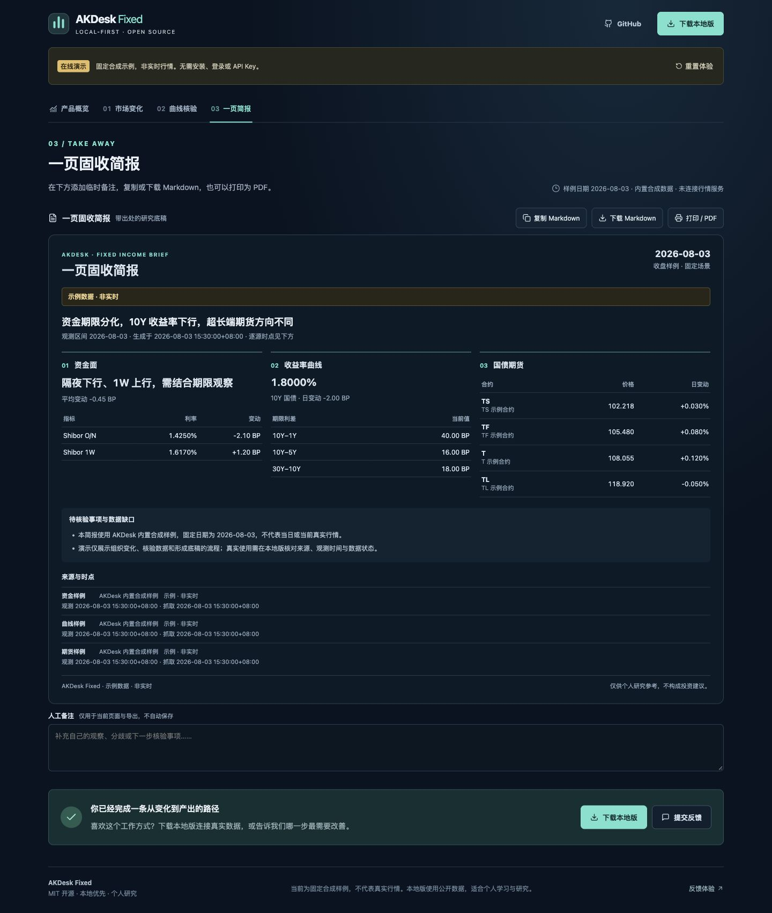

# AKDesk Fixed

从黄金、指数和固收市场出发，把观察、出处与自己的判断整理成可复盘的研究底稿。

**v1.4.1「周复盘可用性版」**：四项结果独立返回，遇到缺数或超时可只重读一项；从原模块返回会保留日期和当前标签页内的草稿。沿用沪深300、10年国债收益率、Au99.99 和美元兑人民币参考价，不做跨资产总分。[产品介绍](./docs/AKDesk-Fixed-v1.4.1-产品介绍.md) · [用户手册](./docs/AKDesk-Fixed-v1.4.1-用户手册.md) · [使用与验收](./docs/AKDesk-Fixed-v1.4.1-使用与验收指南.md)。

**v1.3.1「跨资产体验与可信收口版」**：新增 Au99.99 黄金、四个指数和四个按需 ETF 观察示例，支持日线、共同日期比较和查询引用工作流；保留固收、信用与持续研究。不是全市场股票或实时交易终端。新行情只在内存展示，不进入数值导出或 AI。[产品介绍](./docs/AKDesk-Fixed-v1.3.1-产品介绍.md) · [用户手册](./docs/AKDesk-Fixed-v1.3.1-用户手册.md) · [发布验收](./docs/AKDesk-Fixed-v1.3.1-升级与发布验收.md)。

[](./LICENSE) [](#本地安装三步) [](https://github.com/raistlinsha-plus/akdesk-fixed/releases/tag/v1.4.1)

**v1.1.1 数据边界更新（2026-11-03）**：适配 AKShare 1.20.22 的上游限流停试；FRED 内容不做数值导出或 AI 处理，研究只保存查询引用；市场导出保留使用边界。自备 Key、软件 MIT 或连接成功均不等于数据授权。参见[数据使用规则](./DATA_USAGE.md)与[升级说明](./docs/AKDesk-Fixed-v1.1.1-升级与使用说明.md)。

**[3 分钟首任务](https://raistlinsha-plus.github.io/akdesk-fixed/#/start)** · [股债金汇周复盘样例](https://raistlinsha-plus.github.io/akdesk-fixed/#/cross-asset-week) · [一页固收简报](https://raistlinsha-plus.github.io/akdesk-fixed/#/brief) · **[下载本地版](https://github.com/raistlinsha-plus/akdesk-fixed/releases/latest)** · [English](./README_EN.md) · [反馈](https://github.com/raistlinsha-plus/akdesk-fixed/issues/new/choose)



上图为 v1.1 固收路径的合成示例，不是新增跨资产页面截图。

新路径：**选择黄金/指数/ETF → 载入日线并核对时点 → 写一句自己的观察 → 下载合成底稿**。真实模式只导出查询引用与人工文字，不附新增行情数值。ETF四例不是推荐，不复权价格变化不是总回报。

先走一条路径：**查看市场变化 → 回到收益率曲线核验 → 添加备注并导出简报**。不必先了解全部模块。

在线演示使用固定 **2026-08-03 合成样例**，非实时行情；无需安装、登录或 API Key，不连接行情服务或本地后端。本地完整版保留市场、信用观察、研究项目、专题和周期复盘；业务界面目前以中文为主。

[60 秒演示视频](https://raistlinsha-plus.github.io/akdesk-fixed/akdesk-demo-60s.mp4) · [查看示例 Markdown](./docs/media/v1.1.0/示例-固收简报.md) · [可复现 AKShare 案例](./docs/examples/AKShare-一页固收简报.md)

## 本地安装三步

主要适配 Apple Silicon MacBook Air，要求 **macOS 12+、Python 3.11–3.13**。首次安装需要网络与约 1 GB 可用空间。正式包已带预构建界面，普通使用无需 Node.js、Docker 或 Rust。

macOS 12+ 为兼容目标；本轮实际验证环境为 macOS 26.6.2 / Apple Silicon，其他系统小版本未逐一实机验收。

1. 准备受支持的 Python。使用 Homebrew 时可执行 `brew install python@3.13`。
2. 从 [v1.4.1 Release](https://github.com/raistlinsha-plus/akdesk-fixed/releases/tag/v1.4.1) 下载 `AKDesk-Fixed-v1.4.1.zip` 与 `SHA256SUMS`。核对 SHA-256 后完整解压。
3. 双击 `start-macos.command`。启动器执行本地预检、安装锁定依赖，并打开 `http://127.0.0.1:8765`。

GitHub 自动生成的 **Source code** 压缩包用于源码查看和开发，与经过发布清单、构建资源和执行权限检查的安装 ZIP 不同；源码用户可能需要自行构建界面或恢复脚本权限。本地验收见 [v1.4.1 使用与验收](./docs/AKDesk-Fixed-v1.4.1-使用与验收指南.md)，公开可下载版本以 Releases 实际资产为准。

macOS 阻止脚本时，可右键选择“打开”。执行权限丢失时，在项目目录运行：

```bash
chmod +x start-macos.command start-macos-demo.command stop-macos.command
```

**停止服务**：在原启动终端按 `Control+C`，或用同一安装目录的 `stop-macos.command`。只关闭浏览器不会停止服务。启动器仅复用同安装、版本、模式与数据目录的实例；自定义 `AKDESK_PORT` 须在启停时一致。

**启动遇到问题**：预检检查 Python、文件、权限、空间和证书位置；依赖失败有分类恢复提示。可独立执行 `python3 scripts/preflight.py --json`。进入应用后，打开“使用与反馈”，主动生成并预览脱敏诊断摘要，再决定是否分享；不会自动上传 Key、路径、数据库或研究正文。详细恢复步骤见 [用户手册](./docs/AKDesk-Fixed-v1.4.1-用户手册.md)。

## 能完成哪些工作

- **快速市场底稿**：查看变化、核验曲线，生成包含资金、利差、期货、出处和时间的一页简报；完整每日复盘仍保留现券、发行事件和研究工作流。
- **小范围跨资产观察**：黄金、四个指数、四个按需ETF，连接原有固收与外汇模块；按需日线、同类共同日期比较、查询引用及人工备注，不扫描全市场。
- **股债金汇周复盘**：选一周，四项独立返回并可单项重读。回原模块核验再返回，所选日期和标签页内草稿不丢；真实底稿不导出行情数值。
- **持续个人研究**：统一自选、证据篮、研究项目、专题、反证、任务与每周复盘，记录观点如何变化。
- **信用与跨市场观察**：信用观察 R2、外汇、宏观图表、主权比较与事件线索。
- **解释数据状态**：区分真实、缓存、过期、演示和混合来源；缺失保持为空，关键数值不足时方向待核验。

临时备注可以随简报复制、下载 Markdown 或打印/PDF，不会自动保存为研究笔记。旧归档没有逐源出处时会显示待核验。具体操作见 [当前用户手册](./docs/AKDesk-Fixed-v1.4.1-用户手册.md)，数据限制见[数据使用规则](./DATA_USAGE.md)。

## 四类数据源

| 数据源 | 主要用途 | 配置与边界 |
| --- | --- | --- |
| AKShare / AKTools 生态 | 中国资金、曲线、现券、国债期货、转债、发行、部分外汇；新增新浪指数、上金所黄金及东方财富ETF日线 | 当前本地版使用 Python AKShare；它是公开数据访问层，不是交易所授权实时行情；新增数值仅内存/no-store |
| FRED 官方 API | 美国利率、通胀、就业、增长与发布复盘 | 用户自备 Key；内容仅按请求展示，研究只保存用户查询引用；无数值导出、不送入 AI |
| World Bank API v2 | 跨经济体主权结构比较 | 无需 Key；署名与变换说明，本地缓存；默认开放许可有指标/数据集例外 |
| GDELT DOC 2.0 | 外部事件检索与待核验线索 | 无需 Key；按需查询和缓存元数据，不抓取新闻正文，不自动判断信用风险 |

中国市场路径不需要 FRED 或 AI Key。FRED 与 AI 都是独立可选功能：用户按需提供自己的凭据；macOS 使用 Keychain 管理凭据。AI 经用户授权发送裁剪上下文，提供摘要与待核验任务，使用额度由用户自己的服务账户承担。

This product uses the FRED® API but is not endorsed or certified by the Federal Reserve Bank of St. Louis.

应用没有使用遥测或追踪 SDK。研究数据保存在本机；反馈由用户主动提交。数据缓存、凭据、AI 发送范围和备份规则见 [当前用户手册](./docs/AKDesk-Fixed-v1.4.1-用户手册.md) 与 [数据使用规则](./DATA_USAGE.md)。

## 适合谁

适合关注固收与宏观的个人研究者、AKShare/Python 使用者，以及想评估本地投研工作流的业务与科技人员。可以先用在线样例判断产出是否对自己有用，再安装完整版。

不适合作为机构生产交易、正式估值、会计核算、监管报送或风控限额的唯一依据。公开数据的时效和连续性受上游影响；产品不承诺实时行情或机构级 SLA，不构成投资建议。

## 文档与反馈

- 当前：[v1.4.1 产品介绍](./docs/AKDesk-Fixed-v1.4.1-产品介绍.md) · [用户手册](./docs/AKDesk-Fixed-v1.4.1-用户手册.md) · [测试清单](./docs/AKDesk-Fixed-v1.4.1-测试用例清单.md) · [使用与验收](./docs/AKDesk-Fixed-v1.4.1-使用与验收指南.md)
- 历史：[v1.4.0 指南](./docs/AKDesk-Fixed-v1.4.0-产品与使用指南.md) · [v1.3.2 首任务](./docs/AKDesk-Fixed-v1.3.2-体验指南.md) · [v1.3.1 产品介绍](./docs/AKDesk-Fixed-v1.3.1-产品介绍.md)
- [v1.3.1 Review](./docs/AKDesk-Fixed-v1.3.1-开发与Review记录.md) · [升级与发布验收](./docs/AKDesk-Fixed-v1.3.1-升级与发布验收.md) · [获客素材与观察计划](./docs/AKDesk-Fixed-v1.3.1-GitHub获客与发布准备.md)
- [v1.2 产品与使用指南](./docs/AKDesk-Fixed-v1.2.0-产品与使用指南.md) · [发布与验收](./docs/AKDesk-Fixed-v1.2.0-发布与验收记录.md)
- [三条场景指南](./docs/AKDesk-Fixed-v1.1.2-场景案例与使用指南.md) · [English casebook](./docs/examples/AKDesk-v1.1.2-casebook-EN.md) · [利率研究成品](./docs/examples/AKDesk-v1.1.2-利率研究样例.md) · [信用复核成品](./docs/examples/AKDesk-v1.1.2-信用复核样例.md)

- [v1.1 产品介绍](./docs/AKDesk-Fixed-v1.1.0-产品介绍.md) · [用户手册](./docs/AKDesk-Fixed-v1.1.0-用户手册.md) · [测试用例清单](./docs/AKDesk-Fixed-v1.1.0-测试用例清单.md)
- [发布与验收记录](./docs/AKDesk-Fixed-v1.1.0-发布与验收记录.md) · [更新记录](./CHANGELOG.md) · [公开路线图](./ROADMAP.md)
- [提交功能/数据问题](https://github.com/raistlinsha-plus/akdesk-fixed/issues/new/choose) · [分享使用场景](https://github.com/raistlinsha-plus/akdesk-fixed/discussions/16)

反馈最有帮助的信息是：要完成的任务、操作步骤、预期与实际结果、应用版本和模式。请先检查截图和附件，不上传 API Key、本机数据库或未公开研究材料。

## 开发与复现

后端：

```bash
python3 -m venv .venv
.venv/bin/python -m pip install -r backend/requirements.lock -r backend/requirements-dev.txt
PYTHONPATH=backend:. .venv/bin/python -m pytest backend/tests
```

前端与独立静态演示：

```bash
cd frontend
npm ci
npm run check
npm run build:demo
npm run preview:demo
```

无需第三方依赖的固定 CLI 样例：`python3 examples/fixed_income_brief.py --output brief-example.md`。真实模式与超时说明见 [examples/README.md](./examples/README.md)。应用由 React/TypeScript/Vite、FastAPI/Python 与 SQLite 组成，完整开发流程见 [CONTRIBUTING](./CONTRIBUTING.md)。

## 许可与贡献

自有代码采用 [MIT License](./LICENSE)。第三方组件与数据分别受其原始许可、使用条款和署名要求约束；**MIT 不授予第三方行情或内容的再分发权**。参见 [第三方声明](./THIRD_PARTY_NOTICES.md)。

AKShare 官方将接口和相关数据定位为学术研究；机构/商业场景应自行核验原始提供方授权。本产品不是合规认证。FRED 使用还须遵守完整服务与 API 条款，自备 Key 不豁免限制；具体实现与官方链接见[数据使用规则](./DATA_USAGE.md)。

欢迎可复现 Bug、文档修正、适配器测试和研究案例。参与前请阅读 [贡献指南](./CONTRIBUTING.md)、[行为准则](./CODE_OF_CONDUCT.md)；敏感漏洞按 [安全政策](./SECURITY.md) 报告。
