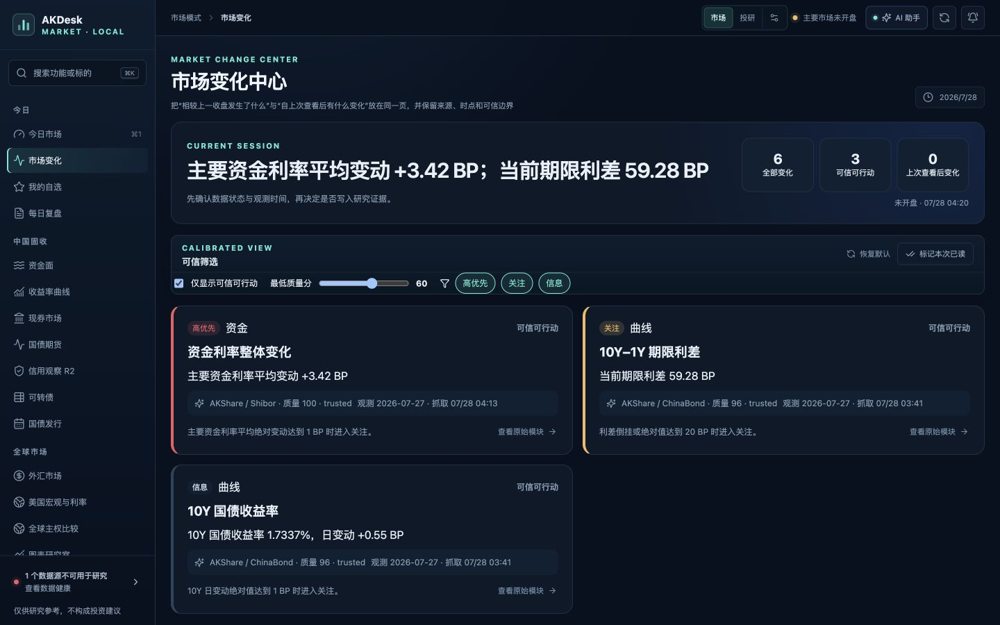

# AKDesk Fixed

[](./LICENSE)
[](#quick-start-on-macos)
[](#development)

AKDesk Fixed is a local-first, open-source research workstation for fixed-income and macro research. It organizes public market data from AKShare, FRED, the World Bank and GDELT into traceable workflows for market monitoring, evidence collection, research projects, watchlists, daily reviews and data-health checks.

> Local-first · Free and open source · Personal research use · Not investment advice

[中文说明](./README.md) · [Download](https://github.com/raistlinsha-plus/akdesk-fixed/releases/latest) · [Feedback](https://github.com/raistlinsha-plus/akdesk-fixed/issues/new/choose) · [Contributing](./CONTRIBUTING.md)



## What it includes

- China fixed-income market dashboard: funding rates, yield curves, cash bonds, CGB futures, convertible bonds, issuance events and daily reviews.
- Market-change center: changes since the previous close or the user's last view, with source, timestamp and quality boundaries.
- Research workspace: projects, hypotheses, conclusions, evidence, counter-evidence, tasks, review dates and change history.
- Credit Watch R2: user-imported bond and issuer data, portfolios, event calendars and guarded spread calculations.
- Global research: RMB FX references, selected FRED series, World Bank sovereign comparisons and GDELT event leads.
- Bring-your-own-key AI assistance: optional AIHubMix summaries and follow-up questions with explicit scope, local budgets and no automatic investment conclusions.
- Local storage and trust controls: SQLite, rolling backups, cache degradation, circuit breakers, provenance and data-health diagnostics.

## Quick start on macOS

AKDesk Fixed targets Apple Silicon MacBook Air and macOS 12 or later. Python 3.11–3.13 is required; Node.js is not required for normal use because the frontend is prebuilt.

1. Download `AKDesk-Fixed-v1.0.0.zip` from [GitHub Releases](https://github.com/raistlinsha-plus/akdesk-fixed/releases/latest).
2. Verify its SHA-256 checksum and unzip it.
3. Double-click `start-macos.command`.
4. Open `http://127.0.0.1:8765` if the browser does not open automatically.
5. Stop the service with `Control+C` in the launcher window, or double-click `stop-macos.command`.

The application binds only to the local loopback interface by default. On first launch it creates a project-specific Python virtual environment and installs locked dependencies.

## Data and licensing boundaries

AKShare/AKTools is an access layer for public data, not an exchange-authorized market-data feed. FRED, World Bank, GDELT and every upstream source retain their own terms, attribution and redistribution requirements. The MIT License covers AKDesk Fixed's original code only and does not grant redistribution rights for third-party data or content.

Data availability, timeliness and accuracy are not guaranteed. The software is intended for learning and personal research, and must not be the sole source for trading, accounting valuation or risk-limit decisions.

See [THIRD_PARTY_NOTICES.md](./THIRD_PARTY_NOTICES.md) for dependency and data-source notices.

## Development

Backend:

```bash
python3 -m venv .venv
.venv/bin/pip install -r backend/requirements-dev.txt
PYTHONPATH=backend .venv/bin/pytest backend/tests
```

Frontend:

```bash
cd frontend
npm ci --cache .npm-cache
npm run check
```

See [CONTRIBUTING.md](./CONTRIBUTING.md) before opening a pull request. Please use the issue forms for bugs, upstream data-source failures and feature requests. Never post API keys, local database files or confidential research content in a public issue.

## License

Original AKDesk Fixed code is released under the [MIT License](./LICENSE). Copyright © 2026 AKDesk Fixed contributors.
