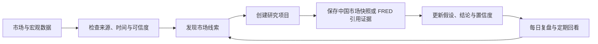

# AKDesk Fixed v0.6.1.1 产品介绍

> 当前版本：v0.6.1.1「可信修复版」  
> 产品形态：运行在个人 Mac 上的本地宏观固收投研终端  
> 适用范围：个人学习、市场观察、研究记录与复盘  
> 数据来源：AKShare 中国固收公开数据、FRED 美国宏观与利率官方 API

## 1. 一句话介绍

AKDesk Fixed 是一款面向个人研究者的本地固收行情与投研工作台，把分散的中国固收行情、美国宏观数据、研究项目、证据、自选和每日复盘组织成一条可追溯的研究流程。

它不是交易下单终端，也不试图用一个“神奇评分”代替研究判断。产品重点解决三个问题：现在市场发生了什么、这些数据是否可信、我的观点为什么发生变化。

## 2. 产品定位

传统免费行情工具通常擅长“展示数据”，但个人研究仍需要在浏览器、表格、笔记和截图之间来回切换。AKDesk Fixed 希望提供一套轻量、透明、可在 MacBook Air 上长期运行的个人研究环境：

- 用统一界面查看资金、曲线、现券、国债期货、可转债和发行事件；
- 用来源、观测时间、质量评分和可信等级判断数据能否用于研究；
- 把市场异常或宏观序列保存到研究项目，而不是只留下无法追溯的截图；
- 记录假设、证据、结论、置信度和复盘日期，保留观点演进轨迹；
- 数据和研究资料优先保存在用户自己的电脑上。

## 3. 适合哪些用户

### 个人固收与宏观研究者

希望持续观察资金利率、收益率曲线、国债期货和宏观数据，并形成自己的研究记录。

### 金融从业者的个人研究环境

需要一套与机构系统隔离、用于公开数据学习和个人复盘的本地工具。它不能替代机构授权行情、估值、风控或合规系统。

### 金融专业学生与进阶学习者

希望理解期限结构、久期、DV01、资金面与宏观数据之间的关系，并通过真实数据建立研究习惯。

### 轻量量化与数据爱好者

希望使用 AKShare/FRED 数据，但不想先搭建复杂数据平台、容器和数据库集群。

## 4. 核心研究闭环

这条流程贯穿产品各模块。市场数据不是终点，而是研究问题的起点；研究结论也不是一次性文本，而是可以被新证据继续验证或推翻的过程。

## 5. 产品模块

### 5.1 投研首页

投研首页汇总研究项目、自选、FRED 状态、市场研究线索和可信市场快照入口。

典型场景：

- 早晨快速判断当前是未开盘、交易中、午间休市还是已收盘；
- 查看资金、曲线、期货和现券中有哪些值得进一步研究的变化；
- 选择可信信号并保存到已有研究项目；
- 查看待复盘项目和近期研究活动。

### 5.2 固收市场总览

在同一页观察资金利率、收益率曲线、国债期货、现券异动和发行事件，并可进入对应专业页面。

典型场景：

- 盘前查看最近可信快照；
- 盘中快速定位资金、曲线和期货的共同变化；
- 收盘后回看市场结构，而不是只看单一价格。

### 5.3 资金面

展示 Shibor O/N、Shibor 1W、FR007、FDR007 和 LPR 等资金与贷款市场利率。FR、FDR、LPR 使用独立数据适配器，单一源失败不会拖累其他资金数据。

典型场景：

- 判断短端资金是边际收紧还是转松；
- 对照 Shibor、FR 和 FDR 的差异；
- 将资金变化与曲线、期货表现结合观察。

### 5.4 收益率曲线

展示国债及政策金融债期限结构、前值变化、关键期限利差和历史趋势。

典型场景：

- 比较 1Y、5Y、10Y、30Y 等期限；
- 跟踪 10Y–1Y、10Y–5Y、30Y–10Y 利差；
- 判断曲线是变陡、变平还是整体平移。

### 5.5 现券市场

提供现券收益率、净价、成交量和收益率变动，支持类型、收益率、异动幅度、排序、分页、保存筛选视图与 CSV 导出。

典型场景：

- 筛选国债、政策金融债、同业存单或其他债券；
- 查找收益率变化较大的标的；
- 保存个人常用筛选组合；
- 把可信标的加入自选或设置提醒。

当公开源缺少可信债券代码或出现异常数据时，记录仍可用于排查，但不会进入正式研究快照、提醒或可信历史。

### 5.6 国债期货

展示 TS、TF、T、TL 主要合约的价格、涨跌、成交量和持仓量。

典型场景：

- 观察不同久期国债期货的相对表现；
- 用期货变化辅助判断利率方向和期限偏好；
- 将合约加入自选并创建价格或涨跌提醒。

v0.6.1.1 会拒绝未来观测时间。源没有提供交易日时，只推断到最近已经发生的交易时点，并明确标为部分可用。

### 5.7 可转债

展示价格、涨跌幅、转股溢价率、双低值、到期收益率和强赎状态，支持筛选、排序、保存视图与 CSV 导出。

典型场景：

- 按价格、溢价率、双低和 YTM 初筛标的；
- 关注正股与转债之间的定价关系；
- 主比价源不可用时，使用只含价格的备用行情继续观察。

备用行情缺少溢价率、双低和 YTM 时，页面会明确标记为部分可用，不会把缺失字段包装成完整研究数据。

### 5.8 美国宏观与利率

通过用户自己的 FRED API Key 按需获取美国政策利率、流动性、美债收益率、通胀、实际利率、就业和增长等精选指标。

典型场景：

- 查看 DGS10、联邦基金利率、CPI、实际利率等常用序列；
- 阅读单位、频率、季调、来源机构和更新时间；
- 从指标详情进入图表研究室；
- 查看 FRED 数据发布日历。

FRED API Key 验证成功后保存在 macOS Keychain；Key 不写入数据库、日志或导出文件。FRED 观测值在请求期间处理，不写入本地 SQLite。

### 5.9 图表研究室

支持组合最多 6 条 FRED 序列，选择 1–50 年区间，并使用原值、单期变化、官方同比、归一化和 Z-Score 等变换。

典型场景：

- 比较名义利率与实际利率；
- 对照通胀、就业与美债收益率；
- 导出带来源、vintage 和使用说明的 CSV；
- 把序列、变换方法和来源保存为研究项目中的引用证据。

引用证据不冻结或保存 FRED 数值。重新打开证据时，会按当前官方版本重新请求数据，并明确提示这一点。

### 5.10 研究项目

研究项目记录问题、初始假设、状态、置信度、研究期限、标签、复盘日期、当前结论和证据。

典型场景：

- 建立“长端利率是否继续上行”等可验证问题；
- 保存中国固收市场快照和 FRED 引用证据；
- 记录支持证据与风险点；
- 回看状态、置信度和证据变更轨迹。

### 5.11 我的自选与提醒

证券和 FRED 指标使用统一自选模型，可以设置分组、标签、研究状态、置顶、备注和下次复盘日期。

典型场景：

- 按主题管理关注标的；
- 记录为什么关注、需要验证什么；
- 为现券、期货和可转债建立阈值提醒；
- 设置冷却时间、每日触发上限和静默时段。

宏观指标可以加入自选，但当前不支持证券式阈值提醒。当前自选卡片以研究管理为主，最新行情仍需回到对应市场页面查看。

### 5.12 每日复盘

每日复盘汇总资金、曲线、期货、现券异动、发行事件、数据健康和研究项目状态，并自动归档到本地 SQLite。

典型场景：

- 生成盘中快报、收盘复盘或最近快照；
- 查看综合可信度和各核心数据源贡献；
- 导出 Markdown 或打印为 PDF；
- 离线回看历史复盘。

### 5.13 固收计算器

提供应计利息、全价、YTM、麦考利久期、修正久期、凸性、DV01、利率情景价格和现金流计算，支持 ACT/365、ACT/ACT 和 30/360 计息规则。

典型场景：

- 快速理解债券价格对利率变化的敏感度；
- 比较不同期限、票息和收益率下的久期与 DV01；
- 用情景价格辅助研究，不用于正式估值入账。

### 5.14 数据健康中心

数据健康中心同时展示连接状态和研究可用性。

- 连接状态：健康、缓存可用、降级、不可用、未检查；
- 研究状态：研究可用、受限可用、不可用于研究、待检查；
- 运行信息：来源、观测时间、缓存年龄、质量评分、异常隔离、连续失败、熔断和恢复探测时间。

典型场景：当页面显示“数据不可用”或数值看起来异常时，先到数据健康中心判断是市场未开盘、实时源失败、缓存降级，还是数据质量不足。

### 5.15 信用观察 Beta

当前只保留信用数据验证入口，尚未提供正式的主体归一化、评级日期对齐、剩余期限匹配、基准曲线匹配或信用利差模型。

它不能用于信用评级、违约概率判断或正式投资决策。

## 6. 可信设计

### 数据不是只有“成功”和“失败”

AKDesk Fixed 把连接成功、缓存状态、数据质量和研究可用性分开。接口返回成功不代表数据一定适合研究；质量可疑的数据会被标记或隔离。

### 时间语义可检查

每个行情模块区分观测时间与抓取时间，并展示未开盘、交易中、午间休市、已收盘和非交易日。未来行情时间会在进入缓存和写入历史前被拒绝。

### 故障不会拖垮整个应用

AKShare 任务在独立子进程中运行，最多两路并发。单源超时、崩溃或证书问题不会带走主服务；连续失败会进入熔断，冷却后再恢复探测。

### 缓存不会伪装成实时行情

实时源失败时优先使用最近真实缓存，并明确显示缓存、过期或降级。只有从未获得真实数据时才使用演示数据，演示数据不会进入正式研究证据、提醒或可信历史。

## 7. 本地存储与隐私

| 数据 | 存储位置 | 说明 |
| --- | --- | --- |
| 研究项目、观点轨迹、市场快照、自选、提醒、日报 | `data/akdesk-fixed.db` | 本地 SQLite |
| 最近中国市场行情缓存 | `data/market-cache.db` | 本地 SQLite，可在健康中心清理 |
| FRED API Key | macOS Keychain | 不写入项目数据库 |
| FRED 观测值 | 不持久化 | 当前请求内处理；用户主动导出的 CSV 除外 |
| 筛选视图 | 浏览器本地存储 | 仅保存在当前浏览器环境 |

应用默认只监听 `127.0.0.1:8765`，不向局域网或公网开放。

## 8. 设备与运行方式

- 支持 macOS 12 或更高版本；
- 支持 Python 3.11–3.13；
- 针对 Apple Silicon MacBook Air 和常见小屏视口优化；
- 日常运行不需要 Docker、Rust 或常驻 Node.js；
- 首次安装依赖需要网络，之后可双击启动器运行；
- 本地服务常驻资源较轻，适合个人电脑长期使用。

## 9. 当前能力边界

当前版本明确不提供：

- 自动交易、下单、组合持仓或实盘账户连接；
- 交易所授权的逐笔或交易级实时行情；
- 正式估值、会计入账、风控限额或合规审批；
- 自动买卖建议、仓位建议、收益预测或违约概率；
- 已完成的信用利差模型；
- World Bank 主权比较功能；
- FRED 观测值的后台预抓取或本地离线数据库。

## 10. v0.6.1.1 的重点改进

- 修正盘前被显示为已收盘的问题；
- 修正国债期货缺少交易日时产生未来时间戳的问题；
- 自动清理旧版盘前误写的期货历史；
- 把连接健康与研究可用性分开；
- 修复项目创建轨迹中的错误字段显示；
- 修复部分 macOS Python 环境的 FR/FDR TLS 证书链识别；
- 改善 1280 像素视口下的研究项目布局。

详细变更见 [v0.6.1.1 版本说明](./AKDesk-Fixed-v0.6.1.1-可信修复版.md)和项目根目录的 [CHANGELOG](../CHANGELOG.md)。

## 11. 风险声明

AKDesk Fixed 仅供个人学习和研究。公开数据的版权、更新频率、接口稳定性和准确性受原始数据源约束。AKShare 是公开数据访问层，不等同于交易所官方授权行情；FRED 序列可能继承原始数据提供者的版权和署名要求。

本产品不构成投资建议，不应作为交易下单、正式估值、会计入账、信用审批或风险限额的唯一依据。
