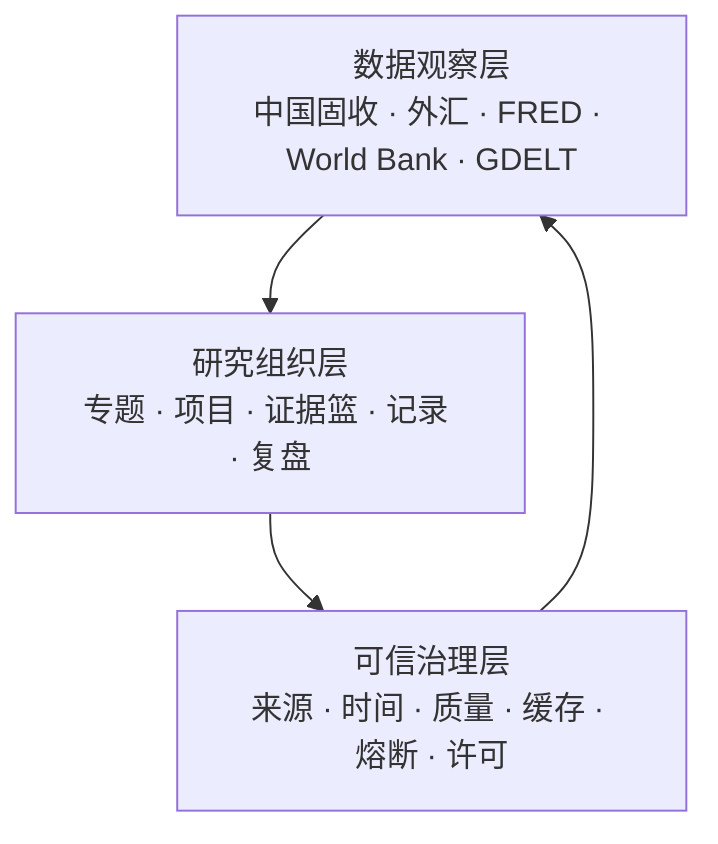

# AKDesk Fixed 产品介绍

> 适用版本：v0.8.0–v0.14.0  
> 产品形态：运行在个人 Mac 上的本地宏观固收投研工作台  
> 适用范围：公开数据观察、个人投研、证据管理与周期复盘  
> 核心数据：AKShare 中国固收与外汇、FRED 美国宏观利率、World Bank WDI 主权结构数据、GDELT 外部事件线索

v0.8.1 新增“市场 / 投研”双入口，两个模式共享同一套数据和研究资产。具体变化见 [v0.8.1 双入口体验版说明](./AKDesk-Fixed-v0.8.1-双入口体验版.md)。

v0.8.2 新增人民币参考价、全球主要外币对和跨市场首页脉搏。具体变化见 [v0.8.2 市场增强版说明](./AKDesk-Fixed-v0.8.2-市场增强版.md)。

v0.9.0 新增专题投研工作台、统一研究对象、跨源时间线、证据篮和规则化项目摘要。具体变化见 [v0.9.0 专题投研版说明](./AKDesk-Fixed-v0.9.0-专题投研版.md)。

v0.9.0.1 修复 SQLite 文件句柄累积，增加本机运行资源诊断，并治理后台页面轮询，提升 MacBook Air 长时间运行稳定性。具体变化见 [v0.9.0.1 连接与长稳修复版说明](./AKDesk-Fixed-v0.9.0.1-连接与长稳修复版.md)。

v0.9.1 增加专题聚合工作区、组件懒加载与编辑、证据篮筛选和批量清理，并加强现券与可转债的数据层级门禁。具体变化见 [v0.9.1 专题可用性增强版说明](./AKDesk-Fixed-v0.9.1-专题可用性增强版.md)。

v0.9.2 增加面向 50+ 专题的批量读取与检索、组件级刷新/失败重试、时间线筛选与分批显示，并加强专题切换的键盘语义。具体变化见 [v0.9.2 专题规模与交互增强版说明](./AKDesk-Fixed-v0.9.2-专题规模与交互增强版.md)。

v0.9.2.1 收口时间线与导出的完整性，增加零数据和界面失败恢复、图表数据摘要、可读性调整及自动化质量门。具体变化见 [v0.9.2.1 可信交互收口版说明](./AKDesk-Fixed-v0.9.2.1-可信交互收口版.md)。

v0.10.0 合并交付可信呈现、研究工作流和市场驾驶舱三阶段改进：增加动态图表精度、自动研究库备份、五步研究闭环、项目完成度、周度观点与下一步、可配置市场首页和跨资产历史分位。具体变化见 [v0.10.0 市场驾驶舱增强版说明](./AKDesk-Fixed-v0.10.0-市场驾驶舱增强版.md)。

v0.11.0 将信用观察升级为单券、发行人和组合三级工作台，增加 CSV/Excel 映射导入、历史利差与评级时间线、信用事件日历和人工确认信号。具体变化见 [v0.11.0 信用观察 R2 说明](./AKDesk-Fixed-v0.11.0-信用观察-R2.md)。

v0.11.0.1 完成 v0.11.0 整体复核，修复空白可选列导入，调整为“先观察、后维护”，以单券利差范围替代跨券简单平均，并增加当前信用观察 CSV 导出。具体证据与取舍见 [v0.11.0 整体评审与优化](./audits/v0.11.0-overall-review/AKDesk-Fixed-v0.11.0-整体评审与v0.11.0.1优化.md)。

v0.11.1 打通信用观察与研究项目：发行人可直接建立覆盖项目，人工确认信号可带备注写入项目复盘，并可导出全部本地多期信用历史。具体变化见 [v0.11.1 信用研究联动版说明](./AKDesk-Fixed-v0.11.1-信用研究联动版.md)。

v0.12.0 统一 AKShare / AKTools、FRED、World Bank 和 GDELT 的访问、凭据、缓存、许可和研究边界。具体变化见 [v0.12.0 统一外部数据连接器说明](./AKDesk-Fixed-v0.12.0-统一外部数据连接器.md)。

v0.12.1 增加 GDELT 事件雷达、发行人事件专题和“待核验线索 → 证据篮 → 项目”的人工确认链路。具体变化见 [v0.12.1 GDELT 事件雷达说明](./AKDesk-Fixed-v0.12.1-GDELT事件雷达.md)。

v0.12.1.1 修复信用观察长列表的页签与筛选定位，增加单券 20 条分段显示、组合成员搜索与“仅看已选”，并补齐键盘页签模型。具体变化见 [v0.12.1.1 信用滚动修复版说明](./AKDesk-Fixed-v0.12.1.1-信用滚动修复版.md)。

v0.12.2 通过动态起步清单、自然语言式任务入口、示例专题和渐进式表单降低首次使用门槛，同时保持现有可信数据与研究链路不变。具体变化见 [v0.12.2 低门槛体验版说明](./AKDesk-Fixed-v0.12.2-低门槛体验版.md)。

v0.13.0 新增 BYOK AI 研究助手预览版，通过产品向导、市场观察和研究教练降低使用门槛，并用 Keychain、最小化上下文、发送前确认和不落库策略控制外部处理。具体变化见 [v0.13.0 低门槛与 AI 助手预览版说明](./AKDesk-Fixed-v0.13.0-低门槛与AI助手预览版.md)。

v0.13.0.1 修复本地服务断开、AI 上游超时和长回答裁切，增加可执行的连接恢复提示与完整回答呈现。具体变化见 [v0.13.0.1 AI 连接与呈现修复版说明](./AKDesk-Fixed-v0.13.0.1-AI连接与呈现修复版.md)。

v0.13.1 增加每日调用次数与 token 预算、三模块独立授权、触发规则、任务状态和受限页面缓存底座。具体变化见 [v0.13.1 AI 运行底座版说明](./AKDesk-Fixed-v0.13.1-AI运行底座版.md)。

v0.14.0 把受控 AI 洞察接入今日市场、研究项目和信用观察，增加数据变化识别、最终摘要缓存、失败重试和继续追问。具体变化见 [v0.14.0 场景化 AI 洞察版说明](./AKDesk-Fixed-v0.14.0-场景化AI洞察版.md)。

## 1. 一句话介绍

AKDesk Fixed 是一款面向个人研究者的本地宏观固收投研终端，把中国固收行情、美国宏观数据、全球主权指标、外部事件线索、自选、研究项目和复盘组织成一条可追溯的研究工作流。

它不追求替代 Wind、QEUBEE 等机构终端的授权行情、交易和估值能力，而是聚焦个人用户在免费公开数据环境中的三个实际问题：

- 现在发生了什么；
- 当前数据是否足以用于研究；
- 我的判断基于什么证据，又为什么发生变化。

## 2. 产品定位

AKDesk Fixed 的定位不是“更多行情页面”，而是“本地优先的个人宏观固收研究工作台”。

传统免费数据工具往往停留在查询或展示层。个人研究者仍需在网页、表格、截图、笔记和文件夹之间反复切换，数据时间、来源和观点演进很容易丢失。AKDesk Fixed 在行情与图表之外增加了研究项目、证据、反证、任务、发布复盘、每日复盘、每周复盘和数据健康，让数据能够进入持续研究过程。

产品坚持以下原则：

- 公开数据可以免费获取，但不能假装成交易级授权行情；
- 接口请求成功不等于数据一定可信；
- 缺失值、缓存、过期和演示状态必须显式展示；
- 研究结论应当能够回溯到来源、时间和证据；
- 用户资料优先保存在自己的电脑上；
- 不使用自动评分代替信用判断、主权判断或投资决策。

## 3. 主要用户

### 3.1 核心用户：个人利率与宏观研究者

持续观察资金面、收益率曲线、国债期货、中国现券和海外宏观数据，希望形成自己的研究记录与复盘节奏。

典型需求：

- 每天快速判断市场结构；
- 跟踪长短端利率、期限利差和期货表现；
- 比较美国宏观变量与中国固收市场；
- 比较不同经济体的增长、财政与外部平衡；
- 把异常变化保存到研究项目，而不是只留截图。

### 3.2 次核心用户：金融从业者的个人研究副屏

固定收益、宏观、资产配置、交易或产品岗位从业者，需要一套与机构生产系统隔离的公开数据研究环境。

AKDesk Fixed 可用于个人学习、观点整理和非生产性复盘，但不能替代机构授权行情、估值、风控、合规、投委会或客户交付系统。

### 3.3 学习用户：金融专业学生与进阶学习者

希望通过真实数据理解：

- 资金利率与债券收益率；
- 收益率曲线和期限利差；
- 久期、凸性与 DV01；
- 宏观发布与市场反应；
- 主权基本面的跨国比较；
- 如何从“看图”升级为“提出问题、保存证据、定期复盘”。

### 3.4 数据用户：轻量量化与金融数据爱好者

熟悉或愿意接触 AKShare、FRED、World Bank，但不想先搭建 Docker、数据库集群和复杂数据平台，希望在 MacBook Air 上使用现成的研究界面和本地数据结构。

## 4. 不适合的用户

当前版本不适合以下场景：

- 依赖逐笔、盘口或交易级实时行情的短线交易；
- 需要自动下单、账户、组合持仓和风险限额的交易系统；
- 需要中债估值、正式会计估值或净值核算的生产系统；
- 需要多人协作、权限、审批和审计链的机构平台；
- 需要正式内部评级、违约概率或授信审批的信用风险团队；
- 需要批量分发或商业再分发数据的服务商。

## 5. 产品价值结构

AKDesk Fixed 由三层能力组成。



### 数据观察层

回答“市场和宏观数据发生了什么”，包括中国固收行情、美国宏观利率和主权结构指标。

### 研究组织层

回答“我正在研究什么”，包括自选、研究项目、笔记、反证、任务、证据、发布复盘和周期复盘。

### 可信治理层

回答“这些数据能否用于研究”，包括来源、观测时间、抓取时间、数据状态、质量评分、异常隔离、缓存年龄、熔断、许可和存储边界。

## 6. 当前功能布局

v0.10.0 提供市场和投研两种导航顺序，但所有模块在两个模式中都可访问并共享研究资产。

| 能力领域 | 模块 | 主要作用 |
| --- | --- | --- |
| 双首页 | 今日市场 | 自定义查看资金、曲线、期货、现券、外汇、事件和跨资产分位 |
| 双首页 | 研究首页 | 汇总项目、自选、市场线索和数据准备度 |
| 使用辅助 | AI 研究助手与页面洞察 | 用个人 AIHubMix Key 提供产品向导、市场观察、研究教练，以及市场 / 项目 / 信用三类内嵌摘要 |
| 研究资产 | 专题投研 | 按研究对象保存跨源视图、事件雷达、时间线、证据篮和项目摘要 |
| 研究资产 | 我的自选 | 管理关注对象、标签、状态、备注与复盘日期 |
| 研究资产 | 研究项目 | 管理问题、假设、证据、记录、结论和备份 |
| 中国固收 | 资金面 | 跟踪 Shibor、FR、FDR、LPR |
| 中国固收 | 收益率曲线 | 查看期限结构、变化、利差与历史 |
| 中国固收 | 现券市场 | 筛选现券成交、收益率与异动 |
| 中国固收 | 国债期货 | 查看 TS、TF、T、TL 合约 |
| 中国固收 | 信用观察 R2 | 批量整理单券、主体和组合，并在严格门禁下观察机械利差历史 |
| 中国固收 | 可转债 | 比较价格、溢价率、双低和 YTM |
| 全球市场 | 外汇市场 | 查看人民币日频参考价和全球主要外币对即时询价 |
| 全球数据 | 美国宏观与利率 | 查询 FRED 精选指标与发布日历 |
| 全球数据 | 全球主权比较 | 比较 World Bank WDI 年度指标 |
| 全球数据 | 图表研究室 | 组合 FRED 序列并进行变换 |
| 全球数据 | 数据发布复盘 | 保存发布前预期并复盘实际值与市场窗口 |
| 复盘工具 | 每日复盘 | 生成并归档每日固收市场报告 |
| 复盘工具 | 每周复盘 | 汇总项目、笔记、反证、任务和发布复盘 |
| 复盘工具 | 国债发行 | 查看近期发行与事件时间线 |
| 复盘工具 | 固收计算器 | 计算 YTM、久期、凸性、DV01 与现金流 |
| 复盘工具 | 数据健康 | 检查连接器、许可、存储、连接状态、研究可用性与缓存 |

## 7. 核心业务场景

### 7.1 中国固收日常观察

适合盘前、盘中和收盘后的固定节奏。

用户可以：

- 在固收市场快速查看资金、曲线、期货和现券；
- 进入专业页面定位变化来源；
- 检查市场状态与数据可信度；
- 把可信变化保存为市场快照；
- 在每日复盘中形成当日记录。

### 7.2 利率方向与曲线研究

用户可结合：

- Shibor、FR007、FDR007；
- 国债和政策金融债曲线；
- 10Y–1Y、10Y–5Y、30Y–10Y 利差；
- TS、TF、T、TL 国债期货；
- FRED 美债利率、通胀和政策指标。

适合研究长端方向、曲线形态、资金传导和海外利率影响。

### 7.3 宏观数据发布复盘

发布前保存预期值，发布后按需请求 FRED 官方实际值，并观察中国资金、收益率曲线和国债期货的前后窗口。

适合 CPI、就业、政策利率、增长等事件研究。

FRED 实际观测值不会写入 SQLite，系统只保存用户预期、复盘记录和 vintage 引用。

### 7.4 全球主权基本面比较

使用 World Bank WDI 比较 2–8 个经济体的增长、财政、外部平衡和收入结构。

适合：

- 比较中国、美国、日本和欧洲主要经济体；
- 研究新兴市场外部脆弱性；
- 检查财政与债务变量的长期变化；
- 将跨国比较保存为项目证据。

系统严格按同一自然年度对齐，缺失值不跨年填充，排名只表示数值顺序。

### 7.5 信用覆盖、主体与组合观察

信用观察 R2 支持手工录入或 CSV/Excel 映射导入，把用户核验资料组织为单券、发行人和自定义组合三级视图。只有主体、评级、评级日期、剩余期限、债券收益率、收益率日期、同日基准、期限匹配和来源全部满足条件时，系统才机械试算：

```text
信用利差 = 债券收益率 - 同日同期限国债基准
```

同一债券的多期记录形成利差和评级时间线；到期、回售、评级资料复核和研究复盘进入本地日历。单券按 20 条分段显示，搜索、状态筛选或层级切换后自动回到当前结果区。发行人和组合只显示通过门槛单券的机械利差范围与样本数，不对不同期限、评级和主体债券做简单平均。发行人可一键建立覆盖项目，自动信号在人工确认时可附核验备注并沉淀为项目复盘。系统不生成内部评级、违约概率或投资结论。

### 7.6 发行人与专题事件发现

用户可在专题中配置 GDELT 事件雷达，也可从信用观察发行人主档直接打开唯一事件专题。系统按需读取标题、链接、来源、国家、语言和时间，只把结果视为待核验线索。

适合：

- 发现发行人融资、偿债、资产、治理或监管相关报道；
- 跟踪主权、政策或宏观主题的外部事件；
- 打开原文核验后，把引用暂存到证据篮；
- 将确认需要保留的线索提交到研究项目和专题时间线。

文章数量、来源国家和媒体语气不能被解释为风险概率、事实确认或投资信号。应用不抓取新闻正文。

### 7.7 研究项目与观点管理

用户可以从市场线索、现券、期货、转债、信用观察或主权比较一键立项，也可以使用模板创建项目。

项目能够保存：

- 研究问题与初始假设；
- 状态、期限、标签和主观置信度；
- 当前结论与风险点；
- 研究笔记、反证、任务和复盘记录；
- 中国市场快照；
- FRED 引用证据；
- World Bank 主权比较快照；
- 经用户选择并保留原文链接的 GDELT 线索；
- 自动生成的观点轨迹。

### 7.8 个人研究资料归档

研究项目支持：

- Markdown 导出；
- JSON 项目包导出和导入；
- SQLite 研究库备份；
- 完整性校验恢复；
- 恢复前自动生成安全副本。

这使 AKDesk Fixed 不只是行情界面，也是一套本地研究档案。

## 8. 模块说明

### 8.1 研究首页

投研模式的默认入口。页面汇总进行中项目、待复盘事项、统一自选、FRED 状态、World Bank 缓存点数和中国市场研究线索。

市场线索可调整敏感度，并在满足可信门槛时保存到指定研究项目。

### 8.2 今日市场

市场模式的默认入口，以总览方式呈现资金、曲线、国债期货、活跃现券、外汇和发行事件。用户可以隐藏低频模块，或套用“全景、利率优先、跨市场”预设；最近查看的市场页面会显示在驾驶舱顶部。

“利率与汇率联动观察”使用本地可信历史计算 10Y 国债和 FDR007 分位，同时展示 10Y–1Y 曲线、T 主力与 USD/CNY 方向。实际样本量随卡片显示，历史不足时不生成虚假分位；观察结果可继续进入投研工作台。

### 8.3 我的自选

证券与宏观指标使用统一模型，支持分组、标签、研究状态、置顶、备注和下次复盘日期。

证券自选会显示可用缓存行情和可信状态；宏观指标按需请求，不在后台持续抓取 FRED。

### 8.4 资金面

展示 Shibor O/N、Shibor 1W、FR007、FDR007 和 LPR。扩展资金源独立运行，单一数据源失败不会拖累整个资金页。

### 8.5 收益率曲线

展示国债与政策金融债期限结构、前值变化、关键期限利差和本地滚动历史。可信行情会自动保存为轻量历史，最长滚动保留 400 天。

### 8.6 现券市场

支持代码、名称、债券类型、收益率、异动和成交量筛选，提供分页、排序、保存视图和 CSV 导出。

缺少可信代码或被质量规则隔离的记录不能进入自选、提醒或正式研究快照。v0.9.1 可以对少数国债、国开、进出口行和农发行标准简称保守推导代码，但始终标记“需核验”，核验前同样不能自选或立项。

### 8.7 国债期货

展示 TS、TF、T、TL 近季合约的价格、涨跌、成交量和持仓量。系统拒绝未来时间戳，并区分盘前最近快照和盘中行情。

### 8.8 信用观察 R2

提供 CSV/Excel 字段映射预览、当前观察与多期历史 CSV 导出、单券历史、发行人聚合、自定义组合、事件日历、规则信号和字段覆盖率。单券列表首批显示 20 只并可继续加载；组合成员支持代码、名称和主体搜索以及“仅看已选”。发行人可以直接建立覆盖项目；人工确认信号时可记录核验动作，并选择同步到研究项目的复盘记录。页面默认先展示单券/发行人/组合观察，低频导入与编辑收在“数据维护”中。适合维护个人核验后的信用观察资料，不适合作为自动评级、授信审批或组合风险系统。

### 8.9 可转债

支持价格、涨跌幅、转股溢价率、双低值、到期收益率和强赎状态筛选。数据明确分为“完整比价、部分比价、仅价格”；主比价源失败时可切换到价格备用源，但字段不完整的记录不会直接进入研究立项。

### 8.9.1 外汇市场

分别展示 USD/CNY、EUR/CNY、100 JPY/CNY 的人民币日频参考价，以及 EUR/USD、USD/JPY 等全球主要外币对即时询价。

外汇标的支持全局搜索、统一自选和研究项目关联。即时询价缺少可信市场时间时会标记为部分可用，不进入自动提醒或研究历史。

### 8.10 美国宏观与利率

提供 20 条 FRED 精选序列，覆盖政策与流动性、美债利率、通胀、实际利率、就业和增长。

用户使用自己的 FRED API Key。Key 验证成功后保存到 macOS Keychain，观测值只在当前请求中处理。

### 8.11 图表研究室

支持最多 6 条 FRED 序列和 1–50 年区间，可使用：

- 原值；
- 单期变化；
- FRED 官方同比；
- 归一化；
- Z-Score。

可导出带来源和 vintage 的 CSV，或保存不含观测值的引用证据。

### 8.12 全球主权比较

首期覆盖 10 个经济体和 10 条 WDI 指标。支持水平值、单年变化、横截面排名和 Z-Score。

World Bank 数据按国家、指标和年份持久缓存 7 天；过期缓存明确降级，不能保存为新的正式证据。

### 8.13 数据发布复盘

用户可以保存发布前预期，发布后请求官方实际值，计算预期偏差并记录复盘 vintage，同时检查中国固收市场窗口。

### 8.14 研究项目

研究项目是产品的核心工作区。模板包括：

- 空白研究；
- 利率方向；
- 宏观发布；
- 可转债事件；
- 信用观察；
- 主权基本面比较。

同一模板和同一研究对象重复一键立项时，会返回已有未归档项目，避免制造重复项目。

项目页会按研究问题、假设、证据、反证、结论和复盘日期计算六项闭环完成度，并给出下一步提示。高频字段默认展示，低频设置按需展开；研究库自动安全备份状态也在这里可见。

### 8.15 每日与每周复盘

每日复盘聚焦市场状态，支持本地归档、Markdown 导出和打印 PDF。

每周复盘聚焦研究过程，汇总项目更新、笔记、反证、任务、发布复盘、到期项目、本周观点、下周待验证和下次复盘。

### 8.16 提醒

现券、国债期货和可转债支持阈值提醒，可设置冷却时间、每日触发上限和跨午夜静默时段。

只有健康且未过期的真实数据可以触发提醒。

### 8.17 固收计算器

提供应计利息、全价、YTM、麦考利久期、修正久期、凸性、DV01、情景价格和现金流计算，支持 ACT/365、ACT/ACT 和 30/360。

### 8.18 数据健康中心

数据健康中心先用统一连接器卡片展示 AKShare / AKTools、FRED、World Bank 与 GDELT 的访问、凭据、能力、存储、缓存、许可和边界，再用逐适配器列表诊断运行状态。连接状态与研究可用性分开：

- 连接：健康、缓存可用、降级、不可用、未检查；
- 研究：当前已验证、可信缓存可参考、禁止沉淀为证据、尚未验证。

用户可以查看缓存年龄、质量问题、异常隔离、连续失败、熔断和下次恢复时间，并对单个数据源重试。

### 8.19 专题投研工作台

专题工作台把分散在市场、FRED、World Bank、GDELT 和研究项目中的资料组织为持续研究视图。

首期支持：

- 中国利率方向、中美利率联动、人民币汇率与利率、全球通胀与实际利率模板；
- 市场脉搏、本地历史、FRED 图表、World Bank 比较、GDELT 事件雷达、项目摘要和最近证据组件；
- 利率主题、宏观主题、国家、发行人、证券和发布事件研究对象；
- 市场快照、FRED 引用、World Bank 快照、GDELT 线索、笔记、反证、任务与观点变化时间线；
- 跨页面证据篮和批量归档；
- 证据篮按专题、归属、来源和日期筛选，并支持批量清理；
- 专题详情聚合读取，外部组件按进入视口加载并对相同请求去重；
- 专题库按标题、对象、标签和状态即时筛选，列表读取避免逐专题数据库查询；
- 外部组件独立刷新和失败重试，不影响同页其他组件；
- 时间线按文本、记录类型和项目筛选，显示完整总数，使用稳定游标加载更早记录，并按 20 条分批展开；
- 在专题设置中编辑组件的数据源、序列、区间、变换和比较方式；
- 固定规则生成的项目结构化摘要；
- 专题全局搜索和包含完整研究历史的 Markdown 导出；
- 图表趋势与数值摘要、零数据指导和界面失败后的本地安全恢复。

专题不会把不同频率的数据伪装成同一频率，也不会自动生成投资建议。

## 9. 可信与数据边界

### 中国固收与 AKShare

AKShare 是公开数据访问层，不等于交易所授权行情。系统通过隔离进程、超时、缓存、质量规则和熔断降低公开接口不稳定的影响。

### FRED

- 使用用户本人的 API Key；
- Key 保存于 macOS Keychain；
- 观测值不写入 SQLite；
- 引用证据不保存 FRED 数值；
- 用户主动导出的 CSV 可以包含当次请求结果。

### World Bank

- API 不需要 Key；
- WDI 使用 CC BY 4.0；
- 数据可在本地持久缓存；
- 导出和研究证据保留来源、指标代码、年份、许可和署名；
- 缺失值作为空值记录，不进行跨年填充。

### GDELT

- DOC 2.0 公开 API 不需要 Key；
- 相同查询的规范化元数据本地缓存 12 小时；
- 只保存标题、原文 URL、来源、语言、时间和查询上下文，不保存新闻正文；
- 线索标记为 `unverified_clue`，必须打开原文并交叉核验；
- GDELT 署名与来源网站条款同时保留；
- 不根据覆盖量、来源国家或标题生成风险评分。

## 10. 本地存储与隐私

| 数据 | 存储位置 | 说明 |
| --- | --- | --- |
| 专题、研究对象、证据篮、项目、记录、观点轨迹、发布预期、信用观察、自选、提醒、日报 | `data/akdesk-fixed.db` | 本地 SQLite |
| World Bank 国家、指标和观测缓存 | `data/akdesk-fixed.db` | 7 天缓存，清缓存时删除 |
| GDELT 查询与文章元数据 | `data/akdesk-fixed.db` | 12 小时缓存，不含新闻正文 |
| 最近中国市场行情 | `data/market-cache.db` | 可在数据健康页清理 |
| FRED API Key | macOS Keychain | 不写入数据库或日志 |
| FRED 观测值 | 不持久化 | 当前请求内处理 |
| AIHubMix API Key | macOS Keychain | 不写入数据库、日志、浏览器缓存或导出 |
| AI 对话问题、裁剪上下文与回答 | 不持久化 | 请求级处理；关闭助手抽屉后清除当前回答 |
| AI 页面洞察 | `data/akdesk-fixed.db` | 只保存最终摘要、上下文指纹、模型与生成时间；不保存完整提示词、思维过程或上下文副本 |
| AI 每日用量 | `data/akdesk-fixed.db` | 只保存每日调用次数及 prompt / completion / total token 汇总 |
| 保存筛选视图 | 浏览器本地存储 | 仅保存在当前浏览器 |
| 市场驾驶舱布局与最近查看 | 浏览器本地存储 | 不进入研究库 |
| 自动研究库备份 | `data/backups/` | 默认每 24 小时验证并滚动保留 14 份 |

应用默认只监听 `127.0.0.1:8765`，不会向局域网或公网开放。

## 11. 设备与运行

- macOS 12 或更高版本；
- Python 3.11–3.13；
- 针对 Apple Silicon MacBook Air 和 1440×900 视口适配；
- 日常运行不需要 Docker、Rust 或常驻 Node.js；
- 首次安装依赖需要网络；
- 之后可直接双击 `start-macos.command`。

## 12. 当前能力边界

v0.14.0 不提供：

- 自动交易、实盘账户或组合持仓；
- 交易所授权的逐笔行情；
- 正式估值、净值核算、风控限额和合规审批；
- 多人协作、云同步和权限体系；
- 自动信用评级、违约概率或主权评分；
- 任意国家和任意 WDI 指标的开放目录；
- FRED 观测值离线数据库；
- 新闻正文数据库、高频新闻流或媒体内容再分发；
- 自动事件聚类、情绪评分、舆情告警或信用风险评分；
- 自动生成投资建议或仓位建议；
- AI 自动写入、修改或删除项目、专题、证据、自选、提醒或复盘；
- AI 自动信用评级、违约概率、主体评分、买卖信号或交易执行；
- AI 多轮对话历史、对话回答持久化、附件全文分析或新闻正文外发。

## 13. 风险声明

AKDesk Fixed 仅供个人学习与研究。公开数据的版权、可用性、更新频率和准确性受原始数据源约束。数据可能延迟、缺失、修订或暂时不可用。

产品不构成投资建议，也不应作为交易下单、正式估值、会计入账、信用审批或风险限额的唯一依据。

详细操作见 [用户手册](./AKDesk-Fixed-v0.8.0-用户手册.md)。版本变化见 [v0.14.0 场景化 AI 洞察版说明](./AKDesk-Fixed-v0.14.0-场景化AI洞察版.md)、[v0.13.1 AI 运行底座版说明](./AKDesk-Fixed-v0.13.1-AI运行底座版.md) 和项目根目录的 [CHANGELOG](../CHANGELOG.md)。
