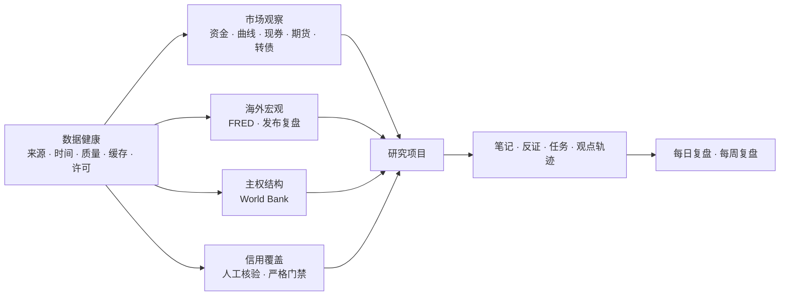

# AKDesk Fixed v0.8.0 功能布局、用户场景与演进建议

> 分析对象：AKDesk Fixed v0.8.0  
> 分析目的：明确当前产品形态、核心用户、业务场景和下一阶段产品路线

> 进展说明：本分析提出的双入口方向已在 v0.8.1 落地，外汇与跨市场观察已在 v0.8.2「市场增强版」落地，专题研究工作台已在 v0.9.0「专题投研版」落地。

## 1. 结论摘要

AKDesk Fixed 当前已经不再是单纯的“免费固收行情软件”，而是一套初步成型的个人宏观固收研究工作台。

产品的差异化不在于行情覆盖数量，而在于：

- 将中国固收、FRED 和 World Bank 放在同一研究环境中；
- 将来源、时间、缓存、质量和许可作为一等信息；
- 将行情变化转化为研究项目和可追溯证据；
- 支持笔记、反证、任务、观点轨迹、发布复盘和周期复盘；
- 数据与研究资料主要保存在用户自己的 Mac 上。

当前最适合的产品定位是：

> 面向个人利率与宏观研究者的本地可信投研工作台。

不建议继续以“免费 Wind 替代品”作为主叙事。Wind、QEUBEE 的价值包含授权行情、估值、交易、机构数据和生产服务，当前产品无法也无需在这些方向全面竞争。

下一阶段最重要的不是继续增加更多数据接口，而是降低使用门槛、整理信息架构，并把现有数据真正连接成专题研究工作台。

推荐路线：

1. v0.8.1：先完成导航、上手、数据状态和场景入口收口；
2. v0.9.0：已建设“专题研究工作台”，连接市场、宏观、主权和项目证据；
3. v0.9.x：深化主权观察和信用观察，而不是简单扩充更多页面；
4. v1.0：完成 macOS 产品化、可配置研究视图和稳定数据扩展框架。

## 2. 当前产品能力结构

从用户价值而不是代码模块看，v0.8.0 形成了四条能力主线。



### 2.1 市场观察主线

覆盖中国固收日常观察：

- 资金利率；
- 国债和政策金融债曲线；
- 现券成交；
- 国债期货；
- 可转债；
- 国债发行与事件；
- 本地可信历史；
- 阈值提醒。

这一主线最接近日常行情终端，是产品使用频率最高的部分。

### 2.2 海外宏观主线

覆盖：

- FRED 精选指标；
- 单序列查看；
- 多序列图表；
- 官方同比、归一化和 Z-Score；
- 数据发布日历；
- 发布前预期；
- 实际值与市场窗口复盘。

这一主线将宏观数据从“看一张图”推进到“发布前形成预期、发布后检查反应”。

### 2.3 主权结构主线

通过 World Bank WDI 提供：

- 10 个经济体；
- 10 条精选指标；
- 同年严格对齐；
- 水平、变化、排名和 Z-Score；
- 覆盖率和最新共同年份；
- 持久缓存；
- 许可与署名；
- 主权比较研究证据。

它补齐了美国宏观之外的全球结构数据，但当前仍是单指标比较工具，尚未形成完整国家研究页。

### 2.4 研究管理主线

覆盖：

- 自选；
- 研究项目；
- 模板立项；
- 市场快照；
- FRED 引用证据；
- World Bank 快照；
- 笔记、反证、任务和复盘；
- 观点轨迹；
- 每日和每周复盘；
- 项目导入导出；
- 整库备份恢复。

这一主线是产品区别于普通免费行情页面的核心。

## 3. 当前信息架构评估

### 3.1 现有布局

当前左侧导航分为：

- 工作台；
- 市场；
- 全球宏观；
- 研究。

这种布局的优点是按功能领域分类，用户可以较快找到某个数据页面。

### 3.2 当前布局的优势

#### 数据与研究同时存在

工作台不是只有行情，也提供项目、自选和研究线索入口。

#### 中国市场与全球宏观边界清晰

资金、曲线、现券和期货属于“市场”；FRED、World Bank 和发布复盘属于“全球宏观”。

#### 数据健康有独立入口

数据质量没有被藏在设置页中，而是成为用户可见的核心能力。

#### 功能在 MacBook Air 上仍可浏览

尽管模块已经较多，当前四组导航仍保持可扫描性，专业页面内部也使用响应式布局。

### 3.3 当前布局的问题

#### 问题一：工作流被分散在不同分组

同一研究过程可能需要在以下页面间来回切换：

- 投研首页；
- 研究项目；
- 图表研究室；
- 数据发布复盘；
- 每日复盘；
- 每周复盘。

这些页面分布在“工作台”“全球宏观”和“研究”三个分组，用户理解的是研究任务，导航表达的却是功能类型。

#### 问题二：投研首页、固收市场和每日复盘存在部分重叠

三者都包含资金、曲线、期货或市场摘要，但角色区分还不够明显：

- 投研首页应强调“今天需要研究什么”；
- 固收市场应强调“市场现在是什么状态”；
- 每日复盘应强调“今天最终发生了什么并如何归档”。

后续需要通过标题、入口和默认信息进一步强化差异。

#### 问题三：研究项目仍是“容器”，研究对象还不是一等实体

当前项目可以关联对象来源，但系统没有统一的：

- 国家页；
- 利率主题页；
- 发行人页；
- 证券研究页；
- 宏观事件页。

因此同一国家、同一主体或同一主题的自选、图表、证据和项目仍可能分散。

#### 问题四：跨数据源研究连接不足

FRED、World Bank 和中国市场都能进入项目，但缺少同一页面上的跨源比较，例如：

- 美国通胀、美债利率与中国 10Y；
- 中美政策利率与期限利差；
- 主权增长、债务和外部平衡的多指标面板；
- 宏观发布前后中国市场反应的连续时间线。

目前是“多个模块可以保存到同一项目”，还不是“多个模块天然组成同一研究视图”。

#### 问题五：系统级能力入口不集中

备份和恢复位于研究项目页，缓存清理位于数据健康页，FRED 凭据位于宏观页。

这些功能都合理，但从产品结构上属于“设置与数据管理”。随着功能增长，继续分散会提高学习成本。

#### 问题六：首次使用路径较长

新用户第一次打开应用，需要理解：

- 正常模式与演示模式；
- 数据状态和研究可用性；
- FRED Key；
- World Bank 缓存；
- 项目、证据和复盘的关系。

当前主要依赖文档和空状态提示，缺少一个明确的首次使用清单。

## 4. 主要目标用户

### 4.1 P0：个人利率与宏观研究者

这是最匹配当前产品的人群。

他们通常：

- 每周多次观察债券市场；
- 有明确的利率、曲线或宏观主题；
- 愿意记录观点和复盘；
- 可以接受公开数据的延迟与不稳定；
- 重视来源、时间和数据边界；
- 使用 Mac 作为个人研究设备。

核心工作：

- 日常市场观察；
- 主题研究；
- 海外宏观跟踪；
- 形成并更新观点；
- 保存研究档案。

### 4.2 P1：固收、宏观和资产配置从业者的个人工具

适合作为机构终端之外的个人副屏或学习环境。

核心价值：

- 公开数据快速查看；
- 个人观点记录；
- 非生产性复盘；
- 跨市场研究草稿；
- 不依赖公司内部系统保存个人研究框架。

产品必须持续强调其不能替代机构系统。

### 4.3 P2：金融学生与研究型学习者

适合课程、论文准备、个人练习和面试研究。

核心价值：

- 真实数据而非纯示例；
- 固收计算器；
- 期限结构和宏观图表；
- 主权跨国比较；
- 研究模板和复盘习惯。

这一用户群的主要障碍是首次安装和金融概念门槛。

### 4.4 P3：金融数据开发者和轻量量化用户

适合希望研究 AKShare、FRED 和 World Bank 数据的人。

他们更关心：

- API 与本地 SQLite；
- 数据缓存和质量状态；
- 导出；
- 可扩展的数据适配结构；
- 不使用 Docker 的轻量运行方式。

当前 UI 对他们有价值，但产品尚未提供正式插件或用户自定义指标框架。

### 4.5 非目标用户

| 用户 | 不匹配原因 |
| --- | --- |
| 高频或日内交易者 | 缺少授权实时、盘口和下单 |
| 机构运营与估值人员 | 缺少正式估值和生产 SLA |
| 多人研究团队 | 当前为单机单用户 |
| 正式信用审批人员 | 信用数据和模型不足 |
| 商业数据分发方 | 数据许可与产品定位不支持 |
| 只想看一个价格的轻用户 | 当前研究结构可能显得过重 |

## 5. 主要业务场景

### 5.1 早晚两次固收市场检查

**用户**：利率研究者、交易岗位个人副屏  
**入口**：投研首页、固收市场、每日复盘  
**过程**：

1. 盘前检查最近可信快照；
2. 盘中定位资金、曲线和期货变化；
3. 收盘后形成归档报告；
4. 将异常保存到项目。

**产出**：每日市场判断、证据和复盘记录。

### 5.2 利率方向专题

**用户**：利率研究、资产配置  
**入口**：收益率曲线、国债期货、FRED、项目  
**过程**：

1. 建立“长端利率是否继续上行”项目；
2. 保存中国市场快照；
3. 添加美国利率与通胀引用；
4. 记录支持证据和反证；
5. 每周更新置信度。

**产出**：可追溯的利率观点轨迹。

### 5.3 宏观数据发布研究

**用户**：宏观研究、交易研究  
**入口**：美国宏观、数据发布复盘  
**过程**：

1. 保存发布前预期；
2. 发布后请求实际值；
3. 计算预期偏差；
4. 查看中国市场窗口；
5. 标记已复盘。

**产出**：事件预期与市场反应记录。

### 5.4 主权结构比较

**用户**：全球宏观、资产配置、学生  
**入口**：全球主权比较  
**过程**：

1. 选择 2–8 个经济体；
2. 比较增长、财政或外部平衡；
3. 检查共同年份和覆盖率；
4. 导出 CSV；
5. 保存为项目证据。

**产出**：口径透明的跨国比较。

### 5.5 小规模信用观察

**用户**：信用研究学习者、固收研究者  
**入口**：信用观察 R1  
**过程**：

1. 录入人工核验字段；
2. 检查覆盖率；
3. 查看阻断原因；
4. 在条件满足时试算利差；
5. 一键建立信用观察项目。

**产出**：经过字段门禁的观察清单，而不是自动评级。

### 5.6 研究档案与知识沉淀

**用户**：所有核心用户  
**入口**：研究项目、每周复盘  
**过程**：

1. 项目记录问题、假设和结论；
2. 持续添加笔记、反证和任务；
3. 保存市场、FRED 和 World Bank 证据；
4. 导出 Markdown 或 JSON；
5. 定期备份研究库。

**产出**：属于用户自己的本地研究资料库。

## 6. 当前版本的产品成熟度

### 已经较成熟

- 中国固收市场浏览框架；
- 数据健康、缓存和降级表达；
- 项目、证据和观点轨迹；
- 自选与提醒；
- 日报与周报；
- FRED 合规存储边界；
- World Bank 主权比较基础能力；
- 研究库备份恢复；
- MacBook Air 本地运行。

### 仍处于成长阶段

- 首次使用引导；
- 导航和任务路径；
- 跨数据源研究视图；
- 国家、主体、证券等研究对象模型；
- 主权多指标研究；
- 信用数据导入和主体管理；
- 自定义工作台；
- macOS 原生应用打包和自动升级。

## 7. 下一步演进原则

### 原则一：从“增加模块”转向“连接模块”

当前页面数量已经足够支持一轮完整研究。下一个阶段的价值来自减少页面跳转、自动带入上下文和复用证据，而不是继续增加孤立数据页。

### 原则二：优先服务 P0 用户

功能选择应优先回答：

- 是否改善个人利率与宏观研究；
- 是否缩短从市场变化到研究项目的路径；
- 是否提高复盘和证据复用率；
- 是否保持公开数据边界透明。

### 原则三：先形成研究对象，再增加数据源

接入 IMF、OECD、BIS 等数据前，应先有统一的：

- 国家和地区对象；
- 指标元数据；
- 频率与时间对齐；
- 许可与署名；
- 跨源证据模型；
- 缓存与健康策略。

否则新增 API 只会增加目录和维护成本。

### 原则四：信用功能坚持门禁

信用 R2 可以提高录入效率和主体管理，但不应为了“看起来完整”而生成未经验证的评级、违约概率或信用结论。

### 原则五：AI 应晚于研究结构

未来可以使用 AI 辅助生成摘要、检查反证和整理周报，但前提是数据来源、证据结构和用户结论已经稳定。

不建议当前直接增加一个无边界的“AI 投资顾问”。

## 8. 推荐版本路线

### 8.1 v0.8.1「场景可用版」

建议先进行一次低风险的产品体验收口。

#### 目标

让首次用户在 15 分钟内完成：

1. 启动应用；
2. 判断数据状态；
3. 打开一个市场或宏观页面；
4. 创建研究项目；
5. 保存第一条证据；
6. 完成研究库备份。

#### 建议范围

##### 首次使用清单

- 欢迎页或首页引导卡；
- 检查中国行情；
- 配置或跳过 FRED；
- 测试 World Bank；
- 创建第一个项目；
- 备份研究库。

##### 导航收口

建议调整为：

- 今日：投研首页、固收市场、每日复盘、每周复盘；
- 中国固收：资金、曲线、现券、期货、信用、转债、发行；
- 全球宏观：FRED、主权比较、图表、发布复盘；
- 研究资产：我的自选、研究项目；
- 工具与数据：计算器、数据健康、数据管理。

不一定需要一次完成全部重排，但应先明确“今日、数据、研究、系统”的角色。

##### 统一数据新鲜度

- 所有低频数据显示发布周期；
- 明确“官方最新”“有效缓存”“过期缓存”；
- 统一刷新按钮语义；
- 页面错误直接提供“查看数据健康”入口。

##### 主权比较快捷模板

- 中美日德；
- G7 主要经济体；
- 金砖主要经济体；
- 外部脆弱性；
- 财政与债务；
- 增长与通胀。

模板只预填国家和指标，不生成综合评分。

##### 数据管理入口

集中展示：

- 研究库大小；
- 中国行情缓存；
- World Bank 缓存；
- 最近备份；
- 下载备份；
- 恢复备份；
- 清空缓存。

#### 验收指标

- 新用户首次保存证据所需步骤减少；
- 所有缓存和过期状态文案一致；
- 顶部刷新作用于所有数据页面；
- 备份入口可在两次点击内到达；
- 不新增数据许可风险。

### 8.2 v0.9.0「专题研究工作台」

这是下一次真正的核心版本。

#### 目标

从“多个功能页面”升级为“围绕研究主题组织数据和证据”。

#### 核心能力

##### 研究对象

引入统一对象模型：

- 利率主题；
- 宏观主题；
- 国家或经济体；
- 发行人；
- 证券；
- 数据发布事件。

项目、自选、证据和复盘均可关联研究对象。

##### 保存研究视图

允许用户把多个组件保存为一个专题看板，例如：

```text
中美利率联动
├── 中国 10Y 国债
├── 10Y–1Y 利差
├── T 合约
├── 美国 DGS10
├── 美国实际利率
└── 相关项目与最近证据
```

##### 跨源时间线

在同一时间线上展示：

- 市场快照；
- FRED 发布；
- World Bank 年度更新；
- 用户笔记；
- 项目状态和置信度变化。

##### 证据篮子

用户先把图表、市场变化和主权比较加入临时证据篮子，再一次性保存到项目，减少页面间反复选择项目。

##### 项目摘要

自动生成结构化摘要：

- 当前问题；
- 当前假设；
- 主要支持证据；
- 主要反证；
- 未完成任务；
- 最近结论变化；
- 下一次复盘。

首期可以使用规则模板，不必立即引入生成式 AI。

#### 不建议同时纳入

- 新增大量国际数据源；
- 自动投资建议；
- 组合管理；
- 多人协作；
- 信用自动评级。

### 8.3 v0.9.x「主权观察 R2」

在 v0.9.0 对象模型之上深化主权研究。

建议包括：

- 国家详情页；
- 3–6 条指标的多面板观察；
- 国家自选和复盘日期；
- 指标更新提醒；
- 多指标覆盖矩阵；
- 结构变化注释；
- 项目中的国家证据时间线；
- World Bank 与 FRED 的跨源指标卡。

仍不生成黑盒主权综合评分。

### 8.4 v0.10「信用观察 R2」

建议在用户已经形成稳定信用观察需求后开发。

#### 推荐范围

- CSV 批量导入人工核验数据；
- 发行人别名与主体归一化；
- 债券到期日和剩余期限自动计算；
- 评级时间线；
- 评级有效期提示；
- 国债基准自动匹配建议；
- 同主体债券聚合；
- 字段覆盖率和异常清单；
- 项目与信用对象关联；
- 信用观察周报。

#### 继续禁止

- 用不可靠公开字段生成评级；
- 自动输出违约概率；
- 将机械利差解释为投资结论；
- 使用不同日期或不同期限基准强行比较。

### 8.5 v1.0「个人研究终端」

v1.0 的重点应是产品化，而不只是功能数量。

建议完成：

- macOS `.app` 打包；
- 更友好的安装与升级；
- 数据迁移和版本回滚；
- 统一设置与数据管理中心；
- 可配置专题工作台；
- 稳定的研究对象和证据模型；
- 数据适配器扩展规范；
- 完整用户手册和内置帮助；
- 稳定性、备份与恢复承诺；
- 可选的本地或用户授权 AI 辅助。

## 9. 功能优先级建议

| 能力 | 用户价值 | 实现成本 | 数据风险 | 建议 |
| --- | --- | --- | --- | --- |
| 首次使用与导航收口 | 高 | 低至中 | 低 | 立即做 |
| 统一数据管理 | 高 | 中 | 低 | v0.8.1 |
| 主权模板与国家自选 | 中高 | 中 | 低 | v0.8.1 |
| 专题研究视图 | 很高 | 高 | 低 | v0.9.0 核心 |
| 跨源时间线 | 高 | 高 | 中 | v0.9.0 |
| 主权多指标页 | 高 | 中 | 低 | v0.9.x |
| 信用 CSV 与主体归一化 | 高 | 高 | 中高 | v0.10 |
| 接入更多国际 API | 中 | 高 | 中高 | 对象模型后 |
| 自动主权或信用评分 | 低至争议 | 高 | 很高 | 不建议 |
| AI 研究摘要 | 中高 | 中高 | 中 | 结构稳定后 |
| 组合与交易 | 偏离当前定位 | 很高 | 很高 | 暂不做 |

## 10. 建议关注的产品指标

本地个人工具不必采集云端行为数据，但可以用匿名或完全本地统计检查产品是否有效。

### 激活

- 首次启动成功率；
- 首次数据源成功率；
- 首次保存证据所需时间；
- 首次备份完成率。

### 研究使用

- 活跃项目数量；
- 每周新增笔记和反证；
- 每周保存证据数量；
- 到期项目完成复盘比例；
- 自选设置复盘日期的比例。

### 数据可信

- 各源成功率；
- 缓存和过期使用次数；
- 异常隔离数量；
- 用户从错误页进入数据健康的比例；
- 过期数据被阻止保存证据的次数。

### 复盘闭环

- 日报归档天数；
- 周报查看和导出次数；
- 发布预期被实际复盘的比例；
- 项目从草稿进入跟踪或形成观点的比例。

## 11. 最终建议

当前产品已经具备继续演进为个人研究终端的基础，不应再以“是否有更多行情页”衡量进度。

下一步的核心问题应从：

> 还能接什么数据？

转变为：

> 用户如何更快地从一个变化出发，形成问题、组合证据、记录反证，并在未来重新检验自己的判断？

因此建议立即启动 v0.8.1「场景可用版」，完成首次使用、导航、数据管理和主权快捷模板；随后以 v0.9.0「专题研究工作台」为主版本目标。

只要保持可信边界和本地优先原则，这条路线会比继续堆叠行情模块更符合当前产品已经形成的优势。
