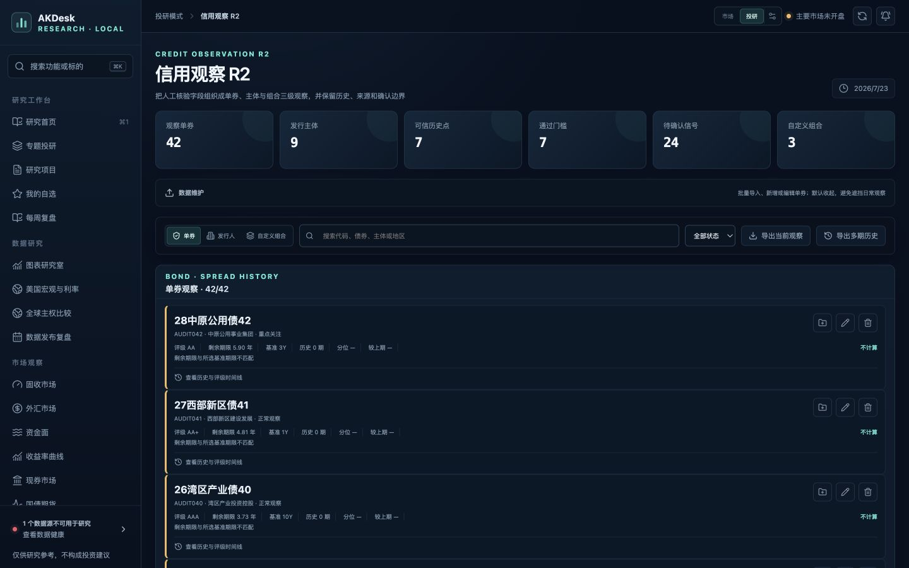
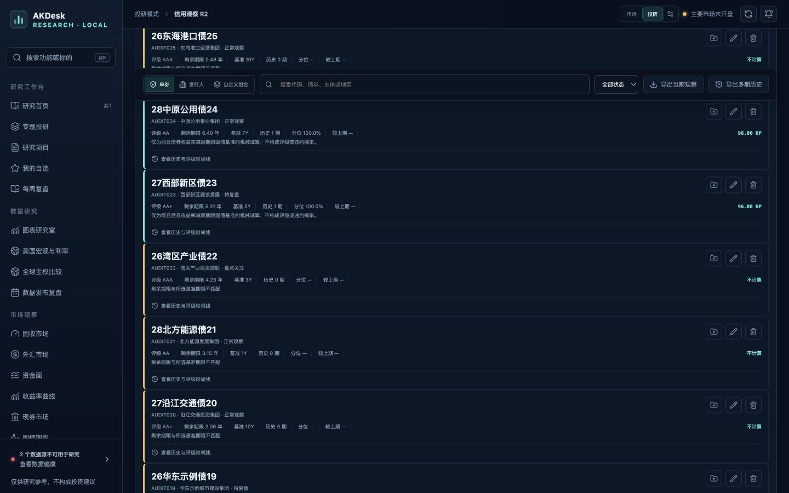
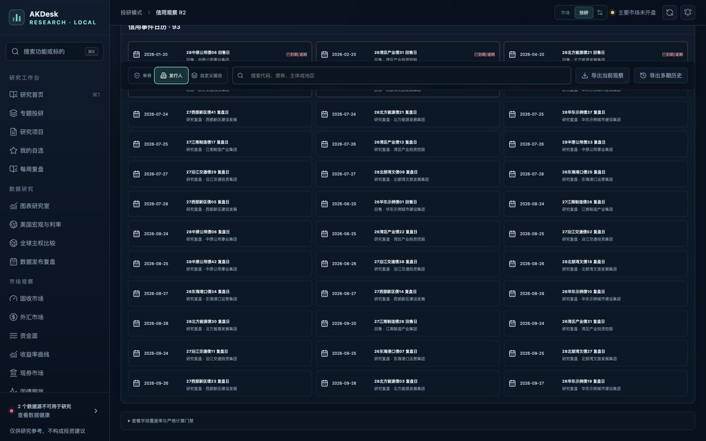
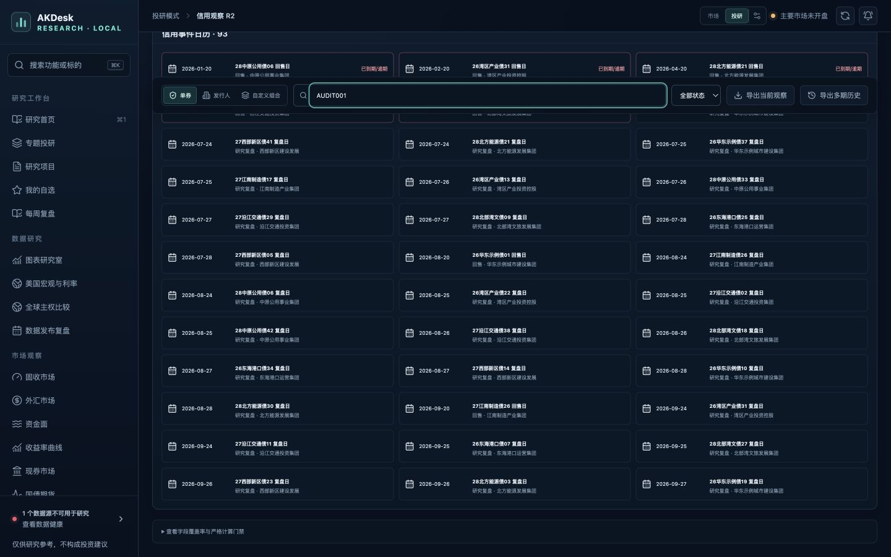
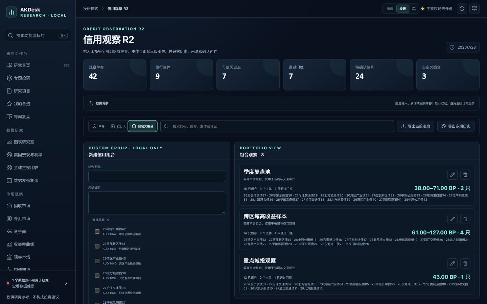
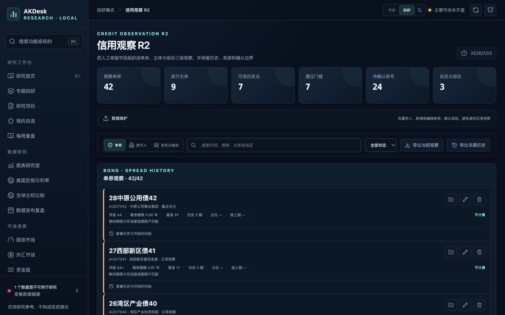

# AKDesk Fixed v0.12.1 信用观察 R2 整体评审

> 评审日期：2026-07-23  
> 评审版本：v0.12.1  
> 视口：1440×900、1280×800  
> 数据口径：正式库空状态 + 隔离审计库 42 只单券、9 个发行人、3 个组合、24 条信号、93 个日历事件  
> 结论：发现 2 项 P1 滚动缺陷、4 项 P2 体验或可访问性风险；本轮只评审，未修改产品代码

> 后续状态（2026-07-23）：上述修复范围已在 [v0.12.1.1「信用滚动修复版」](../../AKDesk-Fixed-v0.12.1.1-信用滚动修复版.md) 完成，并使用 42 / 100 / 500 只隔离数据重新回归；本文件以下内容继续保留为修复前证据。

## 总结

用户反馈属实，问题不只是滚动条样式。

信用观察 R2 将页面主体放在独立的 `.content` 滚动容器中，同时左侧导航和组合成员选择器也各自滚动。更关键的是，页签切换或筛选使内容突然变短时，主容器保留原来的 `scrollTop`，浏览器会把位置压到新页面底部。结果是用户已经切到“发行人”或输入了精确代码，却仍然只看到风险日历和页面尾部，看起来像筛选、页签或滚动失效。

## 主流程

| 步骤 | 检查内容 | 健康 |
| --- | --- | --- |
| 1 | 打开信用观察 R2，确认统计卡、数据维护、三级观察入口和空状态 | 健康 |
| 2 | 在 42 只单券的长列表中滚动，检查粘性工具栏 | 需修复 |
| 3 | 在长列表中段输入精确债券代码进行筛选 | 故障 |
| 4 | 在长列表中段切换到发行人视图 | 故障 |
| 5 | 检查自定义组合的 42 只成员选择和内部滚动 | 需优化 |
| 6 | 检查 1440×900、1280×800、控件命名、页签键盘行为和控制台 | 基本健康 |

## 截图证据

### 1. 有数据的单券首屏

统计、维护入口、筛选与单券列表层次清楚；1440×900 下没有横向溢出。但 42 只单券已经让主内容高度达到 8,039 px，而风险信号和信用日历位于全部单券之后。

### 2. 长列表中的粘性工具栏

工具栏可以保持可见，这是正确方向。当前 `top: 50px` 作用在已经位于顶部栏下方的主滚动容器内，使工具栏固定在视口约 124 px 处；上方留下内容穿过的空档，形成明显的遮挡和“漂浮”感。

### 3. 深处切换页签后的错位

操作前主容器位于单券列表中段。切换到“发行人”后，选中状态已经变化，但 `scrollTop` 被压到新页面最大值 2,163.5 px，发行人面板顶部位于视口上方约 1,744 px。用户实际看到的是日历而不是发行人主档。

### 4. 深处筛选后的错位

输入 `AUDIT001` 后，结果标题已经变为 `1/42`，但主容器停在新的页面底部 1,697 px，结果面板顶部位于视口上方约 1,277 px。筛选框和日历同时可见，唯一匹配结果不可见，容易被误判为筛选失败。

### 5. 组合成员的第三层滚动

组合成员字段集高度 300 px、内容高度 1,840 px，形成侧栏、主内容、成员列表三套滚动区域。内部滚动条在 macOS 默认样式下不明显，创建动作又位于成员列表之后，容易出现滚轮被成员列表捕获、页面不继续向下的感觉。

### 6. 1280×800 紧凑视口

紧凑视口没有出现横向页面溢出，筛选和导出控件仍可用，单券内容没有被裁断。

## 发现与优先级

### P1：页签切换不重置工作区滚动位置

- 触发：在长单券列表中向下滚动，再切换“发行人”或“自定义组合”；
- 结果：新页签内容已经渲染，但页面停在新内容的底部；
- 根因：`view` 改变只替换内容，没有把 `.content` 或新 `tabpanel` 对齐到工具栏下方；
- 建议：统一封装页签切换，在 DOM 更新后将新面板滚到粘性工具栏下方，并增加浏览器回归。

### P1：搜索与状态筛选保留失效的深滚动位置

- 触发：在长列表中段或底部输入查询、改变状态；
- 结果：结果数量变少，但用户看不到结果列表；
- 根因：筛选只更新 React 状态，没有处理内容高度收缩后的滚动位置；
- 建议：查询或状态变化时，将结果面板滚到可视区域；至少在当前滚动位置已经越过结果面板时执行复位。

### P2：粘性工具栏偏移量错误

- `.content` 已经从顶部栏下方开始，工具栏仍使用 `top: 50px`；
- 深滚动时工具栏固定在约 124 px，顶部留下会穿过内容的空档；
- 建议重新以主滚动容器为坐标系校准，避免重复计算顶部栏高度。

### P2：左侧导航和主内容的滚动归属不明确

- 1440×900 下侧栏导航为 671/966 px，主内容为 848/8,039 px；
- 指针位于侧栏时，侧栏从 31 px 滚到 295.5 px，主内容保持不动；
- 建议保留独立导航滚动，但提供持续可见的细滚动提示或顶部/底部渐隐，并评估把低频导航组折叠，减少滚动抢占。

### P2：单券列表没有分段加载

- 42 只单券已经形成约 8,039 px 的页面；导入接口单次允许 500 行；
- 风险信号和信用日历被放在无边界列表之后；
- 建议首屏显示 20 条并“加载更多”，或把风险信号、信用日历提升为独立工作区入口，不建议再新增内部列表滚动。

### P2：页签键盘模型不完整

- 三个 `role="tab"` 都是 `tabIndex=0`；
- `ArrowLeft/ArrowRight` 不改变焦点或选中项；
- 建议实现 roving tabindex、方向键切换、Home/End，并在切换后把新面板纳入清晰的焦点/滚动顺序。

## 已确认的优点

- 1440×900 与 1280×800 均无横向页面溢出；
- 粘性筛选工具栏让长列表中仍可搜索和切换视图；
- 表单标签、搜索框、筛选框和图标操作均有可识别名称；
- 发行人主档、机械利差门槛、人工确认和来源边界表达清楚；
- 浏览器控制台没有 error 或 warning；
- 信用后端与纯函数定向回归通过：后端 9 项、前端 4 项。

## 证据限制

- 正式研究库当前没有信用观察数据，长列表和交互问题在独立临时数据库中以结构化模拟数据复现，没有改写正式库；
- 本轮没有执行文件导入、删除、信号确认或研究项目创建等写入型产品操作；
- 截图和键盘检查不能证明完整 WCAG 合规，VoiceOver、放大模式和真实触控板惯性仍需要实机复核；
- 测试数据只用于布局、滚动和交互验证，不代表真实发行人、债券或信用判断。

## 建议的修复范围

建议以 `v0.12.1.1「信用滚动修复版」` 收口，不扩大业务范围：

1. 修复页签、搜索和状态筛选后的滚动复位；
2. 校准粘性工具栏的顶部偏移和遮挡；
3. 单券列表增加 20 条分段加载；
4. 组合成员增加搜索、已选筛选和粘性创建动作；
5. 补齐 ARIA 页签键盘模型；
6. 增加 42/100/500 只单券的滚动与性能回归。
