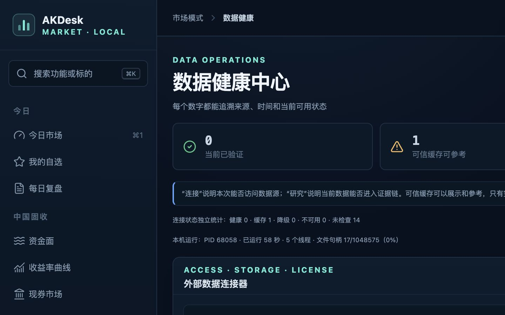

# AKDesk Fixed v0.12.1 整体评审

> 评审日期：2026-07-23  
> 评审版本：v0.12.1「GDELT 事件雷达」  
> 设备口径：MacBook Air 级别、1440×900 视口  
> 结论：通过，无 P0/P1 阻断问题

## 结论

v0.12.0 的统一连接器契约和 v0.12.1 的 GDELT 事件线索链路均已闭环。连接器页面能清楚区分访问、研究可用性、凭据、本地保存、许可和使用边界；事件雷达能够从专题按需读取元数据、明确标记“待核验线索”、加入证据篮，并从信用发行人入口回到唯一专题。

本轮发现三项 P2 体验问题并已在发布前修复：

1. 全局缺少键盘“跳到主要内容”入口：已增加只在聚焦时显示的 skip link，并让主内容容器可聚焦；
2. GDELT 时间采用浏览器本地时区但缺少明确口径：已增加“本机”标记；
3. 专题证据篮空状态只列举旧来源、没有提到事件雷达：已补充事件雷达入口。

## 主流程

| 步骤 | 检查内容 | 健康 |
| --- | --- | --- |
| 1 | 打开数据健康中心，查看四个统一连接器的访问、缓存、许可和研究边界 | 健康 |
| 2 | 打开发行人事件专题，读取 30 天 GDELT 元数据缓存 | 健康 |
| 3 | 查看标题、来源、国家、语言、本机时间和“待核验”说明 | 健康 |
| 4 | 将一条线索加入当前专题证据篮 | 健康 |
| 5 | 确认线索未直接进入项目时间线，必须选择项目后提交 | 健康 |
| 6 | 从信用观察发行人视图打开事件观察，复用同一专题 | 健康 |
| 7 | 检查 1440×900 无横向页面溢出、关键按钮可访问名称和焦点样式 | 健康 |

## 截图证据

### 1. 统一连接器总览

连接器卡片与逐适配器运行状态并存，用户可以先理解提供方级的数据契约，再进入单源诊断。

### 2. 事件雷达加入证据篮

页面在操作后明确提示“提交到项目后才会进入研究时间线”，没有把媒体标题直接包装成研究证据。

## 代码与数据检查

- 后端：125 项测试通过；
- 前端：16 个测试文件、52 项测试通过；
- Ruff：通过；
- ESLint：通过；
- TypeScript：通过；
- Vite 生产构建：通过；
- 正式 SQLite：`quick_check=ok`；
- 正式 schema：1201；
- 升级前备份：`data/backups/before-v0.12.1-20260723.db`，`quick_check=ok`，schema 1100；
- 连接器接口不返回 API Key 明文；
- 仓库未写入用户 FRED Key；
- GDELT 缓存存在 512 KB 单查询上限，正文不落盘；
- 查询、天数、返回数量、排序、URL scheme 和专题组件配置均有后端校验。

## UX、视觉与可访问性

### 已修复

- P2：键盘用户需要逐个经过侧栏才能到主内容。增加“跳到主要内容”。
- P2：GDELT 时间使用浏览器本地时区但缺少口径。显示为“本机时间”。
- P2：证据篮空状态没有提示可从事件雷达收集。已补齐。

### 保留观察项

- GDELT 来源国家和语言目前保留上游英文标签；不影响操作，但后续可增加本地化映射。
- 事件列表在非常窄的移动视口会变为两行操作布局；本版主要验收目标仍是 MacBook Air。
- 连接器卡片展示“最近成功”只统计当前进程成功请求；重启后即使缓存存在也可能显示为空，这一口径与“缓存记录”并列，不构成错误。

## 证据限制

- 当前网络对 GDELT 公共 DOC API 返回了频率限制提示，因此视觉主流程使用隔离数据库中的结构化模拟元数据，远端异常路径由自动测试和真实限流响应共同验证；
- 没有用模拟数据宣称实时新闻内容正确，只验证接口解析、缓存、降级、界面和研究边界；
- FRED 在隔离测试中只读取 Key 的“已配置”状态，没有输出、复制或重新写入 Key；
- 外部原文链接没有在审计中作为事实来源使用。

## 发布判断

可以发布 v0.12.1。当前版本适合个人在 MacBook Air 上按需进行事件发现和研究归档，不适合高频新闻监控、自动舆情评分、机构合规留痕或媒体内容再分发。
