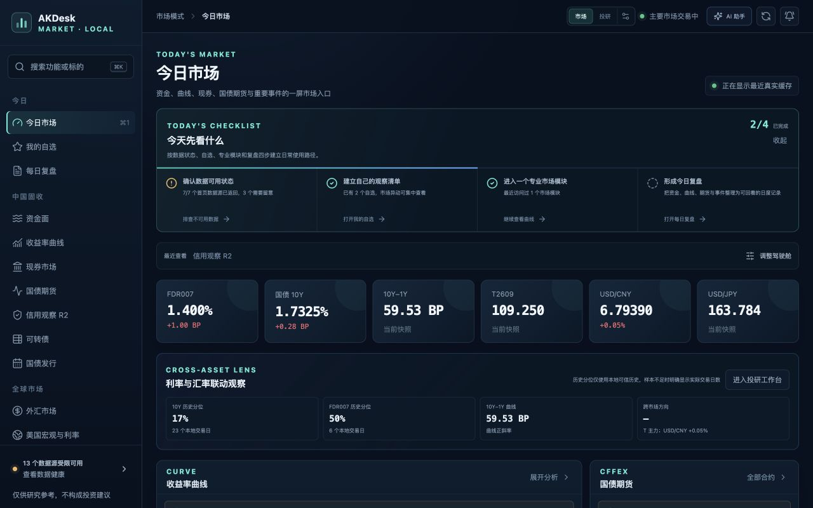

# AKDesk Fixed v0.13.0.1 整体体验与 AI 助手审查

> 审查日期：2026-07-24  
> 视口：1280×800（MacBook Air 紧凑场景）  
> 范围：市场首页、AI 助手入口、真实问答、长回答、服务断开与恢复  
> 模式：UX 与可访问性联合审查

## 总体结论

市场首页、数据可信状态与 AI 外发确认的产品结构是健康的；本轮发现并修复三个会直接影响任务完成的问题：本地服务停止时只显示 `Failed to fetch`、AI 请求没有可靠的总时限、长回答返回后被卡片裁切。

v0.13.0.1 修复后，真实 AIHubMix 问答可以完成，回答进入抽屉内部滚动，本地服务断开时提供明确恢复步骤和重试按钮。

## 审查步骤

### Step 1：进入市场首页 — 健康

- 优点：模式、市场状态、可信数据状态、起步清单和核心指标层级明确；
- 风险：左侧模块很多，第一次使用仍可能产生选择压力；
- 可访问性：结构化标题、导航和跳到主要内容入口存在；但弱化文字普遍偏小。

### Step 2：打开已配置 AI 助手 — 健康

- 优点：模型、提供方、验证状态、隐私边界、场景和外发预览集中呈现；
- 风险：说明文字和辅助链接字号偏小；
- 可访问性：抽屉具有对话框语义，场景具有页签语义，问题和复选框有明确标签。

### Step 3：提交真实问答 — 修复前不健康

- 回答已经由 AIHubMix 返回，但回答卡片被压缩到约 93 px；
- 正文高度约 378 px，父卡片使用隐藏溢出，用户只能看到开头；
- 模型的 Markdown 标记以原始符号显示。

### Step 4：查看修复后的完整回答 — 健康

- AI 抽屉内容高度按正文自然展开；
- 抽屉内容区形成 1226 px 可滚动内容，回答卡片完整高度约 581 px；
- 正文字号提升到 11 px；
- 加粗、标题、编号、项目符号、行内代码、分隔线和引用采用安全 React 节点呈现。

### Step 5：本地服务断开与恢复 — 健康

- 不再显示英文 `Failed to fetch`；
- 明确说明 macOS 启动窗口需要保持运行；
- 提供重新启动 `start-macos.command` 的操作说明；
- 服务恢复后，“重新连接本地服务”可以直接恢复 AI 助手，不需要重新输入 Key。

## 仍然存在的体验风险

1. 全局字号偏小：侧栏、元信息和说明文字多处为 8–10 px，在缩放、弱视或高密度屏幕下存在阅读压力。
2. 导航密度高：双入口改善了首页选择，但左侧仍同时展示大量市场和投研模块。
3. 本地服务生命周期依赖启动窗口：关闭启动器窗口会停止服务；本版本提供恢复说明，但还不是托盘常驻或登录项体验。
4. 首页纵向成本较高：驾驶舱、曲线、期货、现券、事件和外汇连续排列，适合专业用户，但轻量用户仍需要进一步个性化折叠。

## 后续建议

- v0.13.1：全局本地服务在线状态、30 秒心跳和顶部断线提示；
- v0.14：字号与对比度基线校准、紧凑 / 舒适密度切换；
- 后续桌面化：可选菜单栏常驻服务、启动与停止状态管理。

## 证据边界

- 已检查 1280×800 实际渲染、真实 AIHubMix 问答、服务断开恢复、DOM 语义、横向溢出和浏览器控制台；
- 没有在本轮对 VoiceOver、200% 浏览器缩放或全部键盘路径做完整审查，因此不宣称符合完整 WCAG；
- 没有对所有二级、三级市场和投研页面逐屏截图，本报告的整体判断以市场首页与 AI 主任务为核心。
