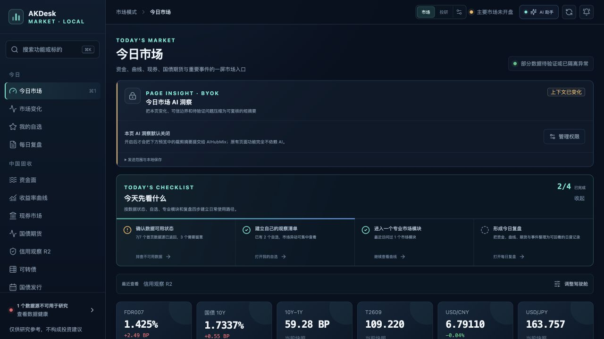
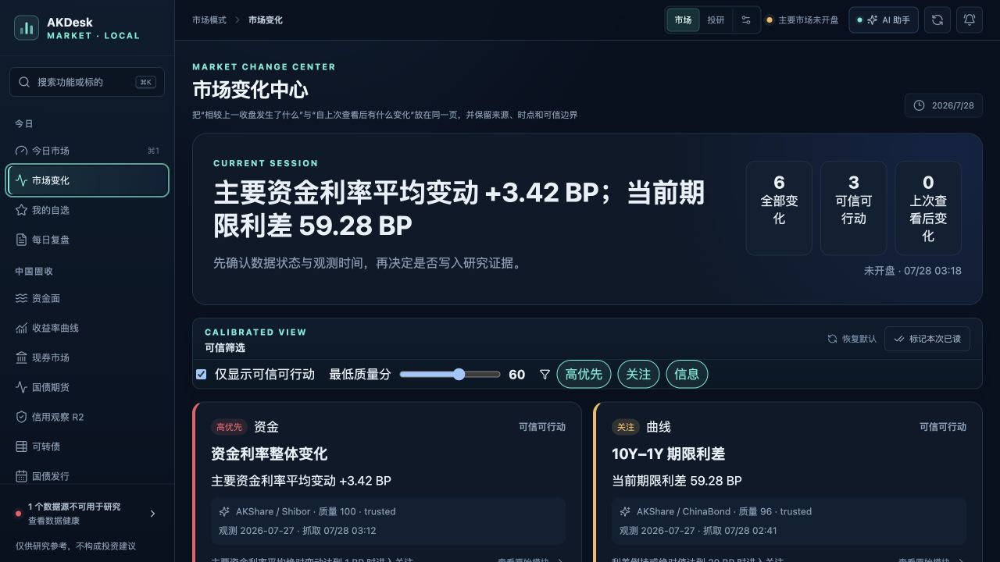
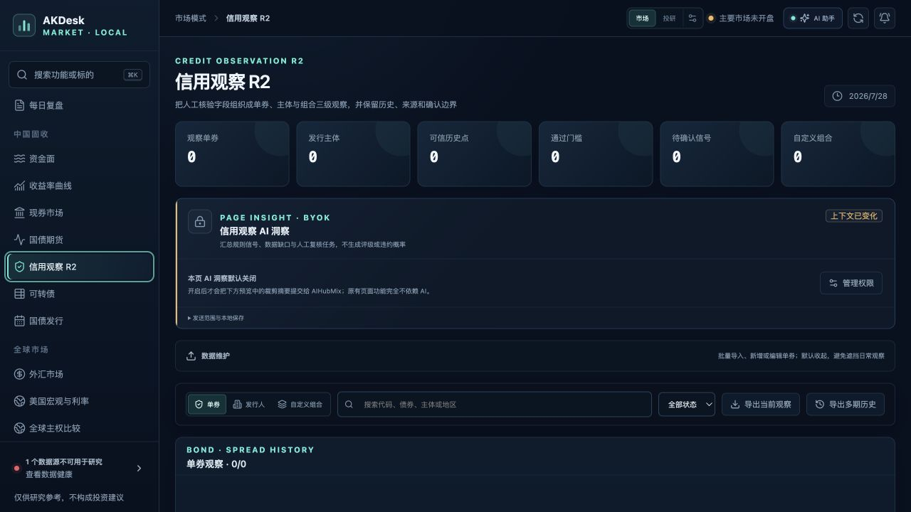
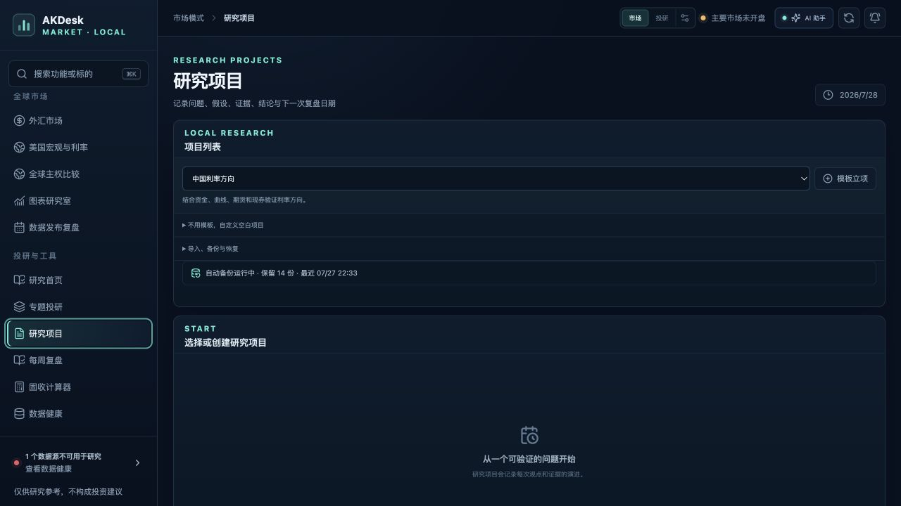
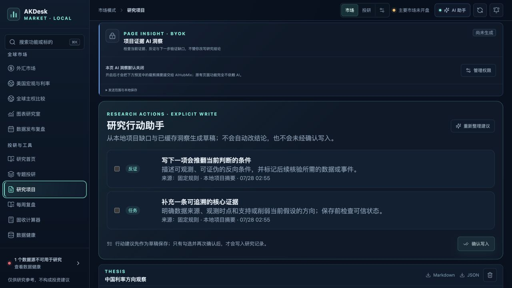
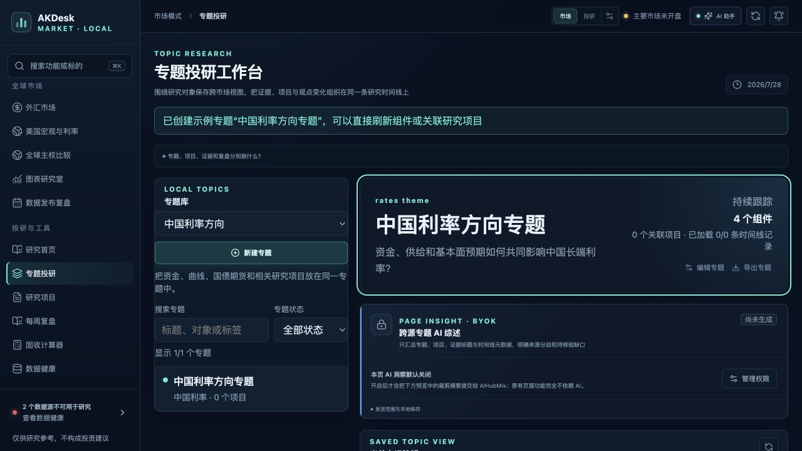
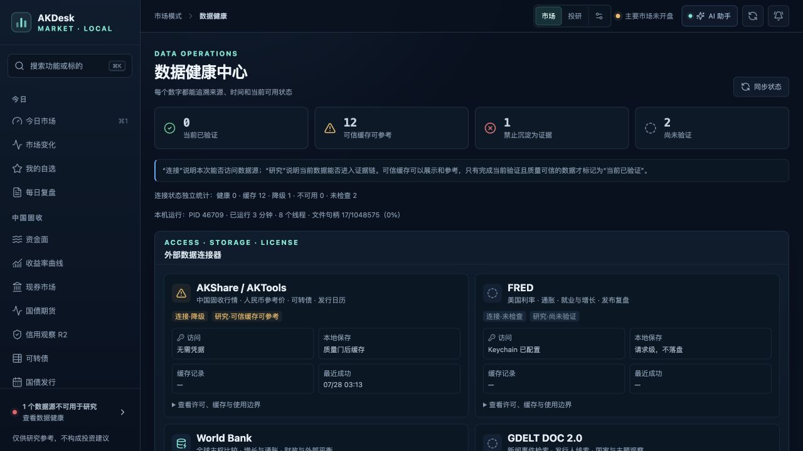
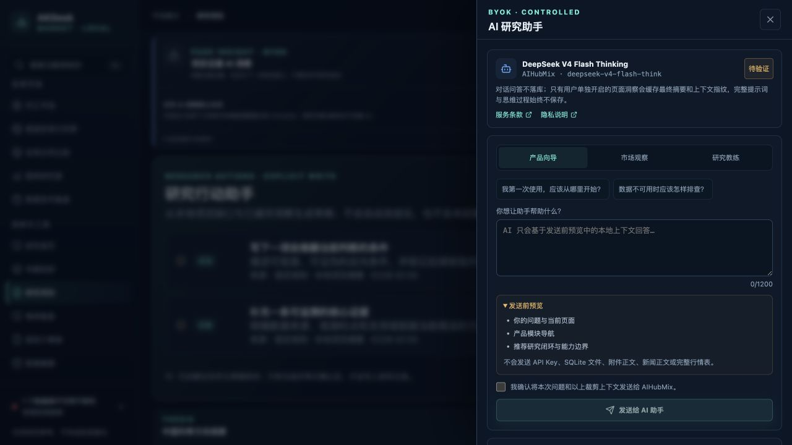
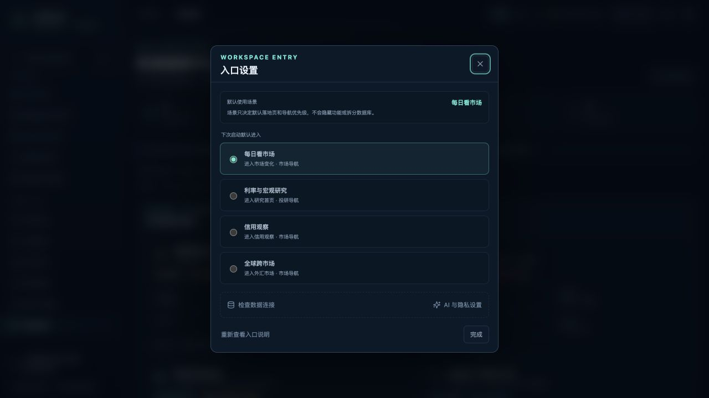

# AKDesk Fixed v0.18.0 详细复核与修复报告

> 日期：2026-07-28  
> 环境：macOS，1440×900 MacBook Air 目标视口，本地 FastAPI + 生产前端构建  
> 范围：市场、信用、研究、AI、外部数据连接、持久化、迁移、安全边界、构建与文档  
> 结论：发现 4 类可复现问题，均已修复；未发现阻断个人本地使用的遗留缺陷

> 后续状态：根据用户在实际浏览器中的四张截图，又完成了 [1408×707 界面细节复核与修复](../v0.18.0-ui-polish-20260728/REVIEW.md)，处理标题换行、零值字形、提示框宽度、外汇说明卡拉伸和发行事件贴边问题。

## 一、发布判断

v0.18.0 当前可以继续作为“低门槛交付版”使用。核心读流程、研究写入边界、AI 显式授权、数据可信状态和本地数据库均工作正常。详细复核不是只做静态检查：关键页面已在生产构建上逐页操作、截图复拍，临时研究数据通过正式 API 清理后又完成全量回归。

外部数据当前状态不等于应用故障。检查发生在主要市场未开盘时段，AKShare 个别端点出现降级或使用可信缓存、FRED 尚未完成本次连接验证、GDELT 尚未按需查询，界面均如实区分“连接状态”和“研究可用性”，没有把缓存或演示数据伪装为实时数据。

## 二、发现并修复的问题

| 编号 | 严重度 | 问题 | 修复与防回归 |
| --- | --- | --- | --- |
| F-01 | 高 | 样式表引用了 7 个未定义的 CSS 自定义属性，市场变化卡片、研究行动卡片等区域会丢失背景、边框或状态色 | 补齐与现有设计系统一致的令牌别名；新增 `frontend/scripts/check-css-vars.mjs` 并接入 `npm run lint` |
| F-02 | 中 | 未知 `/api/*` 请求会落入 SPA 兜底并返回 HTML 200，调用方可能把页面内容误当 API 响应 | API 前缀在 SPA 兜底前统一返回 JSON 404；后端测试覆盖状态码、内容类型和错误信息 |
| F-03 | 中 | 重复点击当前导航仍会 `pushState`，浏览器历史可能累积重复条目 | 只有目标 hash 变化时才写入历史；原有前进 / 后退同步逻辑保持不变 |
| F-04 | 中 | 入口设置、数据健康和 AI 区域的部分辅助文字、状态文字与控件偏小，弱对比信息读取吃力 | 提高关键文本字号、弱文本对比度和主要控件高度；修复后按相同视口复拍 |

兼容性方面，4 处 `color-mix()` 已替换为等价的透明色表达，减少较旧 Safari 版本丢失颜色的风险。

## 三、逐步体验审计

### 1. 今日市场与全局导航

健康度：良好。

市场 / 投研模式、主要市场时段、AI、刷新、提醒和侧栏分组保持清楚；页面具备“跳到主要内容”入口。当前页面重复导航不再写入重复历史。

### 2. 市场变化中心

健康度：良好，已修复。

信号摘要、可信筛选、质量阈值、优先级、来源、观测时点和返回原始模块的路径完整。样式令牌修复后，可信筛选和变化卡片的背景、边框与状态色恢复。

### 3. 信用观察 R2

健康度：良好。

空状态直接解释如何导入、如何试算和可信门禁；单券、发行人、组合、日历和人工确认仍保持“观察优先、维护后置”。本轮没有发现滚动回归。

### 4. 研究项目空状态与立项

健康度：良好。

模板立项优先，自定义项目和导入 / 恢复渐进展开；空状态没有制造默认研究资产。审计项目只用于验证行动建议，最终已通过正式 API 删除。

### 5. 研究行动助手

健康度：良好，已修复。

草稿与正式研究记录分离，默认不会改写结论；只有勾选后才可确认写入。每条建议展示来源和生成依据。样式修复后两张行动卡片的层级、边界和标签可读。

### 6. 专题投研与 AI 综述

健康度：良好。

专题综述默认关闭，页面明确说明标题级发送范围、不发送研究记录正文和新闻正文。专题、项目、证据篮与时间线关系可理解。

### 7. 数据健康中心

健康度：良好，已修复。

当前验证、可信缓存、禁止作为证据和尚未验证分开计数；AKShare、FRED、World Bank 和 GDELT 的凭据、缓存、许可及研究边界统一展示。修复后辅助说明和连接器元数据更易读。

### 8. AI 研究助手

健康度：良好，已修复。

模型、提供方、验证状态、服务条款、发送前预览、显式确认与预算设置均可访问；对话默认不落库，页面洞察默认关闭。抽屉打开和关闭正常，修复后说明文字、场景页签和输入区更易读。

### 9. 入口设置

健康度：良好，已修复。

四类默认场景、市场 / 投研关系和数据 / AI 设置入口集中呈现。焦点陷阱实测正常：首尾焦点可在弹层内循环，关闭后不会留下活动对话框。

## 四、代码、数据与安全复核

| 领域 | 复核结果 |
| --- | --- |
| API 路由 | 已抽查健康、连接器、AI 状态和未知 API；未知 API 现返回 JSON 404 |
| 静态资源 | 路径经解析并限制在构建目录内，未知非 API 路由继续由 SPA 处理 |
| AI 密钥 | 只返回“是否配置”和来源；Keychain 写入使用标准输入，不进入命令行参数 |
| AI 最小化 | 项目与专题上下文只发送完成任务所需的裁剪摘要，不发送数据库、Key、新闻正文、附件正文或完整行情表 |
| AI 写入 | 对话不落库；页面洞察只缓存最终摘要和指纹；研究行动必须显式选择与确认 |
| 研究行动 | 事务级检查项目归属、重复采纳与重复撤销，正式写入可撤销 |
| 数据库 | schema 1600，`quick_check = ok`，外键 0 异常 |
| 审计数据 | 最终 `projects = 0`、`topics = 0`、`research_action_drafts = 0` |
| 浏览器 | 关键流程控制台 0 条 warning / error；未发现重复 ID、标题层级跳跃或缺失图片替代文本 |
| 凭据扫描 | 排除依赖缓存、测试假值和数据库后，生产项目文件未发现 FRED / AIHubMix 凭据模式 |

## 五、自动化回归结果

| 检查项 | 结果 |
| --- | --- |
| 后端测试 | 142 项通过 |
| Ruff | 通过 |
| 前端测试 | 22 个文件、70 项通过 |
| ESLint | 通过，0 warning |
| CSS 自定义属性 | 24 个引用全部有定义 |
| TypeScript | 通过 |
| Vite 生产构建 | 通过 |
| Python 依赖 | `pip check` 通过 |
| npm 生产依赖 | 官方 registry，0 个漏洞 |
| Markdown 本地链接 | 通过 |
| 服务健康 | `status = ok`，`version = 0.18.0` |

后端仍有 1 条来自 Starlette `TestClient` 与 httpx 兼容层的上游弃用警告，不影响应用运行或测试结论。

## 六、仍需持续观察的风险

1. 本轮完成键盘焦点、语义和关键尺寸检查，但没有声称完成全量 WCAG、VoiceOver 或 200% 缩放认证；
2. AKShare、FRED、World Bank、GDELT 和 AIHubMix 的可用性受网络、额度、许可与上游接口变化影响，应继续依赖数据健康、缓存和显式降级，而不是承诺持续实时；
3. 前端主包和图表包约 508 KB / 540 KB（压缩前），当前 MacBook Air 本地运行可接受，后续大版本可继续按页面拆包；
4. 个人本地研究是当前产品边界，生产交易、正式评级、估值入账、多人权限和机构级审计不在 v0.18.0 承诺范围内。

## 七、最终结论

所有本轮确认的问题均已修复并通过回归。v0.18.0 没有已知阻断项，可继续用于个人本地市场观察、固收研究、信用观察和跨市场专题工作。
