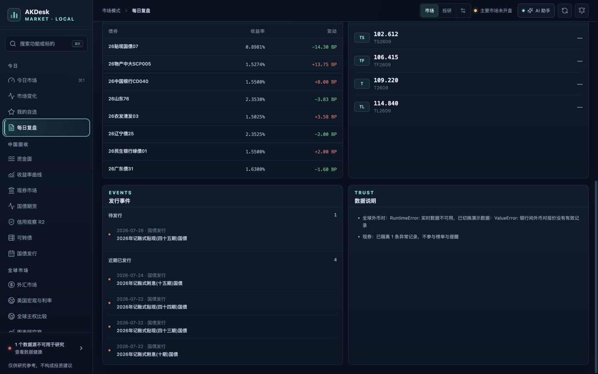
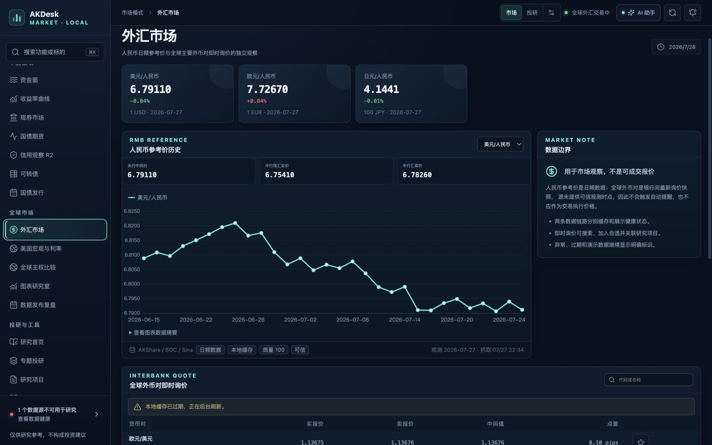
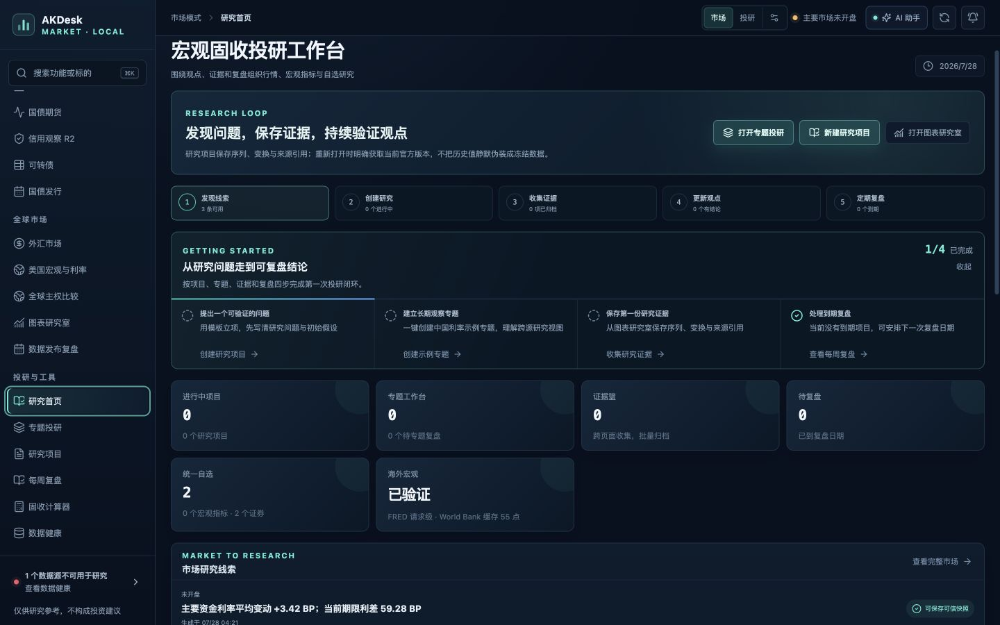
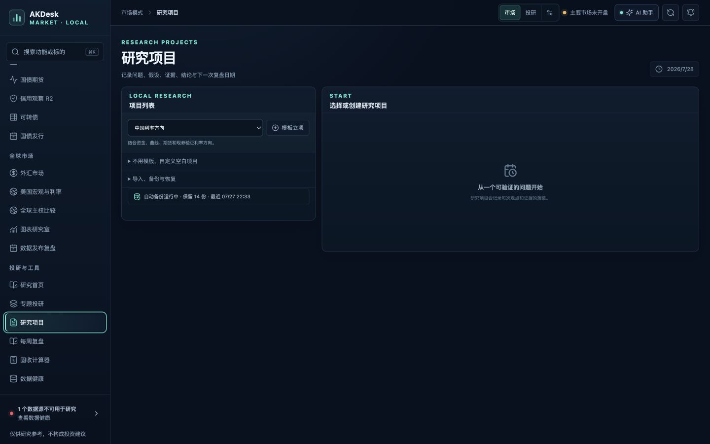
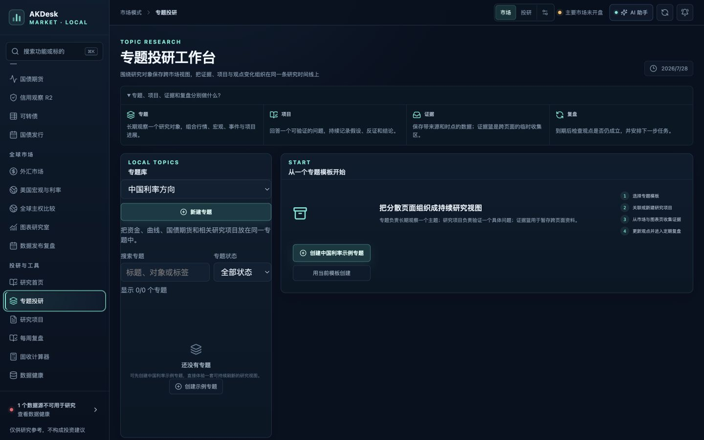
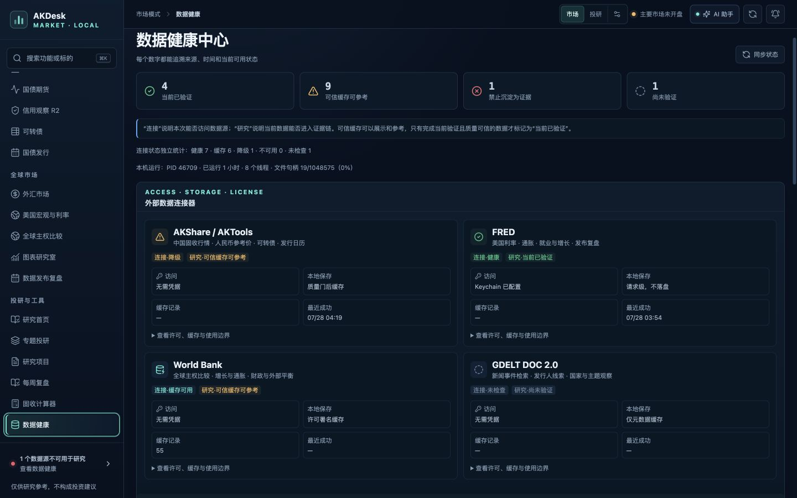
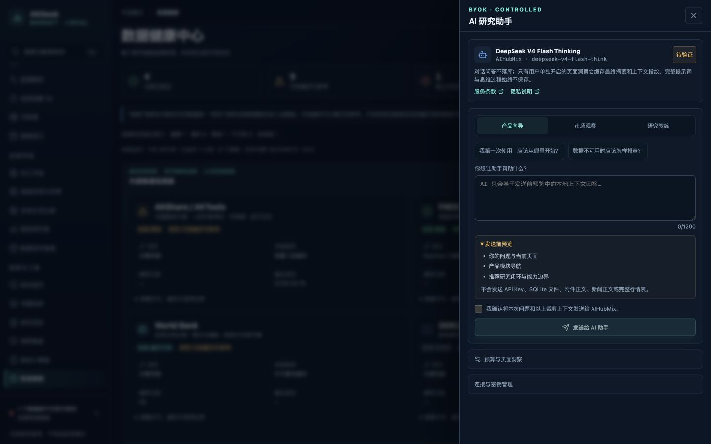
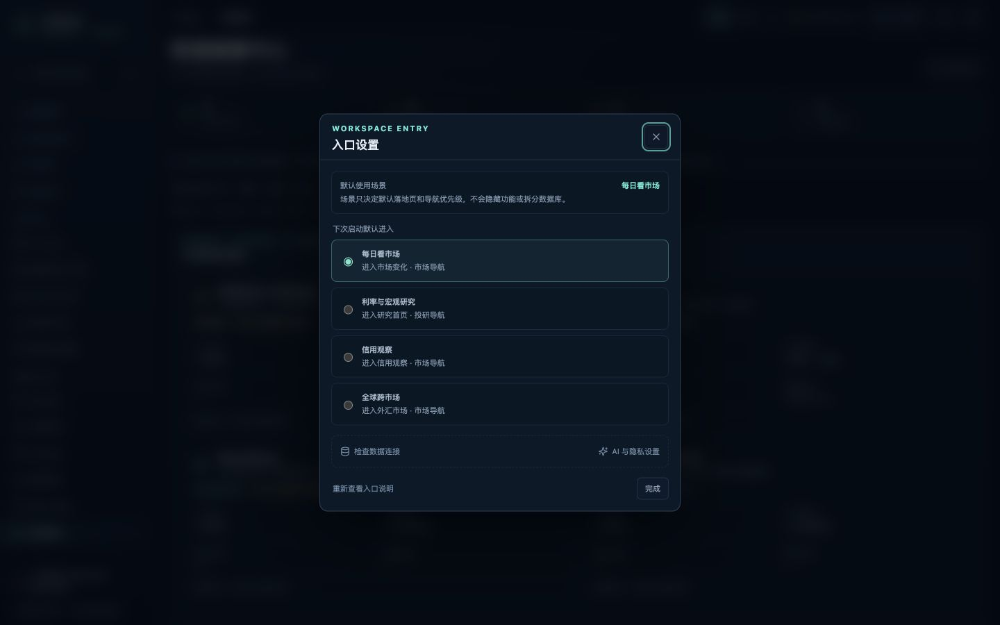

# AKDesk Fixed v0.18.0 发布就绪复核

> 日期：2026-07-28  
> 环境：macOS，1440×900 MacBook Air 目标视口，本地 FastAPI + 生产前端构建  
> 范围：市场、研究、信用、AI、外部连接、启动、持久化、备份、历史迁移、依赖、安全与文档  
> 结论：v0.18.0 没有发现新的阻断性功能缺陷；后续确认的跨终端停止入口缺失已经修复。可以进入 v1.0 候选版，但还不应直接把当前构建改名为 v1.0.0 正式版

## 一、发布判断

v0.18.0 已达到“个人本地宏观固收行情与投研工作台”的功能完整线：市场与投研双入口、四类任务场景、可信数据状态、研究项目与专题、信用观察、FRED / World Bank / GDELT 边界、BYOK AI、备份恢复和降级路径已经形成闭环。

本轮重新执行生产构建、全量测试、正式数据库检查、历史备份迁移、运行时与端口检查，并在真实服务上复拍 9 个界面状态。没有发现需要继续留在 0.x 通过新增功能解决的产品缺口。

当前离 v1.0 的差距集中在发布工程，而不是再增加业务模块：需要把全新 Mac 安装、可复现依赖、干净发布包、长稳故障演练、辅助功能冒烟和第三方声明做成正式门禁。

### 后续服务启停修复

发布复核后进一步确认：`Control+C` 只能终止当前终端的前台进程；当服务由其他终端、IDE 或 Codex 会话启动时，在另一个窗口按键不会送达服务。当前版本已新增 `stop-macos.command`，停止器会先通过 `/api/v1/info` 核验应用名称和版本，再向 8765 监听进程发送正常终止信号。实际验证中，独立停止器的 `SIGTERM` 和等价于 `Control+C` 的 `SIGINT` 均能完成优雅退出，随后可由 macOS Terminal 正常重启。

## 二、逐步体验审计

### 1. 市场变化中心

健康度：良好。

摘要、三项计数、可信筛选、质量阈值、优先级、来源、观测时间与原始模块入口均可读。此前的标题换行和指标断字问题没有回归。

### 2. 每日复盘与发行事件

健康度：良好。

收益率异动、期货、发行事件与数据说明可以连续滚动；发行分组标题、计数、圆点和正文保持同一内容轴。报告中的降级说明对应生成时的数据状态，不会被包装成实时结论。

### 3. 外汇市场

健康度：良好。

人民币日频参考价、历史图表、全球外币对与数据边界分区清楚。说明卡保持内容高度；过期缓存、部分可用、无可信观测时点和不可作为成交报价的边界均有明确提示。

### 4. 研究首页

健康度：良好。

五步研究闭环、首次使用引导、市场线索、可信快照门禁、项目 / 专题 / 证据篮与数据准备度关系清楚。低质量或缺少可信观测时点的线索不可直接保存为证据。

### 5. 研究项目空状态与备份入口

健康度：良好。

模板立项优先，自定义项目和导入 / 备份 / 恢复保持渐进展开。正式库没有审计产生的临时研究项目；自动备份状态正常。

### 6. 专题投研空状态

健康度：良好。

专题、项目、证据和复盘的职责在首屏解释清楚；模板、搜索、状态筛选和首次创建路径完整。本轮没有创建演示专题或污染正式研究库。

### 7. 数据健康中心

健康度：良好。

连接状态和研究可用性继续分开表达。检查时 AKShare / AKTools 有降级但可信缓存可参考，FRED 已验证，World Bank 使用许可署名缓存，GDELT 尚未按需验证；这些状态不是应用故障。

### 8. AI 研究助手

健康度：良好。

Keychain 配置状态、模型、服务条款、发送前预览、显式确认、预算和页面洞察入口均可访问。服务重启后显示“待验证”而不是伪装为可用；本轮没有发起产生第三方调用或费用的问答。

### 9. 四类入口设置

健康度：良好。

每日看市场、利率与宏观研究、信用观察和全球跨市场四种默认场景均可辨识；弹层说明场景只改变落地页和导航优先级，不拆分数据。

## 三、代码、数据、持久化与安全

| 检查项 | 结果 |
| --- | --- |
| 本地监听 | 只监听 `127.0.0.1:8765` |
| 运行时 | 连续运行超过 1 小时，RSS 约 24 MB，8 个线程，文件句柄约 17 个 |
| API 兜底 | 未知 `/api/*` 返回 JSON 404，不返回 SPA HTML |
| 正式数据库 | schema 1600，`quick_check = ok`，外键 0 异常 |
| 正式研究资产 | 项目 0、专题 0、研究记录 0、研究证据 0；本轮未写入审计数据 |
| 备份 | 15 份现有 `.db` 快照逐一 `quick_check = ok`；自动备份线程运行中、最近错误为空 |
| 历史迁移 | schema 701、800、900、1100、1201、1301 的真实历史备份副本均迁移到 1600，完整性和外键检查通过 |
| 密钥 | API 只返回配置状态；排除依赖、缓存、数据库与审计截图后，生产项目文件未发现 FRED / AIHubMix Key |
| 启停脚本 | `start-macos.command`、`start-macos-demo.command`、`stop-macos.command` 均可执行，`zsh -n` 通过；`SIGTERM` / `SIGINT` 实测可优雅退出 |
| 浏览器结构 | 1440×900 无横向溢出、重复 ID 或破图；入口设置打开时只有一个活动对话框 |

正式库还包含 8,484 个市场历史点、55 个 World Bank 观测点、2 个统一自选、7 份日报和 2 条本地 AI 最终摘要。FRED 观测值仍未写入 SQLite，GDELT 新闻正文仍未保存。

## 四、自动化回归

| 检查项 | 结果 |
| --- | --- |
| 后端测试 | 142 项通过 |
| Ruff | 通过 |
| Python 依赖 | `pip check` 通过 |
| 前端测试 | 22 个文件、70 项通过 |
| ESLint | 通过，0 warning |
| CSS 设计令牌 | 24 个引用全部有定义 |
| TypeScript | 通过 |
| Vite 生产构建 | 通过 |
| npm 生产依赖审计 | 官方 registry，0 个漏洞 |
| SQLite 备份检查 | 15 / 15 通过 |
| 历史迁移矩阵 | 7 / 7 通过 |

后端仍有 1 条来自 Starlette `TestClient` 与 httpx 兼容层的上游弃用警告，不影响应用运行或测试结论，但应在 v1.0 候选版更新测试栈时消除。

## 五、当前无遗留阻断缺陷，但仍不是 v1.0 正式版的原因

1. 当前开发目录约 800 MB，其中 `.venv`、`node_modules` 和 npm 缓存约占 753 MB；虽然均不属于运行时产品数据，但还没有自动生成并验证“排除依赖缓存、历史备份和用户数据库”的干净发布包。
2. 前端已有 `package-lock.json`，Python 生产依赖仍以范围约束为主；v1.0 需要可复现的精确锁定文件和升级策略。
3. 历史迁移已用真实备份验证，但尚未形成自动化的发行门禁脚本。
4. 本轮服务运行超过 1 小时且资源稳定，但没有据此声称完成 8 小时 / 24 小时长稳与连续上游故障演练。
5. 本轮完成键盘结构、弹层、破图和目标视口检查，但没有声称完成完整 VoiceOver、200% 缩放或 WCAG 认证。
6. 项目已有 MIT License 和数据源边界说明，但还缺少随发布包交付的第三方依赖声明、SBOM 或等价清单。
7. `.command` 已经适合当前个人本地使用；如果 v1.0 面向非技术用户公开分发，签名 / 公证的 macOS `.app` 应作为正式版门槛，而不是继续让用户处理 Gatekeeper 和 Python 安装。

## 六、最终结论

v0.18.0 本轮复核通过；跨终端停止入口已经补齐并实测，没有遗留的 P0 / P1 / P2 功能缺陷。下一步可以做 v1.0，但应先进入 `v1.0.0-rc.1` 发布工程周期，不再叠加新的行情源、AI 场景或研究模块。

具体门禁与版本拆分见 [v1.0 发布就绪评估与规划](../../AKDesk-Fixed-v1.0-发布就绪评估与规划.md)。
