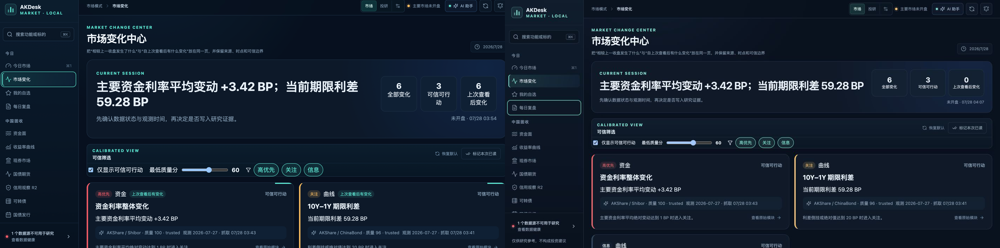
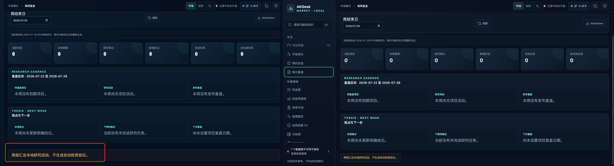
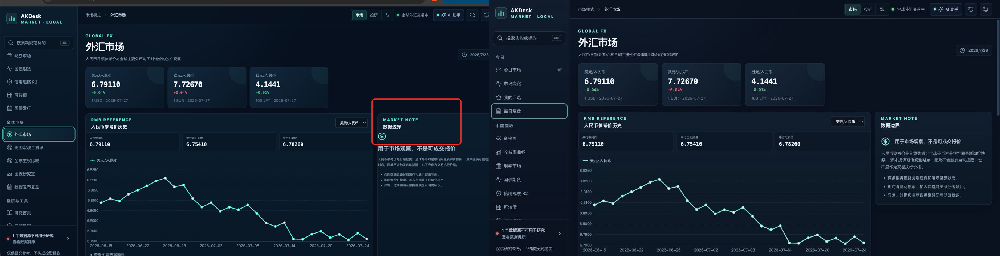
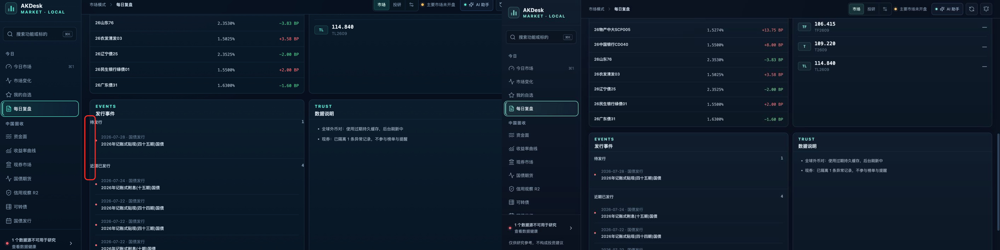

# AKDesk Fixed v0.18.0 界面细节复核

> 日期：2026-07-28  
> 依据：用户提供的 4 张实际运行截图  
> 验证视口：1408×707 与 1440×900  
> 结论：4 处显示与字体问题均已修复

## 1. 市场变化主摘要

健康度：已修复。

原布局让摘要标题占比过大，同时三项指标沿用默认正文字号，导致“可信可行动”和“上次查看后变化”断成三行。现在主摘要与指标使用更合理的宽度比例，标题降低最大字号与字重，指标标签保持单行；1040 px 以下会切换为单列。

## 2. 每周复盘零值与底部声明

健康度：已修复。

周报计数原来使用 SF Mono 的斜线零，在连续零值场景下容易被看成异常字符；底部声明又被拉伸为整行。现在周报计数使用系统数字字形，声明按内容宽度呈现，同时保留最大宽度和小屏换行。

## 3. 外汇数据边界卡

健康度：已修复。

说明卡原来与左侧图表处于同一网格行并被默认拉伸，内部图标也单独占一行，造成明显空白和断裂。现在网格从顶部对齐，说明卡保持内容高度，图标与核心结论同行，正文与列表具有一致内边距。

## 4. 每日复盘发行事件

健康度：已修复。

事件条目有内边距，但分组标题直接贴在面板左边界，标题、计数和圆点不在同一内容轴线上。现在每个分组统一负责水平内边距，事件列表取消重复缩进，两个分组的标题、计数、圆点和文本对齐。

## 回归结果

- 前端 22 个测试文件、70 项测试通过；
- ESLint、CSS 自定义属性检查、TypeScript 和 Vite 生产构建通过；
- 1408×707 和 1440×900 均无新增横向溢出；
- 四个页面的浏览器控制台均无 warning / error；
- 只调整展示和页面 class，没有改动接口、业务数据或 SQLite schema。

## 验证边界

本轮针对截图暴露的视觉问题和相同视口完成验证，没有据此声称完整 WCAG、VoiceOver 或所有浏览器缩放比例均已认证。
