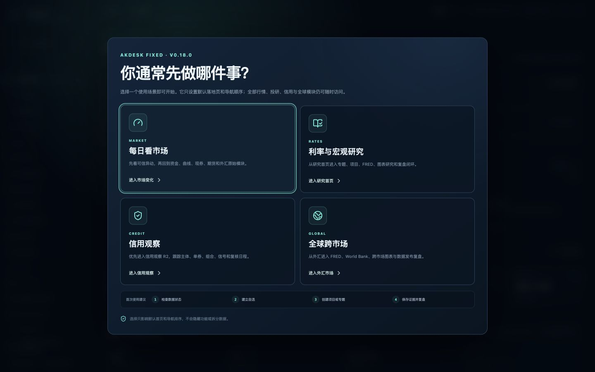
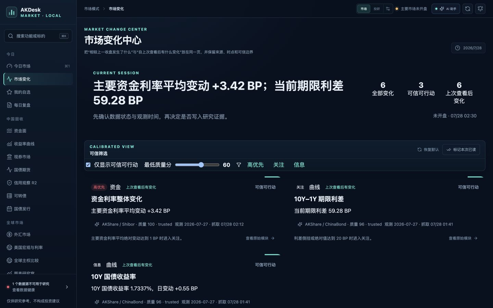
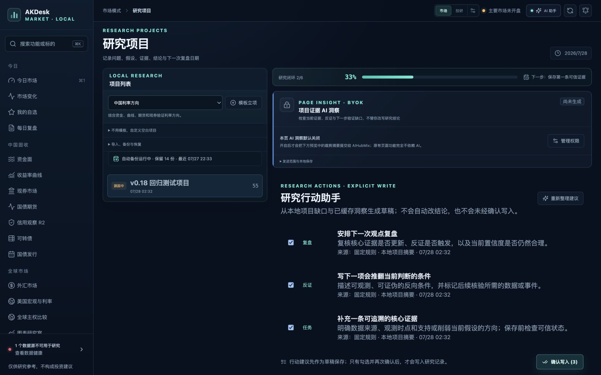
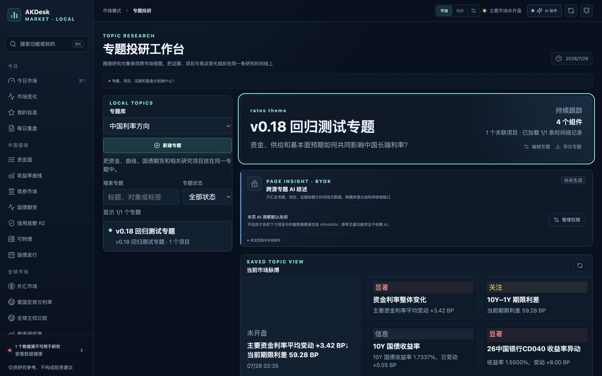
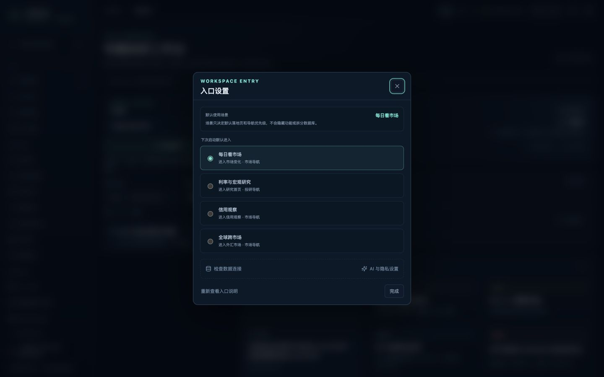

# AKDesk Fixed v0.18.0 最终评审

> 评审日期：2026-07-28  
> 环境：macOS，1440×900 浏览器视口，本地 FastAPI + 生产前端构建  
> 范围：v0.14.1 → v0.18.0 的功能、交互、数据、构建与回归

> 后续状态：同日完成了覆盖更多页面、API 兜底和样式令牌的 [详细复核](../v0.18.0-detailed-20260728/REVIEW.md)。复核发现的 4 类问题均已修复，以下封板结论仍然成立。

## 结论

v0.18.0 达到“低门槛交付版”的封板条件。六个版本的功能已经按顺序落地，关键写入操作有显式确认与撤销边界，AI 权限默认关闭，专题上下文执行标题级最小化，正式 SQLite 数据库迁移、完整性和外键检查正常。

本轮未发现阻断发布的功能缺陷。评审中发现并修复了三项导航状态问题：场景入口与临时模式可能争夺初始路由、浏览器前进 / 后退未同步页面、同页项目查询参数未刷新。

## 关键流程视觉检查

### 1. 首次任务入口

健康度：良好。

四个任务卡片在 1440×900 视口内完整呈现，入口名称、适用任务和主要动作清楚。用户先选择工作目标，不需要先理解市场 / 投研的信息架构。

### 2. 市场变化中心

健康度：良好。

变化、优先级、质量、来源、观测时间和回到原始模块的路径形成清晰层级。“标记已读”实测可把当前 6 条变化归零，阅读状态不会改变行情数据。

### 3. 研究行动助手

健康度：良好。

草稿与项目正式记录视觉上分离，用户必须勾选项目、点击采纳并经过系统二次确认才能写入。来源和生成依据可见，已采纳内容支持撤销。

### 4. 专题 AI 综述

健康度：良好。

默认未授权状态明确，卡片直接说明需要到 AI 助手开启权限；页面同时呈现发送范围和“标题级摘要、不发送正文”的隐私边界。

### 5. 入口设置

健康度：良好。

四类默认场景、市场 / 投研导航关系以及数据健康、AI 隐私快捷入口集中呈现，弹层在目标视口内无需额外滚动。

## 功能与技术验证

| 检查项 | 结果 |
| --- | --- |
| 后端自动化测试 | 142 项通过 |
| 前端自动化测试 | 22 个测试文件、70 项通过 |
| Python 静态检查 | Ruff 通过 |
| TypeScript / ESLint | 通过 |
| 前端生产构建 | 通过 |
| Python 依赖一致性 | `pip check` 通过 |
| npm 生产依赖安全审计 | 官方 registry，0 个漏洞 |
| SQLite schema | `user_version = 1600` |
| SQLite 完整性 | `quick_check = ok` |
| SQLite 外键 | 0 个异常 |
| 服务健康端点 | 版本 `0.18.0`，正常响应 |
| 浏览器控制台 | 核心流程未见 warning / error |
| 密钥扫描 | 未发现提交到项目文件的真实 API Key |

配置镜像的 npm audit 接口不兼容 npm 审计协议，因此安全审计改用 npm 官方 registry 完成；这不是依赖漏洞。

评审临时建立的项目、专题和行动草稿已清理，正式库保持零条测试记录，外键检查仍正常。迁移前数据库备份位于 `data/backups/before-v0.14.1-20260728.db`。

## 各版本验收

| 版本 | 验收结论 |
| --- | --- |
| v0.14.1 | AI 用量按场景归因、摘要可清除，权限和缓存边界完整 |
| v0.15.0 | 市场变化中心、上次查看快照、筛选和已读流程可用 |
| v0.15.1 | 信号执行真实 / 非过期 / 质量合格门禁，来源与时点可追溯 |
| v0.16.0 | 行动草稿、选择、确认写入、重复保护和撤销闭环完成 |
| v0.17.0 | 专题综述授权、缓存与删除完成；发送上下文限制为标题级 |
| v0.18.0 | 四场景入口、入口设置、导航历史与同页项目定位完成 |

## 剩余风险与建议

1. 部分辅助说明文字在 1440×900 下偏小、对比度偏低，建议下一版执行独立的字号、色彩对比和缩放专项；
2. DOM 已包含语义化控件、焦点陷阱和键盘页签处理，但本轮截图审查不能替代 VoiceOver、完整键盘遍历和 200% 缩放验收；
3. 后端测试仍有一条 Starlette `TestClient` 的上游弃用警告，不影响运行，后续升级依赖时应消除；
4. AKShare、FRED、World Bank、GDELT 与 AIHubMix 均受外部网络和接口策略影响，长期稳定性仍需以数据健康、缓存和真实设备长稳测试持续观察。

## 发布判断

建议发布 v0.18.0。当前版本适合作为个人本地行情观察与研究工作台使用；生产级交易、正式评级、估值入账和多人协作仍不在产品承诺范围内。
