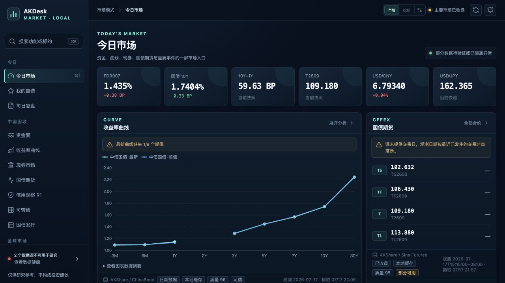
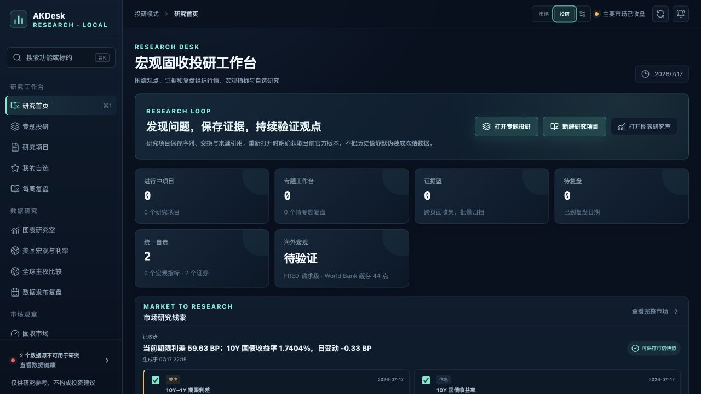
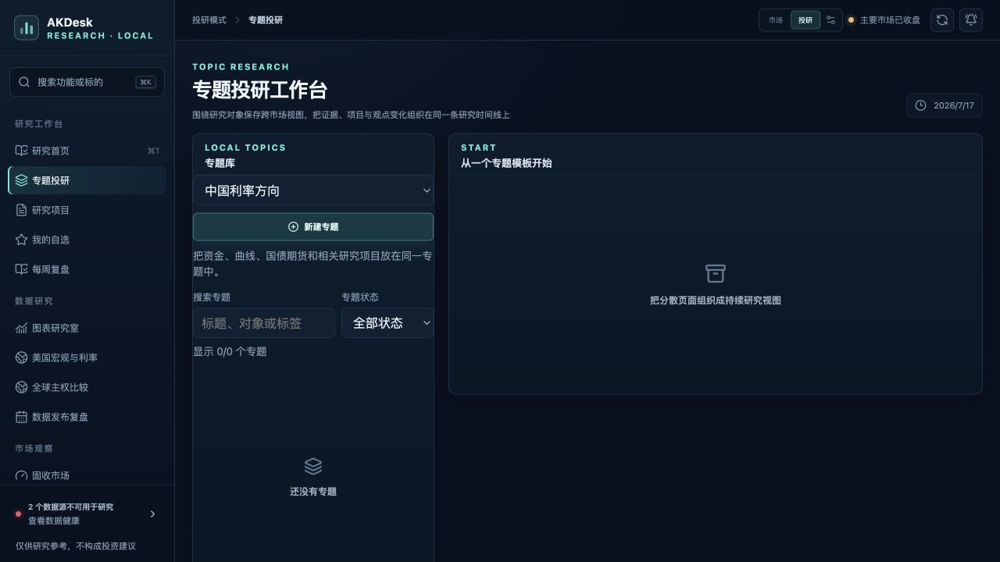
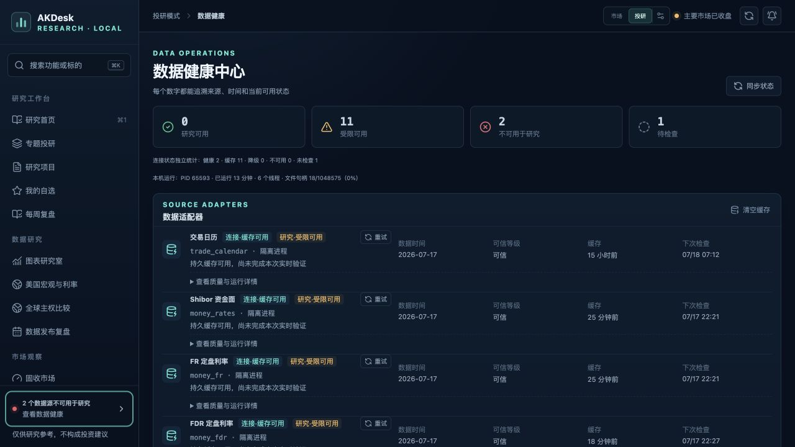
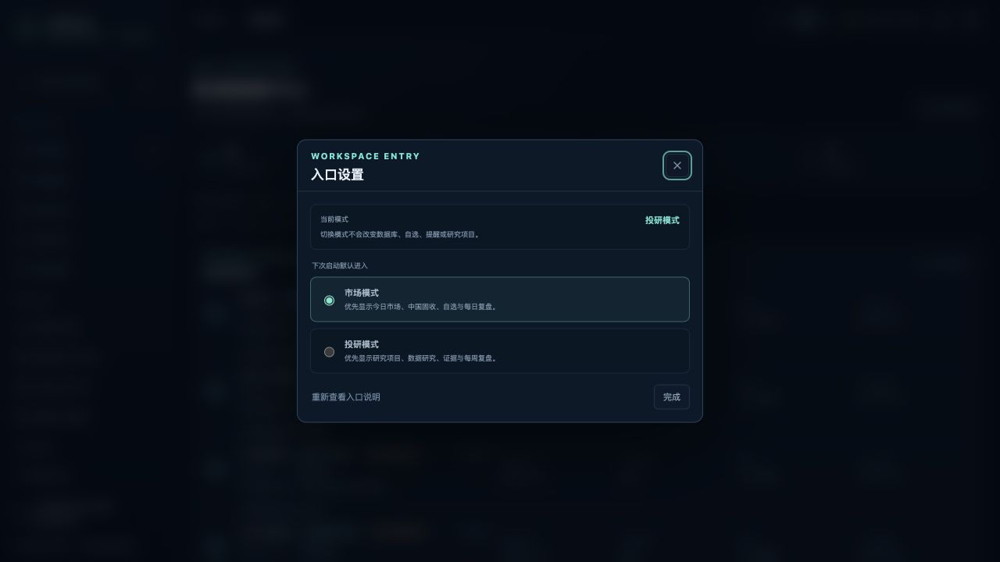
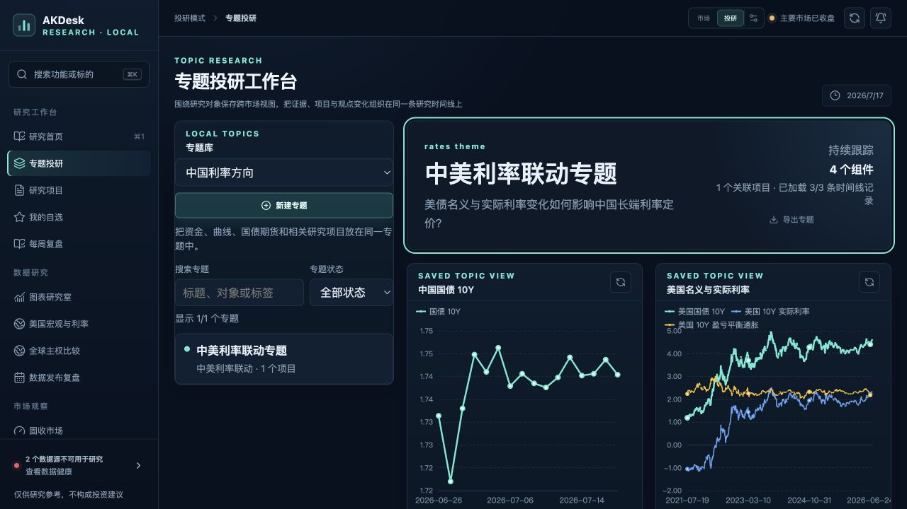
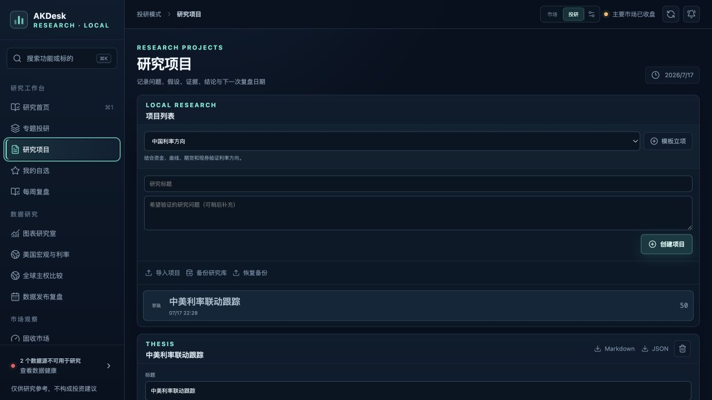
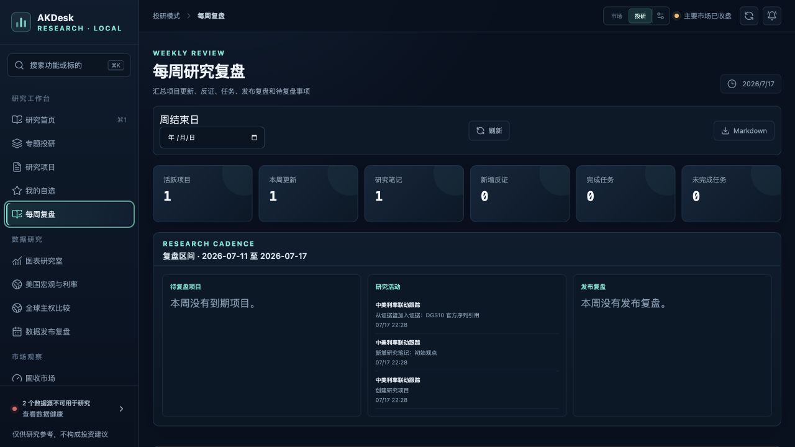
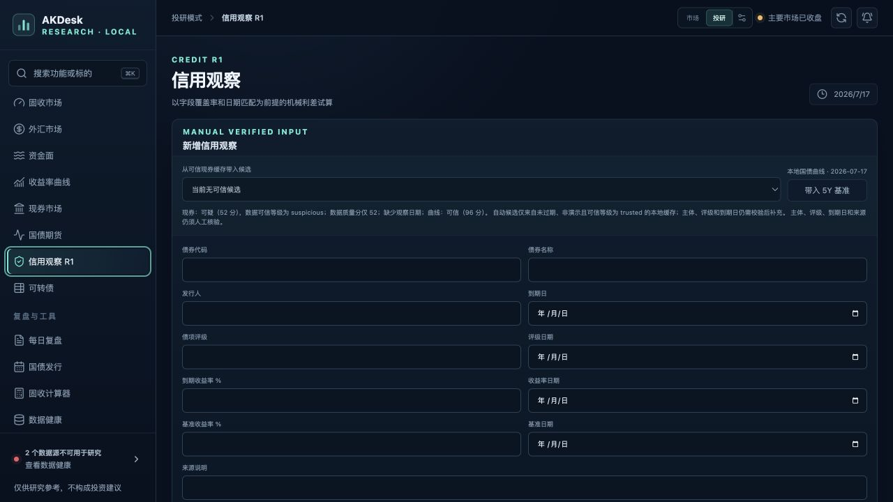

# AKDesk Fixed v0.9.2.1 整体 Review 与产品演进建议

> 审查日期：2026-07-17  
> 审查版本：v0.9.2.1「可信交互收口版」  
> 审查范围：市场入口、投研入口、专题、研究项目、周复盘、信用观察、数据健康、数据安全、稳定性与工程质量

## 1. 结论

v0.9.2.1 已从“功能原型”进入“可信可日用的个人固收研究工作台”阶段。市场快照、来源与质量状态、专题研究、项目证据、跨源时间线和周复盘已经形成闭环；本地服务资源占用低，适合 MacBook Air。

当前没有阻断发布的 P0 缺陷。下一阶段不应继续横向增加大量资产类别，而应优先收口研究对象模型、数据状态语义、自动备份和端到端回归，再建设信用观察 R2 与个性化市场驾驶舱。

产品定位建议保持为：

> 面向个人固收投资者与独立研究者的本地、可追溯、可复盘市场研究终端。

不建议把市场版和投研版拆成两套产品或两个数据库；当前双入口是正确方向，底层自选、提醒、专题、证据和研究项目应继续共享。

## 2. 验证结果

| 维度 | 结果 |
| --- | --- |
| 后端自动化 | 108 项通过；Ruff、compileall、pip check 通过 |
| 前端自动化 | 13 个测试文件、42 项测试通过；ESLint、TypeScript、生产构建通过 |
| 依赖安全 | npm 正式依赖审计 0 个漏洞 |
| 数据库 | 主库与缓存库 `quick_check` 正常；外键检查无异常；schema 900 |
| 本地性能 | 正式服务常驻约 30 MB RSS；缓存接口约 1–20 ms |
| 真实浏览器 | 1280×720 下完成双入口、专题、项目、证据、周复盘、信用观察和数据健康检查 |

唯一自动化告警是 Starlette TestClient 未来迁移提示，不影响当前运行，但应在依赖升级时处理。

## 3. 审查流程与页面健康度

### Step 1：市场入口 — 健康

优点：核心行情、曲线、期货、现券、外汇与来源质量集中展示；交易时段、缓存、观测时间和可信等级没有被隐藏。

风险：长侧栏使低频功能难发现；卡片同时混合快照、涨跌和可用性语义；“部分数据待验证”仍需要用户自己判断具体影响。

### Step 2：投研入口 — 健康但需引导

优点：市场线索能够直接进入专题、项目或证据流程；空库状态仍有清晰的主操作。

风险：“专题、研究项目、证据篮、自选”四类对象并列出现，新用户不容易理解推荐顺序和边界。

### Step 3：专题空状态 — 可用但引导不足

优点：模板、新建、搜索与状态筛选结构清晰。

风险：右侧大面积空白只说明“从模板开始”，没有解释创建后会得到什么，也没有把“选模板 → 新建 → 关联项目 → 收集证据”变成可见步骤。

### Step 4：数据健康 — 可信度强，语义仍可优化

优点：连接状态、研究状态、缓存年龄、观测时间、质量分、重试时间与运行资源均可追溯；这是当前产品最有辨识度的能力之一。

风险：页面可能同时显示“0 个研究可用”和多个“可信、缓存可用”数据集。逻辑上前者表示未完成本次实时验证，但用户容易把它理解成“当前所有页面的数据都不能研究”。

### Step 5：双入口设置 — 健康

优点：当前模式、下次默认入口及共享数据边界说明清楚；切换没有数据割裂风险。

建议：继续保持一个产品、两种工作模式，不拆分应用。

### Step 6：已建立的专题 — 核心闭环健康

优点：中国本地历史、FRED 请求级数据、关联项目摘要、证据与完整时间线能汇合到一个专题视图；专题导出和组件级刷新可用。

问题：窄波动区间图表的 Y 轴固定保留两位小数，会出现多个视觉上相同的刻度；专题设置和日常阅读处于同一长页面，认知负担偏高。

### Step 7：研究项目 — 功能完整但表单偏重

优点：问题、假设、置信度、期限、复盘日期、结论、记录、反证、任务和证据均可维护，并支持导入、导出和数据库备份。

风险：创建区、项目列表、项目编辑和记录区纵向堆叠，日常“补一条证据/更新一次判断”需要面对完整表单；缺少明确的完成度或推荐下一步。

### Step 8：每周复盘 — 闭环健康

优点：项目活动、反证、任务、发布复盘和到期事项可以自动汇总，并能导出 Markdown。

风险：周结束日输入初始为空，虽然系统会按当前日期生成报告，但用户看不到实际采用的日期；空栏目占据固定宽度，信息较少时空间利用率不高。

### Step 9：信用观察 R1 — 可信但仍是工具页

优点：不会在主体、评级、到期日、观察日期或同日基准缺失时强行计算利差；可疑现券数据被明确隔离。

风险：当前以人工表单和单券试算为主，尚未形成发行人主档、利差历史、风险日历、组合观察和持续告警，因此不宜把它包装成成熟信用风险平台。

## 4. 问题优先级

### P0：阻断发布

无。

### P1：建议下一个补丁解决

1. 图表 Y 轴精度应根据区间动态调整，避免重复刻度。
2. 数据健康把“连接验证”“展示可用”“可保存为研究证据”拆成更直白的三层语义。
3. 周复盘应显示系统实际使用的结束日期。
4. 增加自动研究库备份、保留周期和恢复前预览；当前只有手工备份与恢复。
5. 为专题空状态加入一条明确的推荐路径，并解释专题、项目和证据的关系。

### P2：下一个功能版本解决

1. 把研究项目编辑改为“概览 / 观点 / 证据 / 任务 / 复盘”分区或渐进展开。
2. 增加页面级组件测试和最小浏览器冒烟测试；现有前端测试主要覆盖工具函数与错误边界。
3. 拆分超大模块：`database.py`、`provider.py`、`MarketPages.tsx`、`TopicResearchPage.tsx` 和 `App.tsx` 已形成维护风险。
4. 信用观察增加 CSV 导入、字段映射、发行人主档和历史利差，而不是继续堆叠手工字段。
5. 为长导航增加“最近使用、固定入口、按任务搜索”，减少依赖滚动侧栏。

## 5. 推荐产品路线

### v0.9.2.2「可信呈现修复版」

目标：用小版本修掉会影响判断和理解的问题，不扩展数据域。

- 动态图表刻度精度与窄区间显示。
- 数据状态三层语义和页面级影响说明。
- 周复盘日期显式化、表单字段级错误提示。
- 自动备份、保留 7–14 个版本、恢复前校验与差异摘要。
- 增加专题创建到周复盘的浏览器冒烟测试。

### v0.9.3「研究工作流收口版」

目标：让第一次使用者不用先理解内部数据模型，也能完成一次研究。

- 推荐主链：发现线索 → 创建研究 → 收集证据 → 更新观点 → 设置复盘。
- 专题作为跨项目的长期研究视图；项目作为一次可验证问题；证据篮作为临时收件箱，在界面中明确这三者的关系。
- 研究项目增加完成度、下一步建议和快速记录入口。
- 专题阅读模式与设置模式分开。
- 每周复盘支持“本周结论、观点变化、下周待验证”模板。

### v0.10.0「市场驾驶舱增强版」

目标：补强市场侧，但保持固收主线，不变成全资产行情大杂烩。

- 自定义首页卡片、最近查看和多套市场视图。
- 资金—曲线—期货—人民币汇率联动面板。
- 异动排行、历史分位、期限利差热力与事件上下文。
- 自选分组级提醒与每日收盘摘要。
- 外汇继续定位为人民币与利率研究的跨市场变量，不扩张成独立外汇交易终端。

### v0.11.0「信用观察 R2」

前置条件：先解决可信数据导入与实体主档。

- 用户 CSV/Excel 导入与字段映射。
- 发行人—债券—评级—到期结构主档。
- 同期限基准映射、历史利差、分位与变动归因。
- 到期、回售、评级、公告和复盘日历。
- 单券、发行人和自定义组合三级观察。
- 所有自动信号继续保留来源、观察日期、质量门和人工确认。

### v1.0「个人固收研究终端」

进入 v1.0 前应满足：

- 新用户能在 10 分钟内完成第一条研究闭环。
- 自动备份与恢复经过真实演练。
- 关键主流程具备稳定端到端回归。
- 市场页和研究页对同一数据状态使用一致语言。
- 信用模块不再依赖纯手工单笔录入。
- macOS 启动、升级和数据目录迁移有稳定说明与失败回退。

## 6. 明确不建议做的事情

- 暂不拆成两个独立应用；双入口足够解决市场与投研的注意力分配。
- 暂不新增股票、商品、基金等大类，仅为已有固收研究需要增加少量跨市场变量。
- 暂不追求交易级实时行情或自动交易；AKShare/公开 API 的来源边界不适合这种承诺。
- 暂不把生成式结论作为核心卖点；优先保证数据、证据、观点变化和复盘过程可追溯。

## 7. 证据边界

本次浏览器审查基于 macOS 本地服务、1280×720 视口、当前缓存数据和隔离研究样本。已检查键盘语义、对话框焦点结构、图表替代摘要和减少动态效果的代码实现，但未完成独立屏幕阅读器、200% 缩放、长周期运行、断网注入或大规模真实研究库测试，因此不宣称完整 WCAG 合规或长期生产 SLA。
