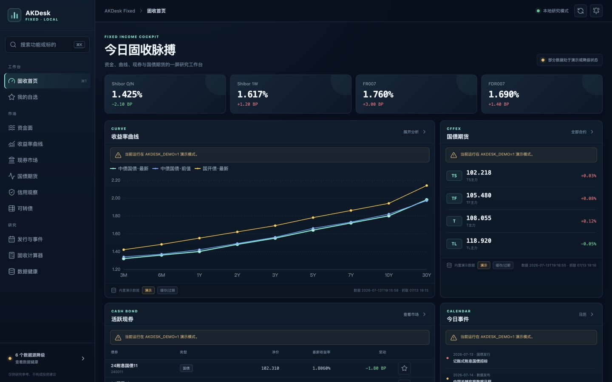
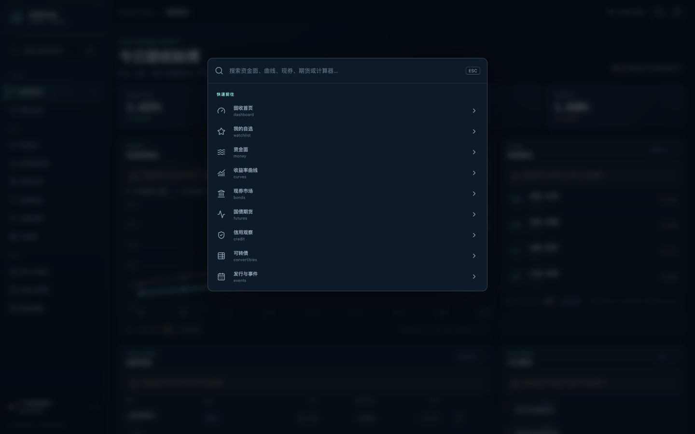
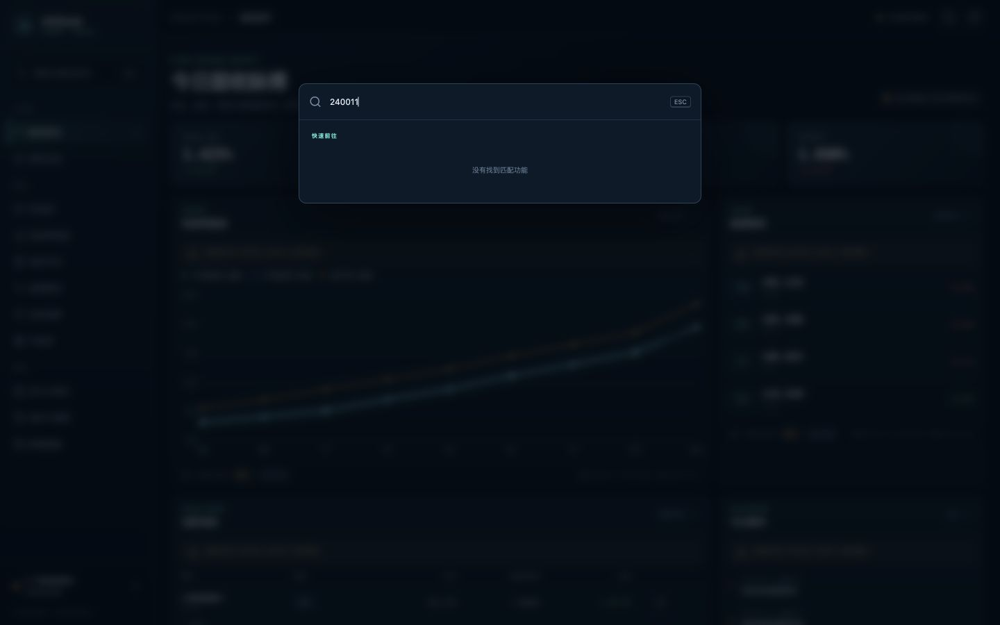
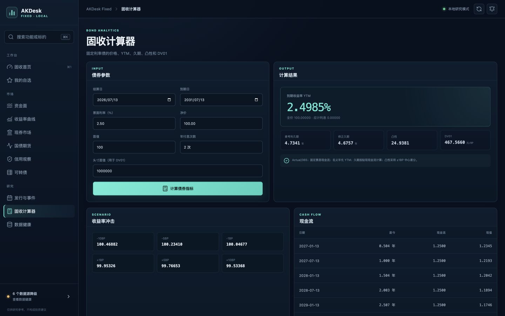
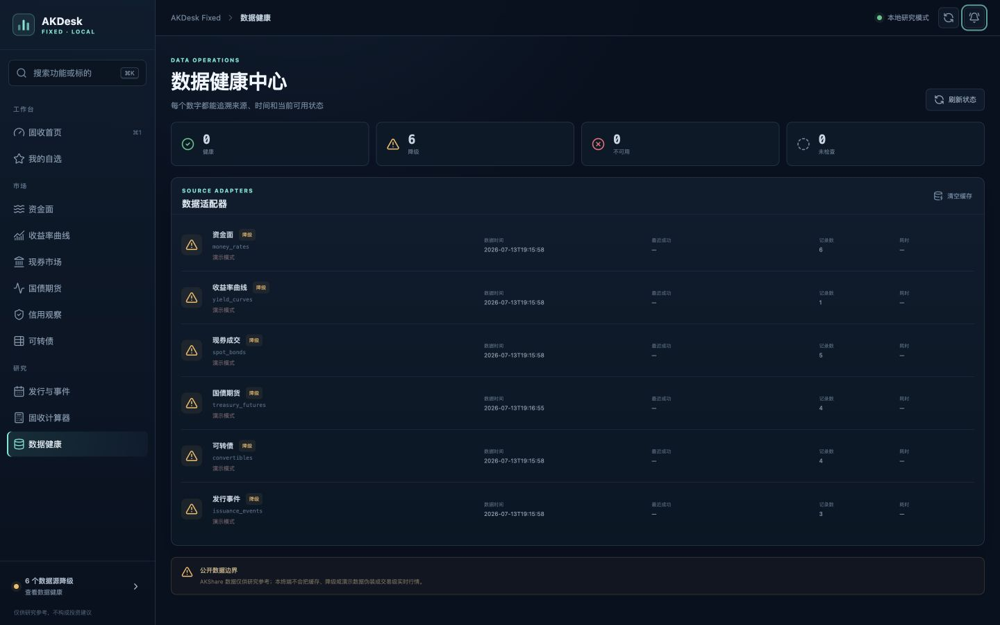

# AKDesk Fixed v0.1 全面评审

- 评审日期：2026-07-13
- 评审对象：`akdesk-fixed` v0.1.0
- 目标基线：`docs/AKDesk-Fixed-PRD-v1.0.md`
- 目标设备：MacBook Air，主视口 1440×900
- 评审方法：代码走查、构建与测试、演示模式 API 冒烟、真实 AKShare 单次探针、浏览器关键流程检查

## 1. 结论

当前项目是一个视觉完成度较高、可以在 MacBook Air 上启动的 **v0.1 MVP**，但还不能按 PRD v1.0 对外宣称“功能完成”。

最值得保留的基础是：本机回环服务、模块级数据来源标记、演示降级、SQLite 自选存储、可用的固定利率债计算器，以及适合固收研究的高密度桌面布局。

阻止进入正式 v1.0 的主要问题不是页面数量，而是四条核心闭环还没有完成：

1. 数据链路没有持久缓存、超时、重试、限频和契约校验，重启后的“离线缓存”实际不存在。
2. 全局搜索、提醒、自选状态没有形成可用闭环，界面上已有入口但部分是空操作或错误承诺。
3. 信用、事件、可转债强赎、期货合约选择等模块的实际口径小于页面文案和 PRD 范围。
4. 自动化测试只有 4 条，尚无真实适配器契约测试、API 集成测试、前端测试、端到端测试和可访问性验证。

建议下一版本命名为 **v0.2「可信可用版」**，优先完成数据可信、自选提醒和搜索闭环，不要立即扩张新闻、完整信用矩阵或复杂衍生品分析。

## 2. 已验证结果

### 2.1 自动化与构建

| 检查项 | 结果 | 说明 |
| --- | --- | --- |
| 后端单元测试 | 通过 | 4/4：计算器 2、数据库 1、演示 Provider 1 |
| Python 编译检查 | 通过 | `compileall` 无错误 |
| 前端 TypeScript/Vite 构建 | 通过 | 单一 JS 包约 774 KB，gzip 约 258 KB，触发大包警告 |
| 演示模式 API 冒烟 | 通过 | 健康、信息、6 个数据模块、自选、提醒接口均返回 200 |
| npm 依赖安全审计 | 未完成 | 当前 npm 镜像不支持 audit 接口，不能据此确认无漏洞 |

### 2.2 真实 AKShare 单次探针

以下仅代表 2026-07-13 的一个时间点，不等于连续稳定性验证：

| 适配器 | 结果 | 返回规模 | 耗时 |
| --- | --- | ---: | ---: |
| 资金面 | 实时成功 | 4 条 | 13.35s |
| 收益率曲线 | 实时成功 | 3 个数据组 | 3.07s |
| 现券成交 | 实时成功 | 250 条 | 3.97s |
| 国债期货 | 实时成功 | 4 条 | 1.58s |
| 发行事件 | 实时成功 | 9 条 | 1.80s |
| 可转债 | 降级为演示数据 | 4 条演示数据 | 15.21s |

可转债失败原因为 Eastmoney 上游连接代理错误。当前降级提示是诚实的，但也证明正式版必须具备持久的 last-known-good 数据，而不能在重启后直接回退成演示标的。

## 3. 关键流程审查

### 3.1 固收首页

优点：信息密度、层级、来源与时间标记较好；1440×900 下主要信息无需横向滚动；模块独立加载和演示标签清楚。

问题：字号大量落在 8–10px；首页一次触发 5 个 API，而后端用一个全局数据源锁串行执行，冷启动耗时会累加；没有可转债、资讯、提醒触发和自选动态概览。

### 3.2 全局搜索

输入首页中真实可见的债券代码 `240011` 后显示“没有找到匹配功能”。实现只过滤导航模块，但入口文案写的是“搜索功能或标的”。这是可稳定复现的功能缺陷。

### 3.3 固收计算器

基础计算链路可用，结果包含 YTM、全价、应计利息、久期、凸性、DV01、情景价格和现金流。当前仅实现 Actual/365 和规则付息周期，尚未覆盖 PRD 中的日计数选择、发行/起息/上一付息/下一付息输入以及结果留痕导出。

### 3.4 信用观察

目前是 R0 占位页，没有债券检索、评级、期限、基准曲线插值和估算利差，因此不能计为已交付模块。占位说明本身是诚实的，正式发布时应显式标为 Beta/开发中，或从主导航移至实验区。

### 3.5 数据健康

优点：来源状态、数据时间、最近成功、记录数和耗时的结构正确。

问题：“刷新状态”只重新读取状态，不会重试数据源；“清空缓存”清空后仍显示旧的健康状态；缺少单源重试、连续失败次数、缓存年龄、Schema/AKShare 版本和诊断导出。

## 4. 缺陷与风险清单

### P0：阻塞对外发布

#### P0-1 全局搜索名实不符

- 现象：债券代码、转债代码、期货合约均无法搜索。
- 根因：搜索结果只来自前端导航数组，没有 `/api/v1/search` 或本地标的索引。
- 风险：用户把全局入口当作标的搜索，得到错误的“无结果”。
- 修复：建立本地 instrument master；搜索返回对象类型、代码、名称、市场和跳转目标；支持键盘选中与直达详情。

#### P0-2 提醒入口是空操作，提醒只有 CRUD 存储

- 现象：顶部铃铛点击无响应；前端没有提醒管理页面。
- 根因：只有提醒规则表和 GET/POST/DELETE API，没有调度、规则评估、暂停、冷却、触发历史或 macOS 通知。
- 风险：页面给出了“提醒”能力暗示，但系统不会产生提醒。
- 修复：补齐提醒引擎、字段枚举与校验、数据过期暂停、触发历史、未读面板和本地通知。

#### P0-3 离线缓存承诺不成立

- 现象：市场数据缓存只在当前 Python 进程内有效，退出后全部丢失。
- 根因：`MemoryCache` 没有持久层。
- 风险：重启后上游失败会显示演示数据，而不是最近真实数据；与 PRD 的离线历史缓存和重启可用要求冲突。
- 修复：SQLite/Parquet 持久缓存，缓存键包含适配器、参数、数据日期和 Schema 版本；保留 last-known-good。

#### P0-4 数据源缺少超时、重试、限频与隔离

- 现象：单次资金面探针耗时 13.35 秒、可转债失败后耗时 15.21 秒；代码没有显式请求超时或重试策略。
- 根因：所有实时 loader 被一个 `_source_lock` 串行包裹。
- 风险：一个挂住的上游会阻塞全部市场模块；首页冷启动延迟为各模块之和；连续刷新可能放大上游压力。
- 修复：每个适配器独立超时、指数退避、熔断、限频与 single-flight；后台刷新，API 优先返回可用缓存。

#### P0-5 国债期货近季合约选择是日期启发式

- 现象：代码按季度月份和“当月 10 日”硬切合约，没有读取真实主力/近月合约状态。
- 风险：临近交割或节假日时可能展示非活跃或错误合约，属于数据正确性风险。
- 修复：从交易所/行情合约列表识别近月、次近月和主力，校验成交量、持仓量和到期日；展示合约代码而非仅中文名。

### P1：影响核心研究闭环

#### P1-1 自选按钮状态不持久且不能原位取消

`WatchButton` 每次挂载都从 `false` 开始，不读取已有自选；保存后再次点击只会重复 upsert，不能取消；失败也没有用户提示。

#### P1-2 全局刷新状态会污染后续页面

`refreshSeed > 0` 后，之后新进入的任何模块首个请求仍会带 `refresh=true`。一次“刷新当前页”会变成会话内后续页面的强制刷新，增加延迟和上游压力。

#### P1-3 信用观察完全缺失

只有占位提示，没有 PRD P0 所需的检索、评级、剩余期限、基准插值、估算利差和缺失原因展示。

#### P1-4 可转债强赎风险不是可靠功能

实时实现只调用比价表，强赎字段不存在时统一填“未提供”，没有联接强赎数据源；界面描述却写“强赎风险观察”。

#### P1-5 “发行与事件”范围和文案不一致

实时实现只拉取国债发行，但页面描述包含缴款、上市与关键数据日程；PRD 还要求地方债、企业债和转债发行。

#### P1-6 计算器存在日期和陈旧结果风险

- 默认日期通过 UTC `toISOString()` 生成，在中国时区凌晨可能出现前一天。
- 重新计算失败时不会清空旧结果，错误提示下方可能保留上一次结果。
- 只有 Actual/365，尚未与 QuantLib 等独立实现交叉校验。

#### P1-7 健康中心操作语义不完整

刷新状态不会发起探针；清空缓存不会重置健康状态；原始异常字符串直接暴露到 UI，可能包含上游完整 URL、查询参数或本机路径。

#### P1-8 数据模型和规则校验过弱

市场数据使用松散字典，缺少逐行 Pydantic Schema；提醒的 `metric`、`operator`、`cooldown_minutes` 未使用枚举和范围约束，负冷却时间等无效规则可写入数据库。

### P2：质量、性能与可访问性

- CSS 中大量 8、9、10px 字号，MacBook Air 上可读性偏弱。
- 命令面板没有 `role="dialog"`、`aria-modal`、焦点陷阱、方向键选择和关闭后的焦点恢复。
- 图表缺少等价数据表或文本摘要，表格无 caption，部分图标按钮没有显式 `aria-label`。
- 前端所有页面同步打进约 774 KB 的单一 JS 包，应做页面/图表级代码分割。
- 启动器只校验 Python 最低版本，README 声明 3.11–3.13，但脚本会接受未来的不兼容版本。
- 当前不是签名/公证的 macOS `.app` 或 DMG；仍依赖首次网络安装 Python 包。
- 项目目录没有 Git 元数据、CI 配置和数据库迁移机制，交付、回滚和升级风险高。

## 5. PRD v1.0 功能覆盖判断

| PRD P0 | 当前状态 | 主要缺口 |
| --- | --- | --- |
| 应用框架与全局搜索 | 部分 | 只有功能导航搜索 |
| 固收首页 | 部分 | 无资讯、自选提醒、可转债总览和布局模式 |
| 资金面 | 部分 | 期限不全，无历史、利差、分位和热力图 |
| 收益率曲线 | 部分 | 无曲线/日期选择、历史、利差、导出 |
| 现券市场 | 部分 | 无做市报价、详情、完整筛选和导出 |
| 国债期货 | 部分 | 单合约、无次近月/价差/K 线/移仓提醒 |
| 信用观察 | 未实现 | 占位页 |
| 可转债 | 部分 | 强赎数据、筛选排序和详情缺失 |
| 发行与事件 | 部分 | 只有国债发行 |
| 固收计算器 | 基础可用 | 日计数、日期口径、留痕导出缺失 |
| 自选与提醒 | 部分 | 自选基础 CRUD；提醒引擎和 UI 缺失 |
| 数据健康中心 | 部分 | 缓存年龄、失败计数、单源重试等缺失 |
| 研究笔记与导出 | 未实现 | 无入口和数据模型 |
| 设置与数据管理 | 未实现 | 无刷新、存储、备份恢复和主题设置 |

## 6. 下一版本范围：v0.2「可信可用版」

### 6.1 版本目标

让用户可以可靠地完成一条最小研究闭环：

> 打开应用 → 看到可信且可追溯的数据 → 搜到标的 → 加入自选 → 创建提醒 → 上游失败时继续使用最近真实数据 → 在健康中心理解原因并重试。

### 6.2 必须纳入

#### A. 数据底座

1. 持久化 last-known-good 缓存，支持重启离线查看。
2. 六个适配器补齐超时、重试、退避、限频、熔断和 single-flight。
3. 拆分全局数据源锁；按适配器隔离故障。
4. 建立严格 Schema、字段单位、数据日期和空值校验。
5. 修正期货合约发现逻辑；事件和可转债文案按真实数据范围收敛。
6. 后台刷新，缓存优先返回；增加聚合首页接口或并行可控的加载策略。

#### B. 搜索、自选、提醒闭环

1. 本地标的主数据索引和 `/api/v1/search`。
2. 搜索支持债券、转债、期货、功能，结果可直达页面并自动定位/过滤。
3. 自选按钮初始化真实状态，支持原位取消、分组和失败提示。
4. 提醒管理页、规则评估器、冷却、启停、触发历史、未读铃铛面板。
5. 数据过期、演示或 Schema 异常时暂停数值提醒。
6. macOS 本地通知；无通知权限时提供站内通知。

#### C. 质量和产品诚实性

1. 信用观察明确标记 Beta；v0.2 若无稳定评级与收益率契约，不承诺利差功能。
2. “发行与事件”暂改名“国债发行”，或补齐页面文案所承诺的事件类型。
3. “强赎风险”在可靠数据接入前显示“数据未接入”，不以默认文本充当状态。
4. 修复刷新种子、自选状态、计算器 UTC 日期和失败后旧结果。
5. 健康中心增加单源重试、连续失败、缓存年龄、版本和诊断导出。
6. 核心字号不低于 12px，补齐命令面板键盘和屏幕阅读器语义。

#### D. 工程化

1. Git 版本管理、CI、数据库迁移和发布版本号。
2. API 集成测试、前端组件测试、关键 E2E、适配器黄金样例契约测试。
3. 真实 P0 适配器连续 5 个交易日探针。
4. 页面/图表按需加载，消除主包大包警告。
5. 锁定并校验 Python 3.11–3.13，补充 macOS 安装失败的可理解提示。

### 6.3 明确不纳入 v0.2

- 完整新闻资讯聚合与摘要。
- 完整信用利差矩阵、行业利差和评级迁移。
- 国债期货 CTD、IRR、基差和组合风险分析。
- 完整研究笔记系统。
- Windows 同步发布。
- 签名公证 DMG、自动更新和正式应用商店流程。

这些内容应放到 v0.3/v1.0，避免 v0.2 再次出现“入口很多但闭环不完整”。

### 6.4 验收指标

| 指标 | v0.2 验收线 |
| --- | --- |
| 已缓存 API P95 | ≤ 500ms |
| 有持久缓存的首页可交互 | ≤ 3s |
| 本地搜索 P95 | ≤ 100ms |
| 单个上游最大阻塞 | 明确超时，不能阻塞其他适配器 |
| 离线重启 | 展示最近真实数据、数据年龄和过期状态 |
| 自选重启保留 | 100% |
| 无效提醒规则 | 100% 拒绝写入 |
| 过期/演示数据提醒 | 0 次误触发 |
| 真实适配器契约 | 连续 5 个交易日通过率 ≥ 95% |
| 核心 E2E | 搜索→自选→提醒→触发历史全通过 |
| 可访问性 | 无无名核心按钮；命令面板全键盘可操作 |

### 6.5 建议周期

个人开发者建议安排 5–6 周，并至少包含 5 个交易日的数据契约浸泡：

- 第 1 周：持久缓存、超时重试、Schema、健康中心。
- 第 2 周：标的主数据与全局搜索。
- 第 3 周：自选状态与提醒引擎。
- 第 4 周：提醒 UI、本地通知、已知缺陷与可访问性。
- 第 5 周：集成/E2E、性能、macOS 启动器和迁移。
- 第 6 周：真实数据浸泡、修复与发布候选。

## 7. 发布判断

- 作为内部预览或技术型用户的 MVP：**可以继续试用**。
- 作为“固收增强版 v1.0”：**暂不建议发布**。
- 作为 v0.2 开发基线：**基础可保留，优先补闭环和数据可靠性，不建议推倒重写**。

