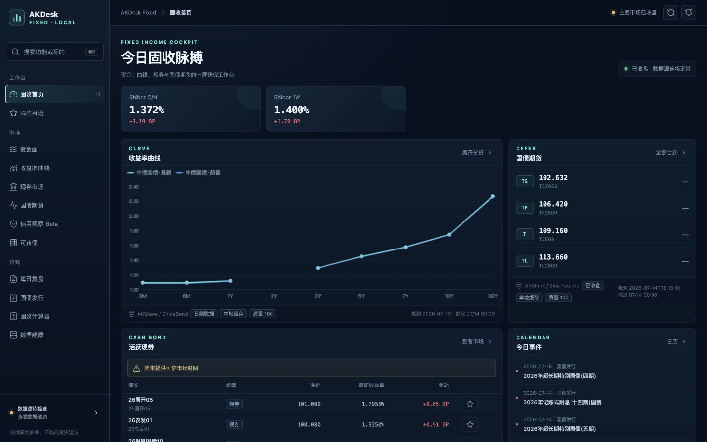
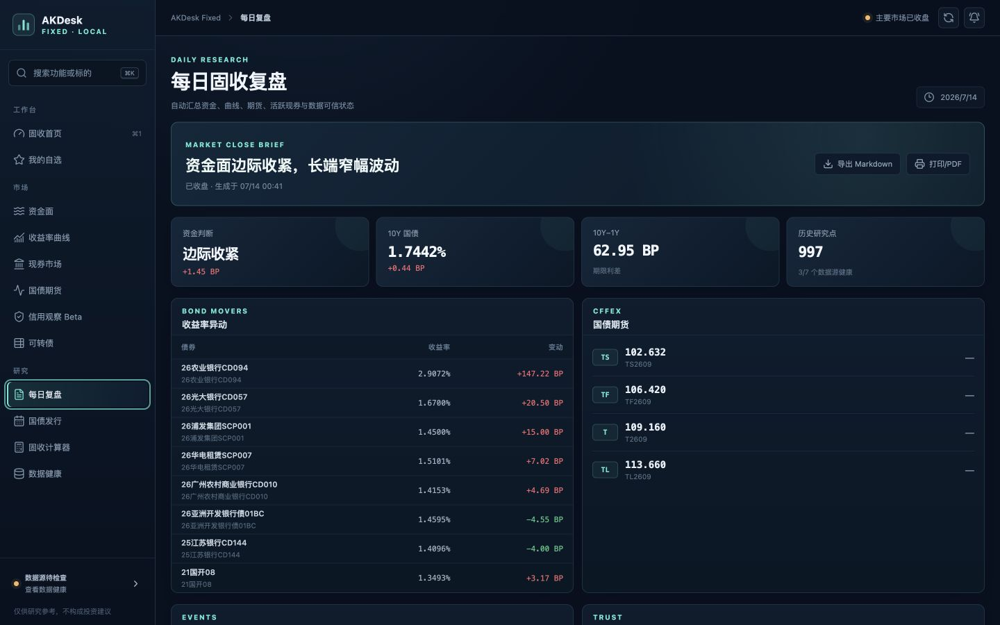
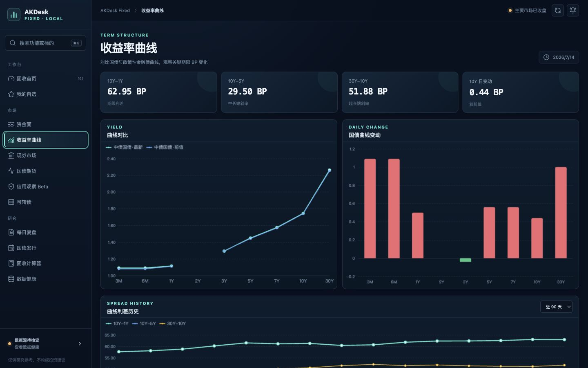
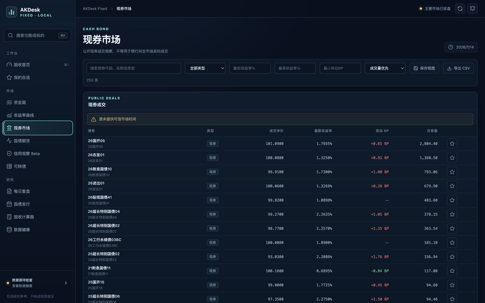
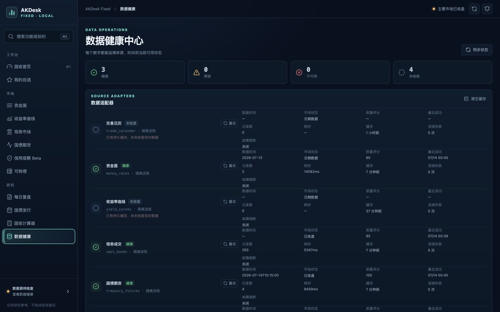
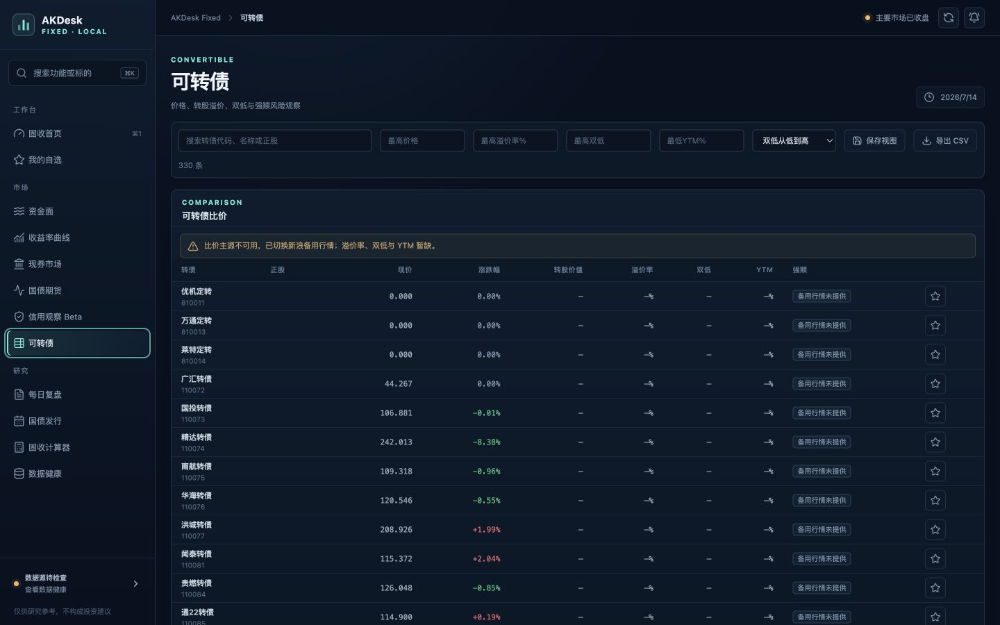

# AKDesk Fixed v0.4 整体评审

> 评审日期：2026-07-14  
> 评审对象：AKDesk Fixed v0.4.0（真实数据模式，macOS 本地运行）  
> 结论：功能骨架和本地运行质量已经达到“个人研究 Beta”水平，但在缓存状态恢复、数据语义校验和可转债备用行情可信度上仍有 3 项发布阻断问题。建议先发布 v0.4.1 可信修复包，再进入 v0.5 日常研究闭环。

## 1. 执行摘要

v0.4 相比前序版本已经从“行情页面集合”演进为一个有研究闭环雏形的本地固收终端：日报、曲线历史、筛选器、自选与提醒、数据健康、持久缓存都已经连起来；MacBook Air 本地占用也很轻。

当前最需要解决的不是继续增加页面，而是确保任何进入日报、历史和提醒的数据都满足统一的可信规则。实测发现：

1. 服务重启后，命中新鲜持久缓存不会恢复数据源健康状态，也不会将缓存数据写入历史、索引和提醒链路；页面能显示数据，但健康页仍显示“尚未检查”。
2. 日报会直接按绝对变动排序，缺少异常值隔离。实测一只同业存单以 `+147.22 BP` 排在异动榜首，极可能是源字段异常或口径变化。
3. 可转债备用行情把无日期的 `ticktime` 拼成当天时间，并保留零价格、退市或无效标的；同时质量分仍可达到 95，容易让用户误判数据完整性。

因此，v0.4 可以继续作为个人预览版使用，但不建议以“可信可用正式版”口径发布。

## 2. 验证结果

| 验证项 | 结果 | 证据 |
|---|---:|---|
| 后端自动化测试 | 通过 | `30 passed in 0.66s` |
| 前端生产构建 | 通过 | Vite 构建成功；主包 gzip 约 82 KB，图表包 gzip 约 183 KB |
| Python 编译检查 | 通过 | `compileall` 无错误 |
| macOS 启动脚本语法 | 通过 | `zsh -n` 无错误 |
| 浏览器控制台 | 通过 | 关键流程中无 error、warning |
| 本地资源占用 | 良好 | 后端常驻 RSS 约 26 MB；两份 SQLite 文件合计约 832 KB |
| 缓存接口响应 | 良好 | 实测约 6–29 ms；日报约 13 ms |
| 数据源健康一致性 | 未通过 | 3 个健康、4 个尚未检查，但 7 个适配器均已有持久缓存 |
| 数据语义质量 | 未通过 | 异常 BP 进入日报；可转债零价格和不可信时间进入数据集 |
| 前端自动化回归 | 缺失 | 未发现前端单元测试或端到端测试 |

资源数据只代表缓存命中时的常驻状态，不包含 AKShare 刷新期间的临时子进程峰值。

## 3. 关键流程审计

### 3.1 首页总览 — 基本健康，存在状态口径冲突

- 信息层级清楚，资金面、曲线、期货、自选和系统状态能在一屏形成研究入口。
- 主区域提示“数据源正常”，侧边栏却显示数据源“待检查”；两者来自不同状态口径，削弱信任。
- 资金面只有两张卡时留白较大；辅助文字和表格字体偏小，MacBook Air 高分屏长时间阅读会较累。

### 3.2 每日固收简报 — 产品价值高，但异常值会被放大

- 日报是 v0.4 最有价值的新模块，已经具备“资金—曲线—期货—现券—事件”的完整浏览顺序。
- `26农业银行CD094` 的 `+147.22 BP` 被直接列为第一异动，说明当前报告缺少范围、跳变和横截面异常校验。
- 报告显示数据健康仅 `3/7`，但仍给出确定性标题；建议同时给出“报告可信度”和未验证数据清单。
- “近期发行”同时包含已过去和未来日期，应拆成“待发行 / 已发行”。日报还应区分盘中快报和收盘定稿。

### 3.3 曲线与历史 — 结构优秀，需明确覆盖范围

- 当前值、利差、期限结构、历史趋势和矩阵视图组合合理，是可以长期保留的主工作台。
- 实际历史只有约 15 个交易日时，界面仍提供“近 1 年”，用户会误以为数据缺失；应显示真实覆盖起止日和样本数。
- 2Y 缺失时仍显示质量 100，说明完整性没有进入质量评分。
- 图表已有可读矩阵作为替代，但键盘和屏幕阅读器的数据探索仍需专项验证。

### 3.4 现券筛选 — 可用，但筛选语义和大表性能不足

- 筛选、CSV 导出和保存视图已经具备研究工具雏形。
- 类型只有“现券”，类型筛选实际无效；部分代码字段退化为债券名称，按代码检索也不可靠。
- 数值输入框只有 placeholder，没有可访问名称；浏览器可访问性树中表现为未命名 spinbutton。
- 250 行一次性渲染，DOM 过大。应增加分页或虚拟滚动，并保留当前筛选状态。
- 保存视图使用原生 `prompt`，缺少重命名、删除、异常数据恢复。

### 3.5 数据健康 — 信息完整，但核心状态恢复有缺陷

- 延迟、缓存年龄、质量、执行模式、熔断和重试信息齐全，排障能力比 v0.3 明显提升。
- 真实数据页已经可读取缓存，健康页仍有 4 个适配器显示“尚未检查”，根因是新鲜缓存返回路径没有更新健康状态。
- 当前表格列数过多、字号过小、换行密集；建议改成“摘要行 + 展开详情”，优先呈现用户要做的决定。
- 状态应明确区分“已有缓存但未实时验证”“实时健康”“降级缓存”“不可用”，而不是将缓存命中归入待检查。

### 3.6 自选与提醒 — 基础闭环成立，策略能力仍偏薄

- 抽屉结构、表单标签和穿越触发语义清楚，适合作为个人本地提醒的起点。
- 可转债后端允许 `change_pct`，前端指标列表却没有该选项，前后端能力不一致。
- 缺少单位提示、规则测试、数据源状态解释、静默时段和每日触发上限。
- 下一步应优先支持曲线利差、BP 变动和成交量，而不是立即接入外部通知渠道。

### 3.7 可转债备用行情 — 能降级显示，但不适合直接研究

- 主源失败后仍能展示 330 行价格数据，降级提示清楚，这是可靠性上的进步。
- 实测前几行包含价格为 0 的标的，也出现退市或信息不完整标的；转股价值、溢价率、双低和 YTM 全部缺失。
- 备用源没有可信交易日期，却将时间拼为当天；在非交易日或旧快照场景下会生成错误的观察时间。
- 当前质量 95 会掩盖“仅有价格快照”的事实。应将数据等级明确为“完整研究数据 / 价格备用数据 / 不可用”。

## 4. 缺陷与风险分级

### P0：发布前必须修复

1. **新鲜缓存绕过健康、历史和提醒链路**  
   `provider.py` 两处新鲜缓存快速返回仅装饰数据，没有调用健康更新和数据事件。重启后页面与健康页口径冲突，历史、搜索索引和提醒也无法从缓存恢复。

2. **异常行情可直接进入日报、历史和提醒**  
   当前质量检查主要覆盖字段缺失，没有范围、跳变、横截面或格式规则。日报排序会把异常值放大为首要信号。

3. **可转债备用行情时间与样本不可信**  
   无日期 `ticktime` 被拼成当天；零价格、退市/无效标的未过滤；缺失研究字段时质量分仍过高。

### P1：v0.5 主范围

1. 现券真实代码、债券类型、期限等关键语义补全；禁止用名称伪装代码。
2. FR、FDR、LPR 拆成独立任务、缓存和健康项，避免一个接口超时导致整组结果丢失。
3. 数据健康页改为摘要 + 展开详情，并显示上次观察时间、缓存可用性和下次检查时间。
4. 表格分页/虚拟化、筛选器永久标签、保存视图完整管理。
5. 日报归档、日期切换、盘中/收盘口径和异常数据说明。
6. 提醒增加曲线利差、BP、成交量、规则测试、静默时段、每日上限。
7. 增加 API/lifespan、缓存迁移、前端组件和浏览器端到端测试。
8. `_emit_dataset` 的历史、索引和提醒写入失败不能静默吞掉，需记录可见错误指标。

### P2：后续增强

1. 自定义日报模板和多日比较。
2. 久期、carry、roll-down，以及在数据口径可信后的期货基差/CTD 分析。
3. 更完整的键盘、对比度和屏幕阅读器测试。
4. 调度器按核心数据优先级分批预热，并观测子进程峰值。

## 5. 推荐版本规划

### v0.4.1：可信修复包（建议先做）

目标：消除状态矛盾和错误信号，不增加新模块。

1. 在持久缓存恢复时同步恢复健康快照，并安全触发历史、索引和提醒恢复；增加幂等保护。
2. 建立适配器级数据契约：代码格式、取值范围、观察日期、必需字段、跳变阈值和横截面异常。
3. 增加 `trusted / partial / suspicious / unavailable` 数据等级；`suspicious` 不进入日报榜单和提醒。
4. 清洗可转债备用行情：过滤零价和无效标的；无法证明日期时观察时间保持为空；完整度决定质量上限。
5. 增加服务重启 + 新鲜缓存、v0.3 数据迁移、异常行情夹具的集成测试。

验收标准：

- 带 7 个持久缓存重启后，7 个数据源均有明确状态，不再出现页面有数据但健康“尚未检查”。
- 零价、伪代码、未来时间、不可信日期和异常跳变不能进入日报、历史或提醒。
- 异常值被标注并隔离，用户可查看原因，但不会成为默认研究结论。
- 旧版本数据目录升级后，历史、缓存和自选均可正常读取。

### v0.5：日常研究闭环

目标：让用户每天可以稳定完成“看状态—读简报—找异动—追踪—复盘”。

1. **可信数据层**：适配器数据契约、备用源矩阵、分源质量分、独立资金扩展任务。
2. **日报与复盘**：日报归档、日期切换、盘中/收盘模式、异动解释、数据可信摘要。
3. **现券工作台**：真实代码与分类、期限筛选、可用时再加入久期/carry/roll-down。
4. **提醒中心**：曲线利差、BP 和成交量；规则试算、静默时段、日触发上限。
5. **效率与体验**：大表虚拟化、完整保存视图、健康页精简、字号和可访问性修复。
6. **工程质量**：前端测试、E2E 回归、升级迁移测试、8 小时稳定运行和资源峰值记录。

建议 v0.5 的完成指标：

- 缓存页面 P95 响应小于 100 ms；健康摘要在启动后 2 秒内可解释。
- 8 小时持续运行无崩溃、无静默写入失败、无失控子进程。
- 所有数据源都显示明确的数据等级和观察时间可信度。
- 核心筛选控件均有可访问名称，键盘可完成筛选、保存视图和创建提醒。
- 关键用户路径具备浏览器端到端测试：冷启动、缓存重启、日报、筛选、自选提醒和主源降级。

## 6. 暂不建议进入 v0.5 的内容

- 券商交易、下单或组合实盘联动。
- 多用户、云同步和团队协作。
- AI 自动研报或大规模资讯聚合。
- 正式信用评分模型。
- Electron/原生壳重构。

这些方向都会显著扩大维护面。当前最有价值的投入仍是数据可信、研究复盘和稳定运行。

