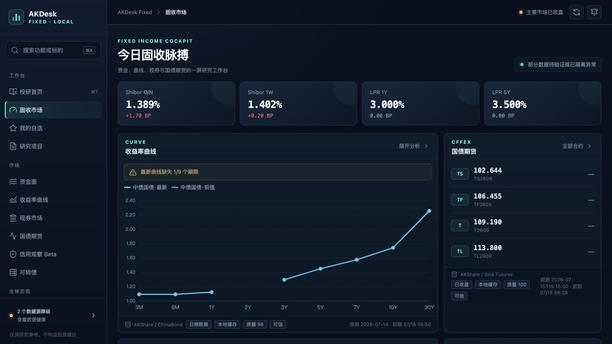
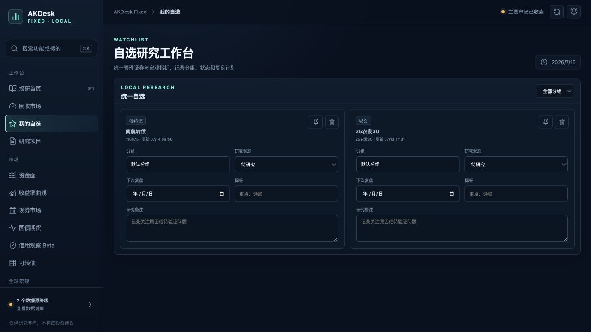
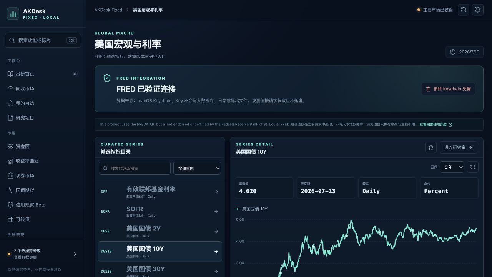
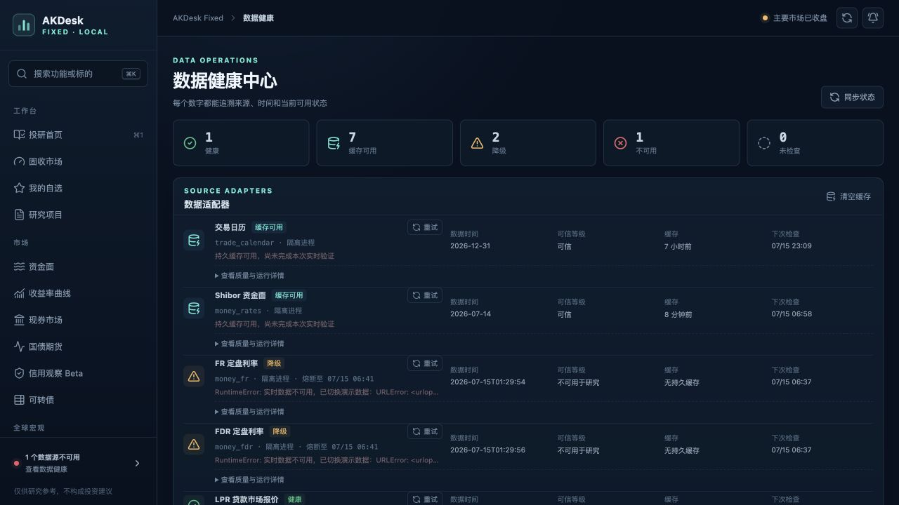
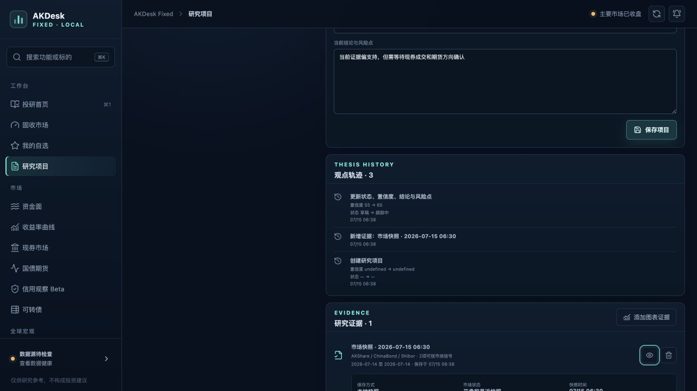

# AKDesk Fixed v0.6.1 整体评审与后续路线

> 评审日期：2026-07-15  
> 评审环境：macOS / MacBook Air 典型 1280×720 可视区 / 本地单机部署  
> 评审对象：v0.6.1「市场研究与投研工作台」  
> 评审方式：正式运行实例、隔离研究样例、接口与数据库检查、前后端测试、生产构建、依赖审计、核心代码走查和界面截图。

## 一、结论

v0.6.1 已经从“行情看板”进入了“本地投研工具”的正确轨道：市场、宏观、自选、研究项目、证据和数据健康之间已经形成基本闭环；本地启动速度、接口响应、内存占用和生产包体积都适合 MacBook Air。当前版本可以作为个人研究的预览版持续使用，但暂不建议把它定义为“可信稳定版”。

发布判断：**有条件通过（Beta）**。

主要原因不是功能数量不足，而是有 5 个会影响研究可信度或操作判断的问题：

1. 盘前被显示为“已收盘”。
2. 国债期货在盘前可能生成当天 15:15 的未来时间戳，并写入历史库。
3. 数据健康把“请求成功”和“可用于研究”混在一起统计。
4. 研究项目创建活动出现“置信度 undefined → undefined”。
5. FR/FDR 在当前 macOS 环境持续出现证书链校验失败。

因此下一步不宜继续横向增加数据源，应先交付 v0.6.1.1「可信修复版」，再进入研究生产力增强。

## 二、运行与工程健康度

| 检查项 | 结果 | 判断 |
| --- | --- | --- |
| 后端自动化测试 | 61 passed，1 条 Starlette/httpx 弃用警告 | 通过 |
| 前端自动化测试 | 10 passed | 通过 |
| 前端生产构建 | 通过；主包约 322 KB，图表包约 538 KB | 通过 |
| Python 依赖完整性 | `pip check` 无冲突 | 通过 |
| npm 依赖审计 | 0 个已知漏洞 | 通过 |
| SQLite | `integrity_check = ok`，WAL 模式 | 通过 |
| 本地运行资源 | 常驻内存约 41 MB；缓存接口约 1–5 ms | 适合 MacBook Air |
| 正式数据 | 研究项目 0、自选 2、历史点 2457、FRED 本地观测值 0 | 符合当前使用状态 |
| 浏览器控制台 | 核心流程未发现 error 日志 | 通过 |

代码规模开始出现结构性风险：`provider.py`、`database.py`、`MarketPages.tsx` 分别约 1856、1519、1416 行；数据库升级仍依赖初始化阶段的临时兼容逻辑，没有明确 schema 版本。v0.6.2 之后若继续接入新数据源和新研究对象，维护成本会明显上升。

## 三、核心流程评审

### 1. 投研工作台总览——健康度：良好

市场研究信号、FRED 状态、自选和项目入口集中在同一页，已经具备“从异常到研究”的信息架构。可信快照、来源和更新时间表达清晰。当前正式库没有项目，首屏尚不能呈现完整闭环价值；部分降级信号仍占用较强视觉权重。

### 2. 市场总览——健康度：需修复后可信

利率卡片、收益率曲线、期货与来源说明层级清楚，曲线期限缺口也有明确提示。但盘前顶部显示“主要市场已收盘”；期货观测时间出现当天 15:15，而截图发生在当天早晨。这不仅是文案问题，还会污染历史序列，是当前最高优先级缺陷。

### 3. 自选研究——健康度：基础可用，场景未闭环

研究假设、关注理由、目标位和止损位可以直接记录，适合作为轻量研究入口。但卡片没有当前行情、涨跌、观测时间、数据可信度和标的详情跳转，用户无法仅凭自选页回答“今天发生了什么、数据是否新鲜”。

### 4. 研究项目空状态——健康度：清晰但缺少引导

创建入口和空状态明确，没有误导性内容。首个项目完全依赖用户自己设计研究问题，页面留白较大；建议提供利率、宏观发布、可转债和信用观察模板。

### 5. 宏观研究——健康度：良好

FRED 凭据验证、目录、序列图表、引用和“仅请求期使用、不持久化观测值”的说明是当前完成度最高的一组能力。成功状态卡中的“移除 Keychain 凭据”过于醒目，应移到设置区并增加确认；全局市场状态在宏观页也显得语义不合适。

### 6. 数据健康——健康度：透明，但指标定义需要校准

来源、缓存、降级原因、连续失败和刷新状态公开透明，这是产品差异化优势。当前汇总主要依据连接状态，而没有把 `trust_level` 纳入“健康”定义：现券请求可以成功，但数据仍因代码缺失、可疑值和缺少可信观测时间而不适合研究。演示数据也会显示类似真实数据的当前时间；熔断期间“下次检查”可能已经过期。

### 7. 项目证据与活动——健康度：模型成立，界面有明确缺陷

该截图来自隔离数据目录中的评审样例，正式数据库未写入样例。证据的支持/反对、可信度、引用与项目结论能够组合成研究链路，方向正确。创建活动却显示“置信度 undefined → undefined”，说明事件详情结构与前端渲染器不一致。在 1280×720 下，详情仍保持双栏；右侧内容较长时被压缩，左侧形成大面积空白。

## 四、问题分级

### P0：v0.6.1.1 必须完成

1. **修正交易时段状态机。** 区分盘前、连续交易、午间休市、盘后和非交易日；全局顶部状态应根据页面语境展示，宏观页不应被“主要市场已收盘”主导。
2. **修正国债期货观测日期。** 当源数据只有时分秒而没有交易日时，不得默认拼接当天日期；优先使用源交易日，否则使用经过交易日历确认的最近交易日。任何未来观测时间应被拒绝并告警。
3. **清理错误历史记录。** 删除或重建被盘前未来时间戳写入的 2026-07-15 国债期货记录，并保留可审计的修复说明。
4. **拆分“连接健康”和“研究可信”。** 健康汇总、侧栏状态和研究入口同时体现连接状态、数据质量、可信等级、是否可用于研究；演示/不可用状态不得显示伪真实的“数据时间”。
5. **修复活动事件渲染。** 针对 created、updated、evidence 等事件建立判别联合或明确 schema；created 应显示初始状态/初始置信度，不能读取不存在的 before/after。
6. **修复 macOS FR/FDR TLS。** 给隔离进程显式传递可信 CA bundle（例如 `certifi.where()`），保留证书校验，禁止通过关闭校验绕过。

### P1：v0.6.2 建议完成

1. 自选卡片增加最新价/收益率、涨跌、观测时间、可信度和详情入口。
2. 从市场异常、自选卡片和行情行“一键创建研究项目”，自动带入标的、来源、数据时间和初始问题。
3. 增加研究模板：利率方向、宏观数据发布、可转债事件、信用观察。
4. 增加时间线式研究笔记、反证、待办和复盘，不再只依赖覆盖式修改结论。
5. 增加项目导出/导入与整库备份恢复；建议采用 Markdown + JSON manifest + 证据引用的可迁移格式。
6. 市场信号解释“为什么触发”，并允许用户设置敏感度，而不是只依赖硬编码阈值。
7. 项目详情根据**实际内容宽度**切换单/双栏，避免 1280 像素设备上内容被压缩。

### P2：持续改善

1. 大文件拆分：provider 按源/资产类别拆分，database 按 repository 拆分，MarketPages 按页面拆分。
2. 引入数据库 schema 版本和顺序迁移，覆盖升级、回滚前备份和失败恢复测试。
3. 提升可访问性：大量 8–10px 辅助文字需增大；弱文本对比度需复测；30–32px 图标按钮应扩大可点击区域。
4. 完成键盘全流程、200% 缩放重排和屏幕阅读器状态播报测试。
5. 信用页面在数据覆盖门槛达成前继续明确标注 Beta/规划中，避免形成已经可用于信用决策的预期。

## 五、建议版本路线

| 版本 | 建议主题 | 核心交付 | 建议周期 | 发布门槛 |
| --- | --- | --- | --- | --- |
| v0.6.1.1 | 可信修复版 | 交易时段、期货时间、健康/可信双状态、活动渲染、FR/FDR TLS、项目窄屏布局 | 约 1 周 | P0 全清；无未来时间戳；回归测试全绿 |
| v0.6.2 | 研究生产力版 | 自选行情化、一键立项、研究模板、研究日志/反证、项目导入导出、备份恢复 | 2–3 周 | 从异常到证据不超过 3 次关键操作；导出回导一致 |
| v0.6.3 | 数据发布复盘版 | FRED 发布事件、用户预期录入、实际值对比、发布前后中国市场窗口、周报 | 2 周 | 仍保持 FRED 观测值不落库；引用和时间窗口可追溯 |
| v0.7.0 | 信用观察 R1 | 发行人归一化、评级及日期、到期日、基准曲线对齐、严格条件下的利差试算、覆盖率报告 | 3–5 周 | 代码、主体、评级、日期、期限任一缺失时不计算；不输出评级/违约概率 |
| v0.8.0 | 主权比较版 | World Bank 官方 Indicators API、8–12 个指标、2–8 国比较、缺失/年份/元数据/许可展示 | 2–3 周 | 独立健康与缓存策略；国家/指标/年份可追溯 |

路线原则：先修可信度，再提升研究效率，然后做事件复盘，最后扩展信用与跨国宏观。World Bank 接入有价值，但它不会直接解决当前“从市场变化到研究结论”的短板，因此放在信用观察之后更稳妥；如果产品定位转向宏观研究，可以与 v0.7.0 调换。

## 六、下一版本的验收清单

v0.6.1.1 建议设置以下硬门槛：

- 盘前、午休、盘后、周末各有单元测试和界面测试。
- 任一行情 `observation_time` 不得晚于本机当前时间允许的合理误差。
- 只有连接成功且达到信任门槛的数据才计入“可用于研究”。
- 演示数据、缓存数据、实时数据在时间和标签上可以一眼区分。
- FR/FDR 在标准 macOS Python 环境完成 TLS 校验；失败时不回退到不安全请求。
- created 项目活动、证据新增、结论修改均无 `undefined` 文案。
- 1280×720 下核心页面无横向溢出，项目详情的主要文本列具有可读宽度。
- 后端测试建议提升到不少于 68 个，前端测试不少于 13 个；生产构建、依赖检查和 SQLite 完整性检查全部通过。

## 七、已知评审限制

- 本次在正式实例上验证了空项目状态；完整项目流程使用隔离数据库，未污染用户正式数据。
- 没有在真实交易时段持续监控一个完整交易日，因此盘中断线、午休切换和收盘切换仍需专门回归。
- 截图与 DOM 检查不能替代 VoiceOver、完整键盘遍历和 200% 缩放测试。
- FRED 已验证凭据状态与请求期使用策略，但正式库当前没有 FRED 观测点；本次未做长周期限流与配额压力测试。
- 信用模块仍为早期占位能力，本次没有把它评为可用于信用判断的功能。

