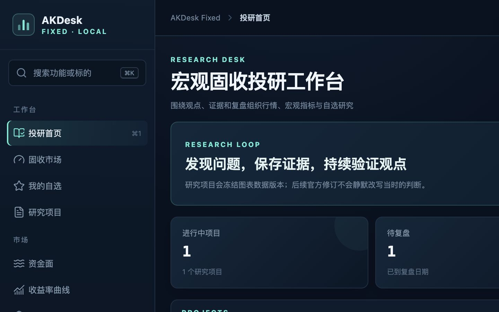
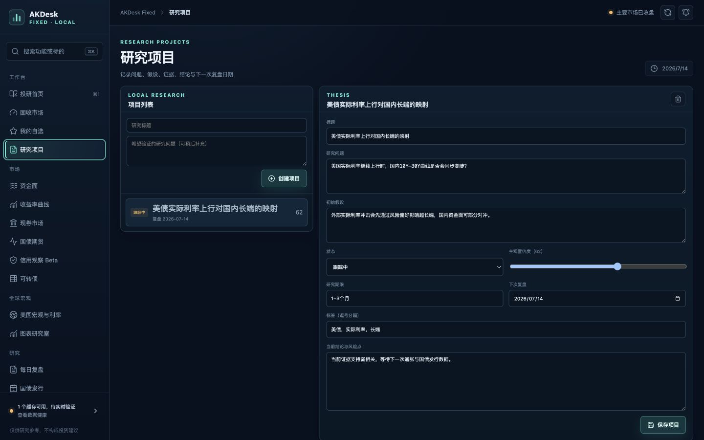
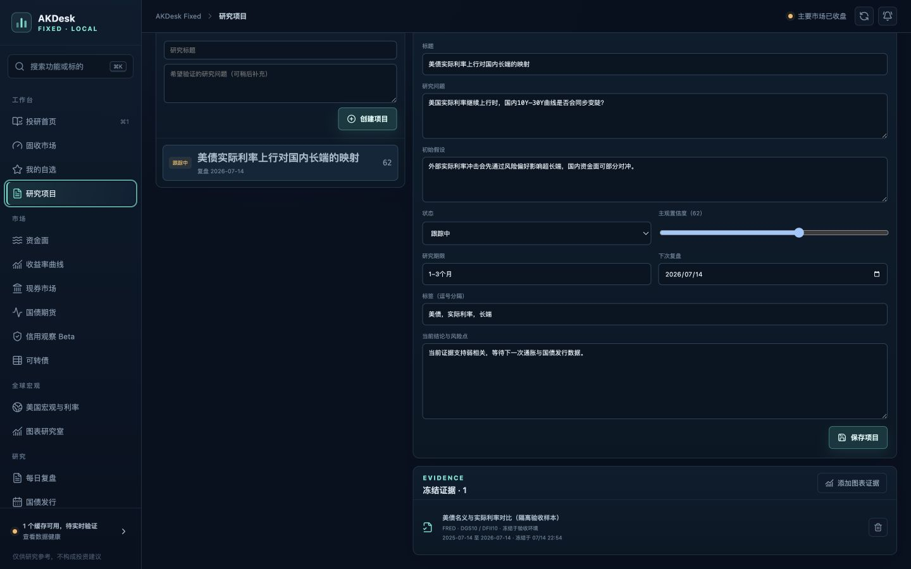
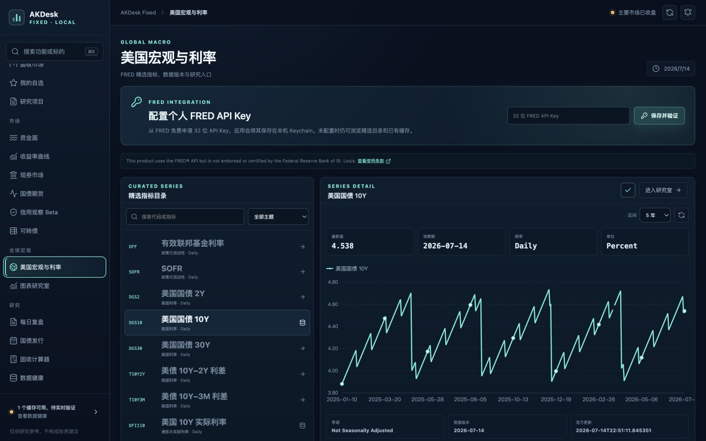
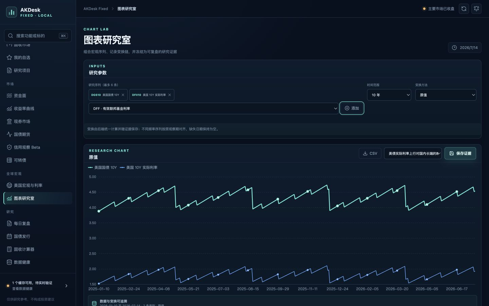
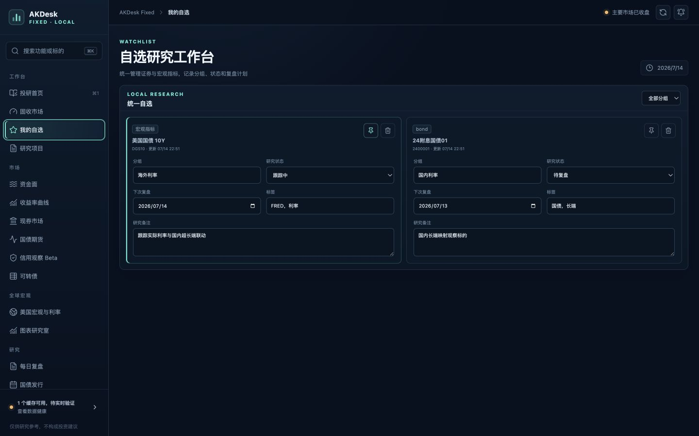
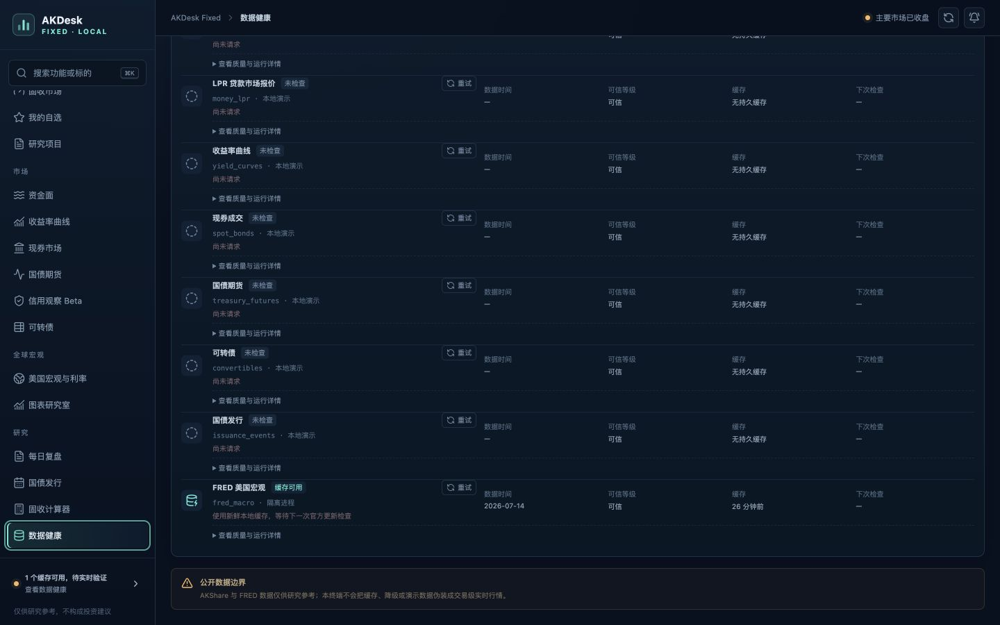
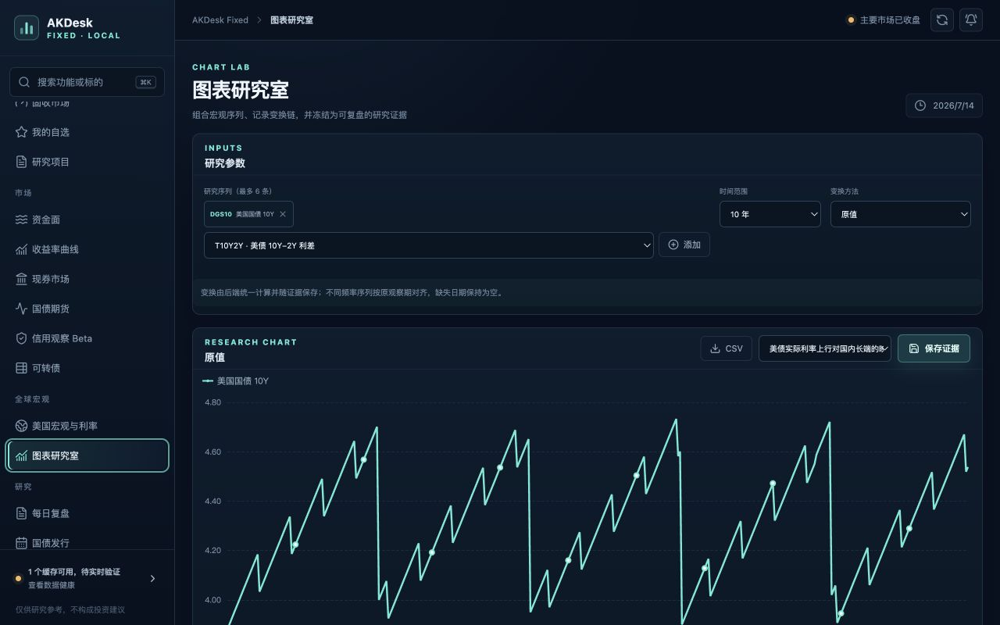

# AKDesk Fixed v0.6.0 整体评审

评审日期：2026-07-14  
评审范围：版本口径、后端与前端测试、生产构建、依赖、macOS 启动链路、FRED 数据语义、研究证据、自选研究流程、数据健康页、1440×900 与 1280×800 页面回归。

## 1. 结论

v0.6.0 已经形成了可运行的“宏观指标 → 图表研究 → 冻结证据 → 项目复盘”主链路，页面结构、MacBook Air 适配和本地缓存性能都达到基础版要求。但当前不宜直接进入 v0.6.1 的 World Bank 与信用观察开发，也不宜把它定义为“可信可用”的正式发布版。

建议将当前版本标记为 `v0.6.0 beta / RC0`，先发布一个 `v0.6.0.1「可信校准版」`。阻断项集中在四类：FRED 条款与缓存架构、缺失值及同比计算、证据版本可复现性、启动与健康状态真实性。

World Bank 和信用观察未完成不属于本轮缺陷：v2 规划已明确把它们放在 v0.6.1。

## 2. 验证结果

| 检查项 | 结果 |
| --- | --- |
| 后端测试 | 51 passed；需手工设置 `PYTHONPATH=backend`；1 个 TestClient/httpx 弃用警告 |
| 前端测试 | 8 passed；全部是工具函数测试，核心页面没有组件/流程测试 |
| 生产构建 | 通过；主 JS 约 310 KB，Charts 分包约 538 KB |
| npm 生产依赖审计 | 0 vulnerabilities |
| Python 依赖一致性 | `pip check` 通过 |
| Python 编译检查 | 通过 |
| macOS 启动脚本语法 | 通过 |
| 版本一致性 | README、CHANGELOG、后端和前端均为 v0.6.0 |
| 缓存接口性能 | Mac 本地 P95 约 3–10 ms，明显低于 300 ms 目标 |
| 进程资源 | 隔离审计实例 RSS 约 117 MB；适合 MacBook Air |
| 页面适配 | 1440×900、1280×800 无明显遮挡、重叠或横向溢出 |

说明：没有用户 FRED Key，因此没有伪造线上成功结果；页面审计使用独立临时数据库和可识别的缓存样例，未修改用户数据。当前 8765 服务在审计期间曾短暂返回空响应，之后自行恢复，所以它不是“过了交易时间”的问题，但本轮没有重启用户进程，根因仍需专项复现。

## 3. 阻断项（P0）

### P0-1 FRED 使用条款与当前持久化缓存设计存在直接冲突

当前完整的 [FRED Terms of Use](https://fred.stlouisfed.org/legal/terms/) 对 API 内容的存储、缓存、归档和数据库整合给出了明确限制，而项目会把 FRED 元数据与观测值持久化到 SQLite，并把图表结果冻结为研究证据。免费、个人本地使用不应被自动理解为豁免。

在对外分发前，应向 FRED/法律顾问取得书面解释，或调整数据架构和数据源。产品内目前指向的是较短的 [FRED API 旧文档条款页](https://fred.stlouisfed.org/docs/api/terms_of_use.html)，不足以覆盖当前完整条款、非背书声明、实际来源与版权提示要求。

### P0-2 缺失日期被删除，与 UI 承诺及研究口径不一致

`backend/app/macro.py:64-71` 在任何变换前删除 `value=None` 的观测，连 `level` 模式也不会保留缺失日期；`frontend/src/pages/ChartLabPage.tsx:195` 却明确写着“缺失日期保持为空”。本轮样例在指标详情中有 393 个日期，进入图表研究室后只剩 392 个，已经复现。

这会破坏多序列时间轴，也会影响后续差分、标准化和同比口径。应先建立完整日期轴，再让缺失值以 `null` 进入图表、CSV 和证据。

### P0-3 同比是“固定行数回看”，不是同日/同期口径

`backend/app/macro.py:92-113` 对日频、周频、月频分别使用 252、52、12 行的固定滞后。在节假日、缺测和不规则发布下，这并不等价于“上年同期”；而缺失行又已被提前删除，偏差会进一步扩大。

应改为日历期对齐并明确频率规则，或使用 FRED 官方 observations 接口提供的 year-ago 变换，并保留原始值与变换参数。参考：[FRED series observations](https://fred.stlouisfed.org/docs/api/fred/series_observations.html)。

### P0-4 “冻结数据版本”尚不能复现当时证据

FRED 原始观测已接收 `realtime_start`、`realtime_end`，但 `backend/app/macro.py:441-520` 输出图表时只保留日期和值，并把 `fetched_at` 重置为生成图表的当前时间。冻结证据因此没有逐点 vintage、抓取批次和元数据快照，不能证明当时看到的是哪一个修订版本。

研究项目页 `frontend/src/pages/ProjectsPage.tsx:260-271` 也只显示证据标题和时间范围，不能重新打开图表或检查数据表。当前“版本冻结”更接近“结果快照”，文案和数据契约都需校准。

## 4. 高优先级问题（P1）

1. **启动器版本仍是 0.5.0。** `start-macos.command:8` 的 `EXPECTED_VERSION` 没有升级；当健康的 0.6.0 已占用 8765 端口时，再双击启动器会被判定为“其他版本”。端口已占用但健康检查异常时也缺少明确的自愈或占用进程诊断。
2. **健康页错误声称 FRED 运行在隔离进程。** `backend/app/macro.py:128-135`、`296-313`、`398-411` 固定写入 `isolated_process`，但实际请求是 `backend/app/macro.py:242-255` 在应用进程内同步执行 `httpx.get`。这既是可信展示错误，也可能阻塞事件循环。
3. **FRED 适配器没有承诺中的重试、退避、限流识别和熔断。** 当前是一次 15 秒同步请求加通用错误，401、429、超时与服务错误没有区别处理。
4. **发布日历查询窗口不可靠。** `backend/app/macro.py:529-537` 只取按日期倒序的 100 条，再在本地过滤最近 14 天到未来 45 天。应把明确的起止日期传给官方接口并增加测试，否则近期开启项可能被远期记录挤出。
5. **API Key 的“已保存”与“已验证”没有分离。** Key 写入 Keychain 后，前端立刻切为 configured；若验证失败，无回滚或“未验证”状态，重开页面仍可能让用户误以为已连接。
6. **归因信息不足。** 元数据使用通用的 “Original source via FRED”，页面和 CSV 没有完整输出实际来源机构、单位、频率、变换、vintage、抓取时间和版权/归因。精选目录继续扩张前必须解决。
7. **证据操作不完整。** 已冻结证据不能查看或重放；单条证据删除没有确认，而删除整个项目已有确认，交互风险不一致。
8. **中国时区日期存在 8 小时偏差窗口。** `frontend/src/pages/InvestmentDeskPage.tsx:57-65` 用 UTC 的 `toISOString()` 判断“今天”；上海时间 00:00–08:00 可能把应复盘项目按前一天处理。
9. **缓存可信度与更新能力混为一谈。** 即使没有 Key，只要缓存仍新鲜，FRED 健康卡仍可显示“可信”；应该分别展示“数据快照可信度”和“当前连接/更新能力”。
10. **核心 UI 缺少自动化回归。** 8 个前端测试均未覆盖投研首页、研究项目、宏观页、图表研究室、自选研究和数据健康页；本次大版本最需要保护的部分反而没有测试。

## 5. 中低优先级问题（P2）

- 自选卡片直接显示英文内部枚举 `bond`，没有统一为中文产品文案。
- 自选移除没有确认，异步失败也缺少局部错误反馈；部分输入使用 `defaultValue`，服务端规范化后可能不回显。
- “重新加载”详情只是重新请求本地 API，没有传 `refresh=true`，并不保证拉取 FRED 最新数据。
- 冻结证据 payload 是无结构上限的 JSON；长周期、多序列证据会增大项目详情响应，后续需要大小限制或独立加载。
- 后端测试依赖调用者手工设置 `PYTHONPATH`，且有一个“缺失边界”测试实际没有包含缺失值，也没有验证同比。
- macOS Keychain 写入时把 Key 作为 `security` 命令参数传入，存在短暂暴露在同用户进程列表中的硬化空间。

## 6. 产品与视觉流程审计

1. **投研首页 — 健康。** 入口、研究闭环、待复盘与数据状态层级清楚；“FRED 待配置”与已有缓存同时出现时还需解释两者关系。  
   

2. **研究项目详情 — 基本健康。** 字段覆盖问题、假设、结论、置信度和复盘日期；一屏信息较密，但 1440×900 可用。  
   

3. **冻结证据 — 风险。** 只能看到摘要元数据，不能预览、重开或核验数据版本；删除没有确认。  
   

4. **宏观数据库 — 基本健康。** 精选目录、Key 配置、指标详情和进入研究室的路径连贯；来源、许可、归因和实际刷新动作仍不够透明。  
   

5. **图表研究室 — 可用但未达到研究级。** 多序列、变换、CSV 与证据保存已形成闭环；缺失值、同比和 vintage 问题会直接影响结论。  
   

6. **自选研究 — 基本健康。** 分组、状态、标签、复盘日期与备注可用；内部枚举、删除反馈和输入同步仍需打磨。  
   

7. **数据健康 — 信息不可信。** 当前把 FRED 标为“隔离进程”，并没有把缓存可信度与连接配置状态分开。  
   

8. **MacBook Air 1280×800 — 健康。** 没有明显重叠或横向滚动，图表区域需要自然向下滚动，但核心操作仍可达。  
   

语义标题、表单标签、图标按钮 `aria-label` 和状态提示已有良好基础。本轮没有完成 VoiceOver、完整键盘路径与自动对比度测量，因此不声明通过 WCAG；次级文字对比度建议纳入后续自动检查。

## 7. 建议的下一步范围：v0.6.0.1「可信校准版」

### 第一批：发布闸门

1. 明确 FRED 条款结论；结论前暂停扩大持久化范围和对外分发。
2. 修正缺失值、同比、原始值/变换值、逐点 vintage 与抓取批次的数据契约。
3. 补齐实际来源、归因、许可说明和含元数据的导出。
4. 修复启动器版本、自愈诊断和真实执行模式展示。

### 第二批：可信交互

1. 增加证据查看器、数据表、重新打开图表和删除确认。
2. 把 Key 状态拆为未配置、已保存未验证、验证成功、验证失败，并支持安全回滚。
3. 加入 FRED 重试、指数退避、429/401 分类、熔断和准确健康状态。
4. 修正发布日历查询、上海本地日期、真实刷新按钮和缓存/连接双状态。

### 第三批：回归闸门

1. 为五分钟主流程增加组件测试与端到端测试。
2. 覆盖无 Key、错误 Key、断网、429、过期缓存、缺失值、同比、数据修订与证据重放。
3. 固化 1440×900、1280×800、键盘路径、对比度、数据库迁移与启动器回归。

只有上述闸门通过后，再恢复 v0.6.1 的 World Bank 与信用观察开发，能够避免把新的数据源和页面叠加在尚未稳定的数据语义上。
